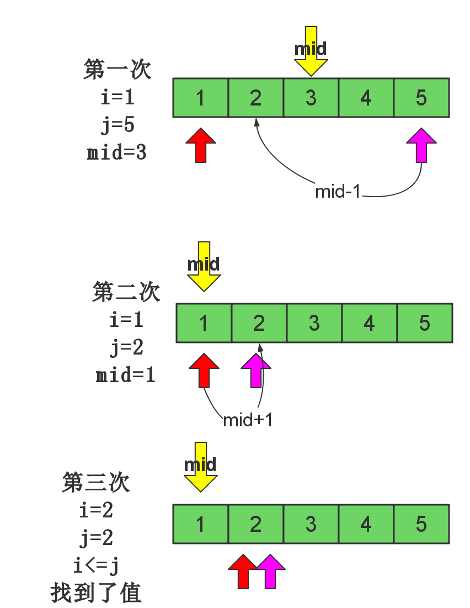

# 二分查找

## 题目引入

在有序表中查找元素常常使用二分查找（Binary Search），有时也译为折半查找，它的基本思想就像是“猜数字游戏”：你在心里想一个不超过1000的正整数，我可以保证在10次以内猜到它—–只要你每次告诉我猜的数比你想的大一些、小一些，或者正好猜中。

猜的方法就是二分。首先我猜500，除了运气特别好正好猜中外，不管你说“太大”还是“太小”，我都可以把可行范围缩小一半：如果“太大”，那么答案在1~499之间，那我下一次猜250；如果“太小”，那么答案在501~1000之间，那我下一次猜750。只要每次选择可行区间的中间点去猜，每次都可以把范围缩小一半。由于$$\log_21000 < 10$$，10次内一定能猜到。

看下面的图示:





我们发现:


 > 如果我们要查找的数据本身是**有序**的,那我可以用二分的思想来查找我们想要找的数据,每一次要找的数据,不是mid,就是在mid的左边,不然在mid的右边

二分查找的算法描述如下:

 1. a表示有序的数组;i,j分别表示数据开始,结束的下标,mid表示中点下标,key表示要找的值
 2. 如果 **i<=j** 表示还有数据没有查完,那么执行3
 3. 如果a[mid] 就是要找的值,那就返回mid,程序结束
 4. 如果 **key < a[mid]** 表示要的值在左边,**j = mid -1**
 5. 如果 **key > a[mid]** 表示要的值在右边,**i = mid +1**


具体代码:

```c
#include <cstdio>

int a[] = {1,2,3,4,5};

int bsearch(int l,int r,int key){
    
    while (l<=r){
        int m = (l+r)>>1;
        if(a[m] == key)
            return m;
        if( key < a[m])
            r = m-1;
        else
            l = m+1;
    }
    return -1;
}

int main(){
    int len_a = sizeof(a)/sizeof(a[0]);

    int ret = bsearch(0,len_a-1,2);
    printf("%d\n",ret);
    return 0;
}
```

## STL中的二分查找

C++,STL中有以下两个函数

**lower_bounder(l,r,a)**

在有序序列[l,r)的范围中查找第一个`>=a`的元素下标，没有找到就返回r

**upper_bouner(l,r,a)**

在有序序列[l,r)的范围中查找第一个`>a`的元素下标，没有找到就返回r


下面我们自己来实现这两种算法


## lower_bound实现

代码如下:
 
```c
#include <cstdio>
int a[] = {1,2,2,2,2,3,4,5};
//查找范围是[l,r)
//a[r] 永远 >= key
int lower_bound( int l, int r, int key)
{
    int m;
    while( l != r  ) //表示l和r没有重合
    {
        m = (l+r) >>1; // 取中间位置
        if( a[m] < key ) //表示
            l = m+1;
        else
            r = m;
    }
    return l;
}

int main(){
    int len_a = sizeof(a)/sizeof(a[0]);

    int ret = lower_bound(0,len_a,2);
    printf("%d\n",ret);

    return 0;
}
```

上面的代码是正确的,且比较次数更少,下面来解释一下上面的代码的含义:

 - 区间`[l,r]`含义是区间内的值都要`>=key`
 - 想办法不停的缩小`[l,r]`的范围
 - 如果`a[m] >= key`,表明m可以作为区间`[l,r]`最右端点
 - 如果`a[m] < key`,表明`[m+1,r]`可能成立
 - 我们这样不停的缩小范围,最后只有一个元素的时候就是所求


## upper_bound实现

根据上面的lowe_bound算法的思想,我们先设计upper_bound的思想

 - 区间`[l,r]`含义是区间内的值都要`>key`
 - 想办法不停的缩小`[l,r]`的范围
 - 如果`a[m] >key`,表明m可以作为区间`[l,r]`最右端点
 - 如果`a[m] <=key`,表明`[m+1,r]`可能成立
 - 我们这样不停的缩小范围,最后只有一个元素的时候就是所求

于是,我们的算法如下:

```c
#include <cstdio>
int a[] = {1,2,2,2,2,3,4,5};
//查找范围是[l,r)
//a[r] 永远 >= key
int upper_bound( int l, int r, int key)
{
    int m;
    while( l != r  ) //表示l和r没有重合
    {
        m = (l+r) >>1; // 取中间位置
        if( a[m] <= key ) //只改这里
            l = m+1;
        else
            r = m;
    }
    return l;
}

int main(){
    int len_a = sizeof(a)/sizeof(a[0]);

    int ret = upper_bound(0,len_a,2);
    printf("%d\n",ret);

    return 0;
}
```

## 一些基于二分查找算法的问题

### 重复元素出现次数

**给一个有重复元素的已排序数组，找出给定的元素key出现的次数，时间复杂度要求为logN.**

**思路:**就是分别找出>=key 第一次出现的位置和最后一次出现的位置的后一个位置。

代码:

```c
#include <cstdio>
int a[] = {1,2,2,2,5};

/* 输入:[l...r) */
/* 恒等式: a[l] <= key < a[r] */
int lower_bound(int A[],int l,int r,int key){
}


/* 输入:(l...r] */
/* 恒等式: a[l] < key <= a[r] */
int upper_bound(int A[],int l,int r,int key){

}

/* 计算出数组A范围内的key所在的范围 , size 数组大小*/
int countArea(int A[],int size,int key){
}

int main(){
    int len_a = sizeof(a)/sizeof(a[0]);
    int ans = countArea(a,len_a,2);
    printf("%d\n",ans);
    return 0;
}
```


## 引用

 - [无处不在的二分查找](http://www.acmerblog.com/ubiquitous-binary-search-5345.html)
 - [二分查找的实现和应该用汇总](http://www.cnblogs.com/ider/archive/2012/04/01/binary_search.html)
 - [关于二分查找及其上下界问题的一些思考](http://www.codeceo.com/article/binary-search.html)
