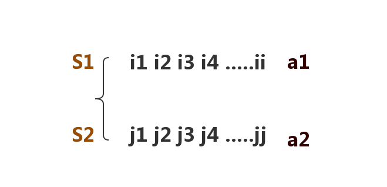

# LCS最长公共子序列(The longest common subsequence)

## 题目

cogs 476

### 【问题描述】

字符序列的子序列是指从给定字符序列中随意地(不一定连续)去掉若干个字符(可能一个也不去掉)后所形成的字符序列。令给定的字符序列x=“x0，x1，…，xn-1”， 序列Y=“y0，y1，…，yk-1是X的子序列，存在X的一个严格递增下标序 列 例如，x=“ABCBDAB”，Y=“BCDB”是X的一个子序列。
对给定的两个字符序列，求出他们最长的公共子序列长度。

### 【输入格式】

第1行为第1个字符序列，都是大写字母组成，以”.”结束。长度小于5000。
第2行为第2个字符序列，都是大写字母组成，以”.”结束，长度小于5000。

### 【输出格式】

输出上述两个最长公共子序列的长度。

### 【输入样例】

```
ABCBDAB.
BDCBBA.
```
### 【输出样例】

```
4
```

##  枚举法

这种方法是最简单，也是最容易想到的，当然时间复杂度也是龟速的，我们可以分析一下，刚才也说过了cnblogs的子序列个数有$$2^7$$个 ，延伸一下：一个长度为N的字符串，其子序列有$$2^N$$个，每个子序列要在第二个长度为N的字符串中去匹配，匹配一次需要O(N)的时间，总共也就是$$O(N*2^N)$$，可以看出，时间复杂度为指数级，恐怖的令人窒息。


## 动态规化

我们这样想:原来有两个字符串S1,S2我知道它们范围内的任意LCS,现在S1后面加入a1,S2后面加入a2,问怎么算新的LCS?



设`f[i][j]`表示s1的`1-->i`范围和s2的`1-->j`范围内的LCS长度.

对于新加入的a1和a2有要求出`f[i+1][j+1]`,要分三种情况来考虑

### 情况1

如果a1!=a2,那么有可能最长的度是`f[i+1][j]`,那么:

```math
f[i+1][j] = max
\left\{\begin{matrix}
 &f[i,j] \\ 
 &f[i,k-1] +1;(a1 == s2[k], 1<=k <=j)
\end{matrix}\right.
```

### 情况2

如果a1!=a2,那么有可能最长的度是`f[i][j+1]`,那么:

```math
f[i+1][j] = max
\left\{\begin{matrix}
 &f[i,j] \\ 
 &f[k-1,j] +1;(s1[k] == a2, 1<=k <=i)
\end{matrix}\right.
```

### 情况3

如果a1==a2,那么有可能最长的度是`f[i+1][j+1]`,那么:

```math
f[i+1][j+1] = f[i,j]+1;(a1==a2)
```

## 得出DP方程

因为只可能有以上三种可能,所以得出DP方程:

```math
f[i,j] = max
\left\{\begin{matrix}
 &f[i-1,j] \\ 
 &f[i,j-1] \\ 
 &f[i-1,j-1]+1,(s1[i] == s2[j])
\end{matrix}\right.
```

边界:

```math
\begin{matrix}
f[0][j] = 0 \\
f[i][0] = 0
\end{matrix}.
```

## 代码

```c
#include <cstdio>
#include <cstring>

char s1[5010];
char s2[5010];
int l1,l2;

int f[5010][5010] = {0};

int max(int a,int b){
    if( a>  b)
        return a;
    return b;
}

int lcs(){
    int i,j;

    for(i=1;i<=l1;i++)
        for(j=1;j<=l2;j++){
            if( s1[i] == s2[j]){
                f[i][j] = f[i-1][j-1]+1;
            }
            else 
                f[i][j] = max(f[i][j-1],f[i-1][j]);
        }
    return f[l1][l2];
}
int main(){
    scanf("%s",s1+1);
    scanf("%s",&s2[1]);
    l1 = strlen(s1+1)-1;//去掉 结尾的.
    l2 = strlen(s2+1)-1;

    int m = lcs();
    printf("%d",m);

    return 0;
}
```
## 过程


最后的整个过程就是下面的这个图了:


## 输出LCS

#### 1.输出所有

#### 2.输出字典序最小的
