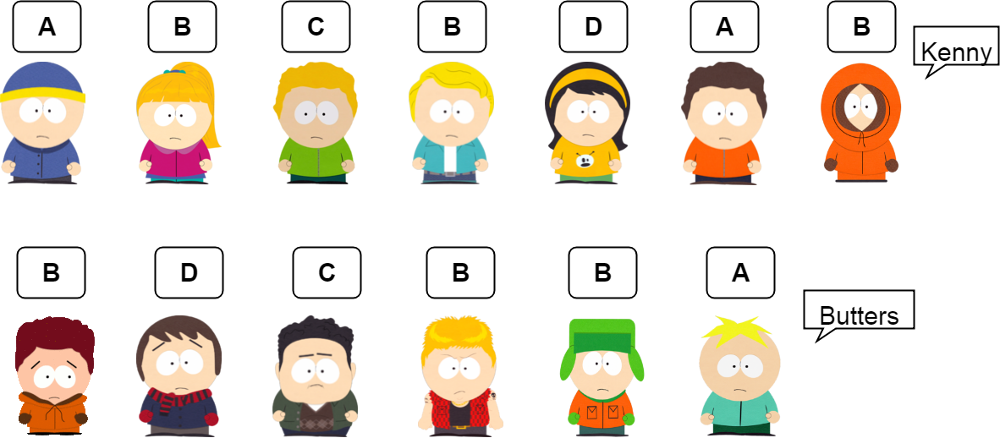
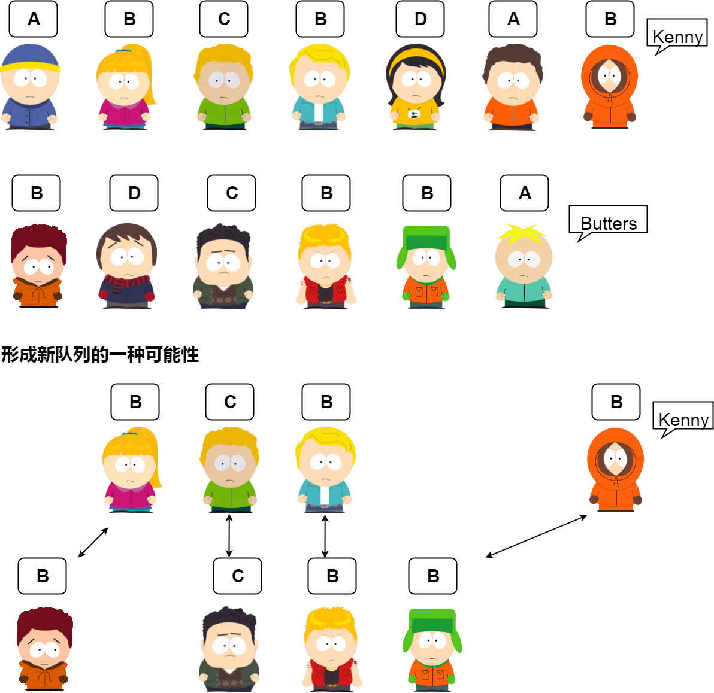

# LCS最长公共子序列(The longest common subsequence)

## 题目

cogs 476

### 【问题描述】

有两队小朋友玩游戏,每个小朋友都有一个标牌:上面写上了字母.游戏规则如下:如果上面队伍的牌号和下面队伍一样,这两个小朋友可以出列排成新的两队,问这样形成的新的队列最长长度的是多少?我们把新的队伍称为LCS(The longest common subsequence)


### 【输入格式】

第1行为第1队的字符序列，都是大写字母组成。长度小于5000。
第2行为第2队的字符序列，都是大写字母组成，长度小于5000。

### 【输出格式】

输出上述两个队伍的形成的新的队列的最长长度

### 【输入样例】

```
ABCBDAB
BDCABA
```
### 【输出样例】

```
4
```



##  枚举法

这种方法是最简单，也是最容易想到的，当然时间复杂度也是龟速的，我们可以分析一下，刚才也说过了cnblogs的子序列个数有$$2^7$$个 ，延伸一下：一个长度为N的字符串，其子序列有$$2^N$$个，每个子序列要在第二个长度为N的字符串中去匹配，匹配一次需要O(N)的时间，总共也就是$$O(N*2^N)$$，可以看出，时间复杂度为指数级，恐怖的令人窒息。


## 使用动态规化的方式思考

我们先设$$f[i][j]$$表示第一队前$$i$$个人和第二队的前$$j$$人所形的的LCS长度.

我们这样想象一下第一队的最后一个人`Kenny`和第二队的最后一个人`Butters`,`Kenny`的牌号是$$B$$,`Butters`的牌号可能是$$A$$,也可能是$$B$$,这里用$$?$$表示.`Kenny`的位置是7,`Butters`的位置是6.
原来的队伍是站好的,他们俩是新加入的.且$$f[0][0]~f[6][4]$$已知.


### 情况1:`Butters`和`Kenny`牌号不相同

如果`Butters`的牌号是`A`,那么`Butters`和`Kenny`牌号不相同,他们想知道他们加入后形成的新的$$f[7][6]$$的值是多少?

仔细想一想:因为他们俩不相同,新加入的两个值后产生和lcs会不会比原来大,**有可能**,例如:

**原来的**

```
CA
B
```

加入后
```
CA      B
B       A
```

所以仔细想一想,你会发现:

```math
f[7][6] = max
\left\{\begin{matrix}
f[7,5] \\ 
f[6,6] \\ 
\end{matrix}\right.
```
条件:$$ s1[7] != s2[6]$$


### 情况2:`Butters`和`Kenny`牌号相同

如果`Butters`的牌号是`B`,那么`Butters`和`Kenny`牌号相同,他们想知道他们加入后形成的新的$$f[7][6]$$的值

```math
f[7][6] = max
\left\{\begin{matrix}
f[7,5] \\ 
f[6,6] \\ 
f[6,5] +1;(s1[7] == s2[6])
\end{matrix}\right.
```


## 得出DP方程

因为只可能有以上的可能,所以得出DP方程:

```math
f[i,j] = max
\left\{\begin{matrix}
 &f[i-1,j] \\ 
 &f[i,j-1] \\ 
 &f[i-1,j-1]+1,(s1[i] == s2[j]) \\
\end{matrix}\right.
```

边界:

```math
\begin{matrix}
f[0][j] = 0 \\
f[i][0] = 0
\end{matrix}.
```
### 手动推导过程

待加入

## 代码

```c
#include <cstdio>
#include <cstring>

char s1[5010];
char s2[5010];
int l1,l2;

int f[5010][5010] = {0};

int max(int a,int b){
    if( a>  b)
        return a;
    return b;
}

int lcs(){
    int i,j;

    for(i=1;i<=l1;i++)
        for(j=1;j<=l2;j++){
            if( s1[i] == s2[j]){
                f[i][j] = f[i-1][j-1]+1;
            }
            else 
                f[i][j] = max(f[i][j-1],f[i-1][j]);
        }
    return f[l1][l2];
}
int main(){
    scanf("%s",s1+1);
    scanf("%s",&s2[1]);
    l1 = strlen(s1+1);//求长度
    l2 = strlen(s2+1);

    int m = lcs();
    printf("%d",m);

    return 0;
}
```
## 过程


最后的整个过程就是下面的这个图了:


## 输出LCS

### 1.输出所有

```c
```

### 2.输出字典序最小的

以什么为字典序呢?**这里:**我们以第一字符序列的下标.

```c
```
