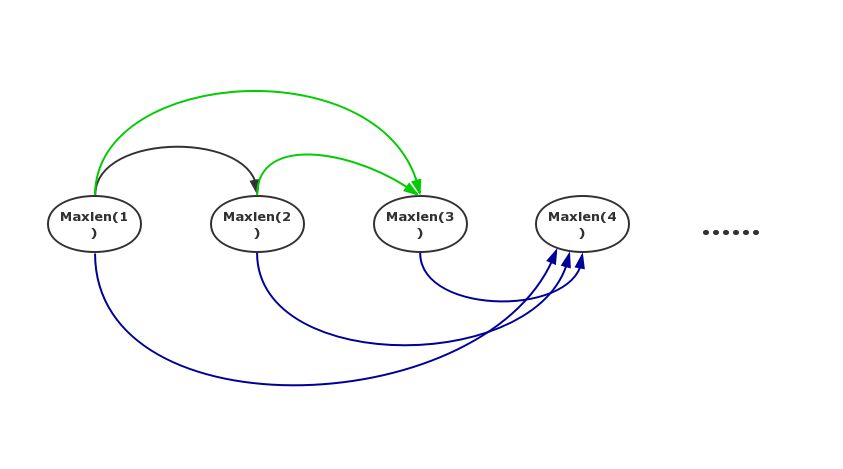

# LIS最长不下降子序列


最长上升子序列（Longest Increasing Subsequence，LIS），在计算机科学上是指一个序列中最长的单调递增的子序列。


## 问题描述

一个数的序列$$b_i$$，当$$b_1 < b_2 < ... < b_n$$的时候，我们称这个序列是上升的(不下降)。对于给定的一个序列$$a_1, a_2,...a_n$$，我们可以得到一些上升的子序列$$a_{i1}, a_{i2},..., a_{ik}$$，这里$$1 <= i1 < i2 < ... < ik <= n$$。比如，对于序列$$(1, 7, 3, 5, 9, 4, 8)$$，有它的一些上升子序列，如$$(1, 7)$$,$$(3, 4, 8)$$等等。这些子序列中最长的长度是4，比如子序列$$(1, 3, 5, 8)$$.
你的任务，就是对于给定的序列，求出**最长上升(不下降)子序列的长度**。

## 输入样例


```
6
3 4 1 2 3 6
```

## 输出样例

```
4
```

## 解题思路


如何把这个问题分解成子问题呢？经过分析，发现 **求以$$a_k(k=1, 2, 3,...N)$$为终点的最长上升子序列的长度**是个好的子问题――这里把一个上升子序列中最右边的那个数，称为该子序列的“终点”。虽然这个子问题和原问题形式上并不完全一样，但是只要这N个子问题都解决了，那么这N个子问题的解中，最大的那个就是整个问题的解。

由上所述的子问题只和一个变量相关，就是数字的位置。因此序列中数的位置k 就是“状态”，而状态 k 对应的“值”，就是以$$a_k$$做为“终点”的最长上升子序列的长度。这个问题的状态一共有N个。状态定义出来后，转移方程就不难想了。假定$$MaxLen(k)$$表示以$$a_k$$做为“终点”的最长上升子序列的长度，那么：


**边界,或者说刚开始时,初始化时:**

$$MaxLen(i) = 1$$

可以这样理解:刚开始时,以下标i为结尾的LIS就是下标i自己本身,所以长度为1.

**状态转移方程:**

```math
Maxlen[k] = Max\{Maxlen[i]+1\},1\leqslant i&lt; k,a[i]&lt;a[k],k&gt; 1
```

这个状态转移方程的意思就是，$$MaxLen(k)$$的值，就是在$$a_k$$左边，“终点”数值小于$$a_k$$，且长度最大的那个上升子序列的长度再加1。因为$$a_k$$左边任何“终点”小于$$a_k$$的子序列，加上$$a_k$$后就能形成一个更长的上升子序列。

实际实现的时候，可以不必编写递归函数，因为从$$MaxLen(1)$$就能推算出$$MaxLen(2)$$，有了$$MaxLen(1)$$和$$MaxLen(2)$$就能推算出$$MaxLen(3)$$,后面同同理.




### 代码如下

```c
#include <cstdio>

int a[1000];
int n;
int f[1000];

int main(){
    scanf("%d",&n);
    int i;
    int j;
    for (i=1;i<=n;i++){
        scanf("%d",&a[i]);
    }

    for(i=1;i<=n;i++) f[i] =1;

    int max = -1;//这里是-1,想想为什么
    for (i=2;i<=n;i++){
        for(j=1;j<i;j++){
            if( a[j] < a[i] && f[i] < f[j]+1){
                f[i] = f[j]+1;
                if(max < f[i])
                    max = f[i];
            }
        }
    }
    
    printf("%d",max);

    return 0;
}
```

## 输出路径

现在问题加上一个条件:输出lis,如果有多个lis满足条件，那么我们想求字典序最小的那个。


## n*log(n)的优化


数据,代码,思路都由Riolu(2014)提供

帮助理解的数据


```c
a: 7 2 9 3 4 10 6 1
b: 1 1 2 2 3  4 4 1

c: 7
   2
   2 9
   2 3
   2 3 4
   2 3 4 10
   2 3 4 6
   1 3 4 6
-----------------
下 1 2 3 4  5
标
```

**核心:**c[i]表示长度为i的LIS最小右端值,且c[i]一定一个上升的序列


```c
int a[n],c[n],f[n],m;
//a 为数组,f存最大长度
//c是符合条件的最长非降序列
//c[i]表示长度为i的LIS最小右端值

memset(c,0x7f,siezof);

int LIS(){
    int i;
    for(i=1;i<=n;i++){
        int min=1,max=i;

        while(min<max){     //寻找最大c[x],使c[x]<=a[i]
            int mid  = (min+max)>>1;
            if(c[mid] <= a[i])
                min = mid+1;
            else
                max= mid;
        }

        f[i]=min;   //保有答案
        c[min]=a[i];//更新最小值
    }
    return f[n];
}
```
