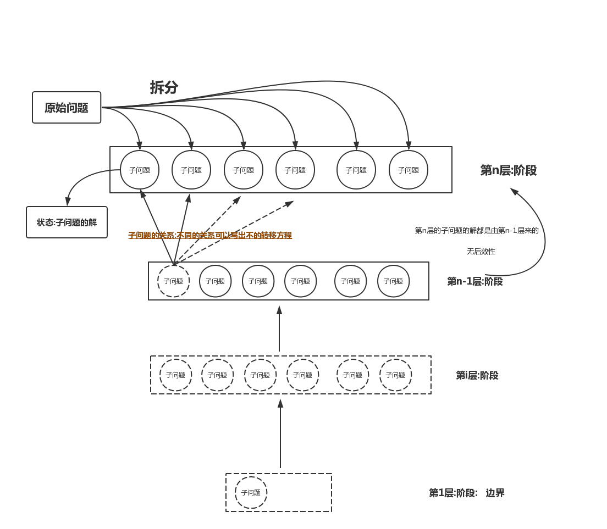

## 一.概念

动态规划(dynamic programming)是运筹学的一个分支，是求解决策过程(decision process)最优化的数学方法。20世纪50年代初美国数学家R.E.Bellman等人在研究多阶段决策过程(multistep decision process)的优化问题时，提出了著名的最优化原理(principle of optimality)，把多阶段过程转化为一系列单阶段问题，利用各阶段之间的关系，逐个求解，创立了解决这类过程优化问题的新方法——动态规划。1957年出版了他的名著《Dynamic Programming》，这是该领域的第一本著作。


在多阶段决策的问题中,各个阶段采取的决策,一般来说是与时间或空间有关的。 决策依赖于当前状
态,又随即引起状态的转移,一个决策序列就是在变化的状态中产生出来,故有“动态”的含义,我们
称这种解决多阶段决策最优化的过程为动态规划方法。

 - 阶段:把所求问题的过程按照时间或空间恰当地分成若干个相互联系的阶段。
 - 状态:表示每个阶段的客观状态,它既是某阶段的出发位置,又是前一阶段的终点。
 - 无后效性:无后效性是指如果在某个阶段上过程的状态已知，则从此阶段以后过程的发展变化仅与此阶段的状态有关，而与过程在此阶段以前的阶段所经历过的状态无关.这说明动态规化是**朝着一个方向前进**的.
 - 决策:一个阶段的状态给定以后,从该状态演变到下一阶段状态的一种选择(行动)。
 - 最优性原理:论初始状态和初始决策如何，对于前面决策所造成的某一状态而言，其后各阶段的决策序列必须构成最优策略”,简单说:最优策略的任何一部分子策略也必须是最优的.例如在:数塔中最优路线是:`13-8-26-15-24`,那么`13->15`的最佳路线一定是:`13-8-26-15`,可以用反证法证明

## 解题过程

 - (1)判断问题是否具有最优子结构性质,若不具备,则不能用动态规划。
 - (2)把问题分成若干个子问题。
 - (3)建立状态转移方程(递推公式)。
 - (4)找出边界条件。
 - (5)设定初始值。
 - (6)递推求解。

## DP模型1



## 分类

动态规划一般可分为线性动规，区域动规，树形动规，背包动规四类。

举例：

 - 线性动规：拦截导弹，合唱队形，挖地雷，建学校，剑客决斗等；
 - 区域动规：石子合并， 加分二叉树，统计单词个数，炮兵布阵等；
 - 树形动规：贪吃的九头龙，二分查找树，聚会的欢乐，数字三角形等；
 - 背包问题：01背包问题，完全背包问题，分组背包问题，二维背包，装箱问题，挤牛奶（同济ACM第1132题）等；

应用实例：

最短路径问题 ，项目管理，网络流优化等；

## 刷题表


**入门:**

| 名称           | 来源  | 所在OJ | 说明 |
|----------------|-------|--------|------|
| 总分           | USACO | moonoj |      |
| 邮票           | USACO | moonoj |      |
| 家的范围       | USACO | moonoj |      |
| 游戏           | USACO | moonoj |      |
| 商店购物       | USACO | moonoj |      |
| “破锣摇滚”乐队 | USACO | moonoj |      |
| 麦香牛块       | USACO | moonoj |      |
| 最长前缀       | USACO | moonoj |      |
| 货币系统       | USACO | moonoj |      |
| 垃圾陷阱       | USACO | moonoj |      |
| 神秘的咒语     | USACO | moonoj |      |
| 天堂的馈赠     | USACO | moonoj |      |
| 上帝的爱好     | USACO | moonoj |      |
| 苹果旅游       | USACO | moonoj |      |
| 文科生的悲哀   | USACO | moonoj |      |
| 硬件           | USACO | moonoj |      |
| 糖果盒         | USACO | moonoj |      |
| 能量项链       | USACO | moonoj |      |
| 金明的预算方案 | USACO | moonoj |      |
| 潜水员         | USACO | moonoj |      |
| 观光游览       | USACO | moonoj |      |
| 任务安排       | USACO | moonoj |      |
| 筷子           | USACO | moonoj |      |
| 递增序列       | USACO | moonoj |      |
| power          | USACO | moonoj |      |
| 清扫           | USACO | moonoj |      |
| 破译密码       | USACO | moonoj |      |
| 奶牛家谱       | USACO | moonoj |      |
| 集合           | USACO | moonoj |      |
| 书本整理       | USACO | moonoj |      |
| 城堡           | USACO | moonoj |      |
| 佳佳的魔杖     | USACO | moonoj |      |
| 编码           | USACO | moonoj |      |
| 将功补过       | USACO | moonoj |      |
| 质数取石子     | USACO | moonoj |      |
| 多人背包       | USACO | moonoj |      |
| 不听话的机器人 | USACO | moonoj |      |
| 路灯的改建计划 | USACO | moonoj |      |
| 吃西瓜         | USACO | moonoj |      |
| 给MM的生日礼物 | USACO | moonoj |      |
| 最勇敢的机器人 | USACO | moonoj |      |
| 创意吃鱼法     | USACO | moonoj |      |
| 爱心蜗牛       | USACO | moonoj |      |
| 工作           | USACO | moonoj |      |
| 最大矩形       | USACO | moonoj |      |
| 座位安排       | USACO | moonoj |      |

## DP按分类刷题表

以下问题在moonoj上搜索


**1.背包问题:**

 - 砝码称重
 - 积木城堡 来源：vijos P1059
 - 采药 来源：NOIP2005（普及组） 第三题 (pcs有题解)
 - 开心的金明
 - 金明的预算方案 来源：NOIP2006 第二题
 - Money Systems 来源：USACO 2.3
 - 新年趣事之打牌 来源： vijos P1071
 - 挖地雷问题 来源：NOIP1996(提高组)
 - Party Lamps
 - 奶牛家谱
 - 分配时间（WFTSC2009T）  分组背包

**2.线型Dp:**

 - 乌龟棋 noip2010
 - 诗人小G
 - 模糊 POJ1229

**3.区间DP:**

 - 石子归并
 - 回文词 IOI2000
 - 决斗问题（POI99）
 - Blocks(POJ1390)
 - 数字游戏(luogu P1043)

**4.矩形模型:**

 - 降维拆成链：滑雪 SHTSC2002
 - 子矩形：采油区域 APIO2009
 - 行列：棋盘分割 (NOI99)
 - 对角线：转纸条
 - 传纸条(NOIP2008T)


**5.树型DP**

 - 没有上司的舞会
 - A Binary Apple Tree 苹果二叉树
 - 加分二叉树 （NOIP2003）
 - 选课（CTSC99）
 - 贪吃的九头龙（NOI2002）
 - 树的最长链
 - 树的最小点支配集 Cell Phone Network（POJ3659）

## POJ动态规划题目列表：

容易：

```
1018,1050,1083,1088,1125,1143,1157,1163,1178,1179,
1189,1191,1208,1276,1322,1414,1456,1458,1609,1644,
1664,1690,1699,1740,1742,1887,1926,1936,1952,1953,
1958,1959,1962,1975,1989,2018,2029,2039,2063,2081,
2082,2181,2184,2192,2231,2279,2329,2336,2346,2353,
2355,2356,2385,2392,2424。
```

不易：

```
1019,1037,1080,1112,1141,1170,1192,1239,1655,1695,
1707,1733(区间减法加并查集),1737,1837,1850,1920(加强版汉罗塔),1934(全部最长公共子序列),
1964(最大矩形面积，O(n*m)算法),2138,2151,
2161,2178。
```

推荐：

```
1015,1635,1636,1671,1682,1692,1704,1717,1722,1726,
1732,1770,1821,1853,1949,2019,2127,2176,2228,2287,
2342,2374,2378,2384,2411
```

## 有关DP的解题思路的思考:

目前( 2018-04-16 15:04)我(rainboy)有关DP的解题思路如下:


DP分成两大类:
    - 时间

时间:基本按问题操作的顺序进行分解子问题(LIS,LCS,背包等)

空间就是分解子问题的时间,主要思考按空间来,和操作的顺序基本无关.和某个数据所在的位置有关.基于数据的左边,右边,上下,切开等有关.
