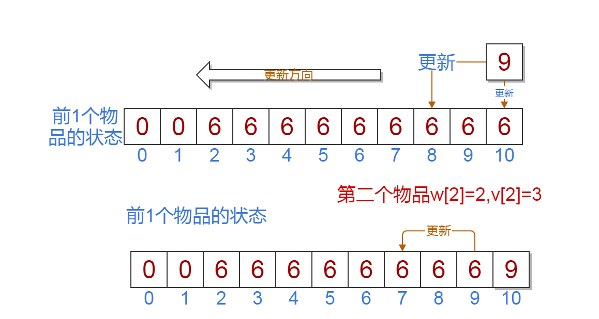
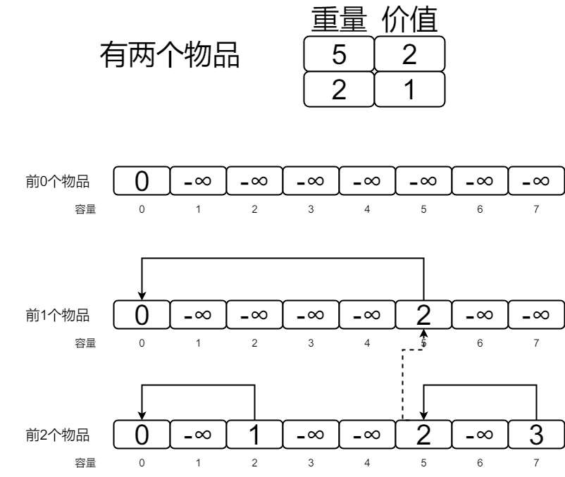

# 01背包

## 普通01背包

### [问题描述]

给定n种物品和一背包。物品i的重量是wi，其价值为vi，背包的容量为C。问应如何选择装入背包的物品，使得装入背包中物品的总价值最大?

### 输入格式/样例

格式:第一行有两个数n,C,表示有n个物品,背包的容量为C.接下来n行,每一行两个数w,v,表示物品的重量和价值.

```
5 10
2 6
2 3
6 5
5 4
4 6
```
### 问题分析

对于一种物品，要么装入背包，要么不装。所以对于一种物品的装入状态可以取0和1.我们设物品i的装入状态为xi,xi∈(0,1)，此问题称为0-11背包问题

我们设$$f(i,j)$$表示前i个物品在容量为j的条件得到的最大价值.

```math
f(i,j)=\left\{\begin{matrix}
 0& i==0 \\ 
 max\{f(i-1,j),f(i-1,j-w[i])+v[i]\}& j>=w[i] 
\end{matrix}\right.
```

$$f(0,j)$$,前0个物品得到的价值为0,也是边界.
其中$$f(i-1,j)$$表示前i-1个物品在容量为j的条件得到的最大价值,也就是不选第i个物品.
其中$$f(i-1,j-w[i])+v[i]$$表示前i个物品中一定选第i个物品的条件下得到的最大价值.
$$f(5,10)$$就是我们最后要求的答案.

### 代码

注意我们这里的边界是f[0][j].

```c
#include <cstdio>

//手动初始化数据
int n=5,c=10;
int w[] = {0,2,2,6,5,4};
int v[] = {0,6,3,5,4,6};

//清空置零,同时前0个物品,边界,f[0][j]=0
int f[6][11]={0};

void Knapsack01(){
    int i,j;
    for(i=1;i<=5;i++)//前i个物品
        for(j=1;j<=10;j++){
            if( j-w[i] >=0){ // 在容量j的条件下能放进去
                if(f[i-1][j] > f[i-1][j-w[i]]+v[i])
                    f[i][j] = f[i-1][j];
                else
                    f[i][j] = f[i-1][j-w[i]]+v[i];
            }
            else { // 在容量j的条件下第i个物品放不下
                f[i][j] = f[i-1][j];
            }
        }
}
int main(){
    Knapsack01();
    printf("%d",f[5][10]);//输出答案
    return 0;
}
```

代码演示: http://dsa.rainboy.cc/#/01Knapsack

## 01背包一维写法

看完上面的代码演示和仔细考虑过代码和状态转移方程后,你会发现一些重要的规律:

 - 每一行的状态都需要上一行(前一层)的状态推导出来
 - 第i行的第j个状态f[i][j]一定是由f[i-1][j]和f[i-1][k]得到的,且k一定小于j

根据上面的规律,我们可以这样做:

 - 定义一个一维的数组f[j]表示状态:f[j]表示前i个物品在容量为j的条件下的最大价值
 - 我们可以很容易的得到第一个物品的所有的状态
 - 在处理前2个物品的状态的时候从f[10]到f[0]倒过来处理

上面的操作可以把01背包的二维状态压缩到1维,节省了空间和代码复杂度.




### 伪代码

```c
for i=1->N //前i个物品
    for j=C->w[i] //容量从大到小
        f[j] = max(f[j],f[j-w[i]]+v[i])
```

### 代码

```c
#include <cstdio>

//手动初始化数据
int n=5,c=10;
int w[] = {0,2,2,6,5,4};
int v[] = {0,6,3,5,4,6};

//清空置零,同时前0个物品,边界
int f[11]={0};

void Knapsack01(){
    int i,j;
    for(i=1;i<=n;i++)//前i个物品
        for(j=c;j>=w[i];j--){
            if(f[j] < f[j-w[i]]+v[i])
                f[j] = f[j-w[i]]+v[i];
        }
}
int main(){
    Knapsack01();
    printf("%d",f[10]);//输出答案
    return 0;
}
```

代码演示: http://dsa.rainboy.cc/#/01Knapsack1


## 恰好装满


有的时候题目会问我们**恰好装满背包**时最优解.

这种时候,在初始化的时候除了$$F[0]$$为0,其它$$F[1..V]$$设为$$-\infty$$,这样就可以保证最终得到的$$F[V]$$ 是一种恰好装满背包的最优解。


这是为什么呢？可以这样理解：初始化的$$F$$数组事实上就是在没有任何物品可以放 入背包时的合法状态。如果要求背包恰好装满，那么此时只有容量为 0 的背包可以在什么也不装且价值为 0 的情况下被“恰好装满”，其它容量的背包均没有合法的解，属于未定义的状态，应该被赋值为$$-\infty$$了。如果背包并非必须被装满，那么任何容量的背包都有一个合法解“什么都不装”，这个解的价值为 0，所以初始时状态的值也就全部为0了。

这个小技巧完全可以推广到其它类型的背包问题，后面不再对进行状态转移之前的初始化进行讲解。


图解:




有很多表示那种能否到达,(前i个物品选j个能否达到某个重量),这种情况下可以抽象成01背包的恰好装满,比如`砝码称重(cojs)`,`猫狗大战(vijos)`等

cojs 砝码称重

状态转移方程:设$$f[i]$$表达重量$$i$$能不能达到.

```math
f[i]=\left\{\begin{matrix}
 1&i==0 \\ 
 f[i-w[i]]& i-w[i]>0 
\end{matrix}\right.
```

```c
#include <cstdio>

int a[20];

int b[20] = {0,1,2,3,5,10,20};
int f[1100] = {0};

int main(){
    freopen("fmcz.in","r",stdin);
    freopen("fmcz.out","w",stdout);
    int i,j,k;
    for (i=1;i<=6;i++){
        scanf("%d",&a[i]);
    }
    f[0]=1; // 设f[0]是可以达到的,所以为1
    for(j=1;j<=6;j++)
        for(k=1;k<=a[j];k++)
        {
            for(i=1000;i>=1;i--){ 
                if( f[i-b[j]] && i-b[j]>=0) //更新的条件
                    f[i] =f[i-b[j]];
            }
        }

    int max = 0;
    for(i=1000;i>=1;i--) 
        if(f[i] !=0){
            max++;
        }
    printf("%d",max);
    return 0;
}
```

## 总结


01背包问题是最基本的问题,它包含了背包问题中设计状态,方程的最基本思想.另外,别的类型的背包问题往往转换成01背包问题求解.故一定要仔细体会上面基本思路的得出方法.状态转移方程的意义,以及空间复杂度怎么被优化.

## 作业


| 名字       | oj    |
|------------|-------|
| 开心的金明 | cojs  |
| 砝码称重   | cojs  |
| 猫狗大战   | vijos |
