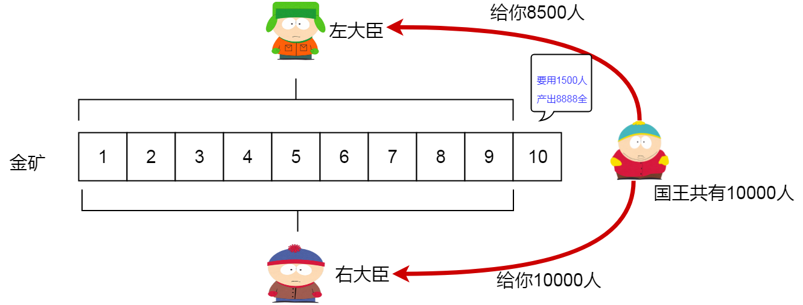

# 背包DP

## 导入-金矿模型

有一个国家，所有的国民都非常老实憨厚，某天他们在自己的国家发现了十座金矿，并且这十座金矿在地图上排成一条直线，国王知道这个消息后非常高兴，他希望能够把这些金子都挖出来造福国民，首先他把这些金矿按照在地图上的位置从西至东进行编号，依次为0、1、2、3、4、5、6、7、8、9，然后他命令他的手下去对每一座金矿进行勘测，以便知道挖取每一座金矿需要多少人力以及每座金矿能够挖出多少金子，然后动员国民都来挖金子。

 - 题目补充1：挖每一座金矿需要的人数是固定的，多一个人少一个人都不行。国王知道每个金矿各需要多少人手，金矿i需要的人数为peopleNeeded[i]。
 - 题目补充2：每一座金矿所挖出来的金子数是固定的，当第i座金矿有peopleNeeded[i]人去挖的话，就一定能恰好挖出gold[i]个金子。否则一个金子都挖不出来。
 - 题目补充3：开采一座金矿的人完成开采工作后，他们不会再次去开采其它金矿，因此一个人最多只能使用一次。
 - 题目补充4：国王在全国范围内仅招募到了10000名愿意为了国家去挖金子的人，因此这些人可能不够把所有的金子都挖出来，但是国王希望挖到的金子越多越好。
 - 题目补充5：这个国家的每一个人都很老实（包括国王），不会私吞任何金子，也不会弄虚作假，不会说谎话。
 - 题目补充6：有很多人拿到这个题后的第一反应就是对每一个金矿求出平均每个人能挖出多少金子，然后从高到低进行选择，这里要强调这种方法是错的，如果你也是这样想的，请考虑背包模型，当有一个背包的容量为10，共有3个物品，体积分别是3、3、5，价值分别是6、6、9，那么你的方法取到的是前两个物品，总价值是12，但明显最大值是后两个物品组成的15。
 - 题目补充7：我们只需要知道最多可以挖出多少金子即可，而不用关心哪些金矿挖哪些金矿不挖。

那么，国王究竟如何知道在只有10000个人的情况下最多能挖出多少金子呢？国王是如何思考这个问题的呢？

国王首先来到了第9个金矿的所在地（注意，第9个就是最后一个，因为是从0开始编号的，最西边的那个金矿是第0个），他的臣子告诉他，如果要挖取第9个金矿的话就需要1500个人，并且第9个金矿可以挖出8888个金子。听到这里国王哈哈大笑起来，因为原先他以为要知道十个金矿在仅有10000个人的情况下最多能挖出多少金子是一件很难思考的问题，但是，就在刚才听完他的臣子所说的那句话时，国王已经知道总共最多能挖出多少金子了，国王是如何在不了解其它金矿的情况下知道最多能挖出多少金子的呢？他的臣子们也不知道这个谜，因此他的臣子们就问他了：“最聪明的国王陛下，我们都没有告诉您其它金矿的情况，您是如何知道最终答案的呢？”

得意的国王笑了笑，然后把他最得意的“左、右手”叫到跟前，说到：“我并不需要考虑最终要挖哪些金矿才能得到最多的金子，我只需要考虑我面前的这座金矿就可以了，对于我面前的这座金矿不外乎仅有两种选择，要么挖，要么不挖，对吧？”

“当然，当然”大臣们回答倒。

国王继续说道：“如果我挖取第9座金矿的话那么我现在就能获得8888个金子，而我将用去1500个人，那么我还剩下8500个人。我亲爱的左部下，如果你告诉我当我把所有剩下的8500个人和所有剩下的其它金矿都交给你去开采你最多能给我挖出多少金子的话，那么我不就知道了在第9个金矿一定开采的情况下所能得到的最大金币数吗？”

国王的左部下听后回答道：“国王陛下，您的意思是如果我能用8500个人在其它金矿最多开采出x个金币的话，那您一共就能够获得 x + 8888个金子，对吗？”

“是啊，是啊……如果第9座金矿一定开采的话……”大臣们点头说到。

国王笑着继续对着他的右部下说到：“亲爱的右部下，也许我并不打算开采这第9座金矿，那么我依然拥有10000个人，如果我把这10000个人和剩下的金矿都给你的话，你最多能给我挖出多少个金子呢？”

国王的右部下聪明地说道：“尊敬的国王陛下，我明白您的意思了，如果我回答最多能购开采出y个金币的话，那您就可以在y和x+8888之间选择一个较大者，而这个较大者就是最终我们能获得的最大金币数，您看我这样理解对吗？”

国王笑得更灿烂了，问他的左部下：“那么亲爱的左部下，我给你8500个人和其余金矿的话你能告诉我最多能挖出多少金子吗？”

“请您放心，这个问题难不倒我”。左部下向国王打包票说到。

国王高兴地继续问他的右部下：“那右部下你呢，如果我给你10000个人和其余金矿的话你能告诉我最多能挖出多少金子吗？”

“当然能了！交给我吧！”右部下同左部下一样自信地回答道。

“那就拜托给你们两位了，现在我要回到我那舒适的王宫里去享受了，我期待着你们的答复。”国王说完就开始动身回去等消息了，他是多么地相信他的两个大臣能够给他一个准确的答复，因为国王其实知道他的两位大臣要比他聪明得多。

故事发展到这里，你是否在想国王的这两个大臣又是如何找到让国王满意的答案的呢？他们为什么能够如此自信呢？事实上他们的确比国王要聪明一些，因为他们从国王的身上学到了一点，就是这一点让他们充满了自信。

国王走后，国王的左、右部下来到了第8座金矿，早已在那里等待他们的金矿勘测兵向两位大臣报道：“聪明的两位大臣，您们好，第8座金矿需要1000个人才能开采，可以获得7000个金子”。

因为国王仅给他的左部下8500个人，所以国王的左部下叫来了两个人，对着其中一个人问到：“如果我给你7500个人和除了第8、第9的其它所有金矿的话，你能告诉我你最多能挖出多少金子吗？”

然后国王的左部下继续问另一个人：“如果我给你8500个人和除了第8、第9的其它所有金矿的话，你能告诉我你最多能挖出多少金子吗？”

国王的左部下在心里想着：“如果他们俩都能回答我的问题的话，那国王交给我的问题不就解决了吗？哈哈哈！”

因为国王给了他的右部下10000个人，所以国王的右部下同样也叫来了两个人，对着其中一个人问：“如果我给你9000个人和除了第8、第9的其它所有金矿的话，你能告诉我你最多能挖出多少金子吗？”

然后国王的右部下继续问他叫来的另一个人：“如果我给你10000个人和除了第8、第9的其它所有金矿的话，你能告诉我你最多能挖出多少金子吗？”

此时，国王的右部下同左部下一样，他们都在为自己如此聪明而感到满足。

当然，这四个被叫来的人同样自信地回答没有问题，因为他们同样地从这两个大臣身上学到了相同的一点，而两位自认为自己一样很聪明的大臣得意地笑着回到了他们的府邸，等着别人回答他们提出来的问题，现在你知道了这两个大臣是如何解决国王交待给他们的问题了吗？

那么你认为被大臣叫去的那四个人又是怎么完成大臣交给他们的问题的呢？答案当然是他们找到了另外八个人！

没用多少功夫，这个问题已经在全国传开了，更多人的人找到了更更多的人来解决这个问题，而有些人却不需要去另外找两个人帮他，哪些人不需要别人的帮助就可以回答他们的问题呢？

很明显，当被问到给你z个人和仅有第0座金矿时最多能挖出多少金子时，就不需要别人的帮助，因为你知道，如果z大于等于挖取第0座金矿所需要的人数的话，那么挖出来的最多金子数就是第0座金矿能够挖出来的金子数，如果这z个人不够开采第0座金矿，那么能挖出来的最多金子数就是0，因为这唯一的金矿不够人力去开采。让我们为这些不需要别人的帮助就可以准确地得出答案的人们鼓掌吧，这就是传说中的底层劳动人民！

故事讲到这里先暂停一下，我们现在重新来分析一下这个故事，让我们对动态规划有个理性认识。

**子问题：** 

国王需要根据两个大臣的答案以及第9座金矿的信息才能判断出最多能够开采出多少金子。为了解决自己面临的问题，他需要给别人制造另外两个问题，这两个问题就是子问题。

思考动态规划的第一点----**最优子结构**：

国王相信，只要他的两个大臣能够回答出正确的答案（对于考虑能够开采出的金子数，最多的也就是最优的同时也就是正确的），再加上他的聪明的判断就一定能得到最终的正确答案。我们把这种子问题最优时母问题通过优化选择后一定最优的情况叫做“最优子结构”。

思考动态规划的第二点----**子问题重叠/相似子问题**：

实际上国王也好，大臣也好，所有人面对的都是同样的问题，即给你一定数量的人，给你一定数量的金矿，让你求出能够开采出来的最多金子数。我们把这种母问题与子问题本质上是同一个问题的情况称为“子问题重叠”。然而问题中出现的不同点往往就是被子问题之间传递的参数，比如这里的人数和金矿数。

思考动态规划的第三点----**边界**：

想想如果不存在前面我们提到的那些底层劳动者的话这个问题能解决吗？永远都不可能！我们把这种子问题在一定时候就不再需要提出子子问题的情况叫做边界，没有边界就会出现死循环。

思考动态规划的第四点----**子问题独立**：

要知道，当国王的两个大臣在思考他们自己的问题时他们是不会关心对方是如何计算怎样开采金矿的，因为他们知道，国王只会选择两个人中的一个作为最后方案，另一个人的方案并不会得到实施，因此一个人的决定对另一个人的决定是没有影响的。我们把这种一个母问题在对子问题选择时，当前被选择的子问题两两互不影响的情况叫做“子问题独立”。

思考动态规划的第五点----**无后效性**：

一个某个人解决一个问题,那会这个问题只会影响包含这个问题的更大子问题,但是这个问题后面的问题(后)就不会影响这个问题了.即子问题的状态一但确定,就不会再改变.

这就是动态规划，具有**最优子结构**、**子问题重叠**、**边界**和**子问题独立**,**无后效性**，当你发现你正在思考的问题具备这四个性质的话，那么恭喜你，你基本上已经找到了动态规划的方法。

### 动态规化的优点

我们看完上面的部分,发现这个题目可以使用**搜索**的方法来实现左右大臣询问式的方法,也可以用动态夫化的方法来进行递推来解决问题.那我们为什么要使用动态规化,直接用搜索不就好了?

如果我们用组合的方法来挑选金矿来开发,看哪种组合出的金子多,每种组合情况由一个人来计算,那么需要$$2^{10}=1024$$个人来计算.

如果按国王的方法来,需要$$1+2+4+8+16+32+64+128++256+512=1023$$个人.

如果使用**动态规化**的方法, 并不需要那么多人，因为有很多问题其实是相同的，而我们只需要为每一个不同的问题使用一个人力便可.

如果有一个人需要知道1000个人和3个金矿可以开采出多少金子，同时另一个人也需要知道1000个人和3个金矿可以开采出多少金子的话，那么他们可以去询问相同的一个人，而不用各自找不同的人浪费人力了

图解:

因为每个问题的人数可以从0取到10000，而金矿数可以从0取到10，所以最多大约有10000 * 10 等于100000个不同的问题,事实上我们需要的人力远远小于这个数的，因为不是每一个问题都会遇到，也许我们仅需要一、两百个人力就可以解决这个问题了，这主要和各个金矿所需要的人数有关.

 思考动态规划的第六点----**做备忘录**：

 正如上面所说的一样，当我们遇到相同的问题时，我们可以问同一个人。讲的通俗一点就是，我们可以把问题的解放在一个变量中，如果再次遇到这个问题就直接从变量中获得答案，因此每一个问题仅会计算一遍，如果不做备忘的话，动态规划就没有任何优势可言了。 

思考动态规划的第七点----时间分析：

正如上面所说，如果我们用穷举的方法，至少需要2^n个常数时间，因为总共有2^n种情况需要考虑，如果在背包问题中，包的容量为1000，物品数为100，那么需要考虑2^100种情况,这个数大约为10的30次方。
 
而如果用动态规划，最多大概只有1000*100 = 100000个不同的问题，这和10的30次方比起来优势是很明显的。而实际情况并不会出现那么多不同的问题，比如在金矿模型中，如果所有的金矿所需人口都是1000个人，那么问题总数大约只有100个。

这就是动态规划的魔力，它减少了大量的计算，因此我们需要动态规划！

### 动态规划的思考角度

那么什么是动态规划呢？我个人觉得，如果一个解决问题的方法满足上面六个思考点中的前五个，那么这个方法就属于动态规划。而在思考动态规划方法时，后两点同样也是需要考虑的。
 
面对问题要寻找动态规划的方法，首先要清楚一点，动态规划不是算法，它是一种方法，它是在一件事情发生的过程中寻找最优值的方法，因此，我们需要对这件事情所发生的过程进行考虑。而通常我们从过程的最后一步开始考虑，而不是先考虑过程的开始。
 
打个比方，上面的挖金矿问题，我们可以认为整个开采过程是从西至东进行开采的（也就是从第0座开始），那么总有面对最后一座金矿的时候（第9座），对这座金矿不外乎两个选择，开采与不开采，在最后一步确定时再去确定倒数第二步，直到考虑第0座金矿（过程的开始）。
 
而过程的开始，也就是考虑的最后一步，就是边界。
 
因此在遇到一个问题想用动态规划的方法去解决时，不妨先思考一下这个过程是怎样的，然后考虑过程的最后一步是如何选择的，通常我们需要自己去构造一个过程，比如后面的练习。

## 总结

那么遇到问题如何用动态规划去解决呢？根据上面的分析我们可以按照下面的步骤去考虑：

 1. 构造问题所对应的过程。
 1. 思考过程的最后一个步骤，看看有哪些选择情况。
 1. 找到最后一步的子问题，确保符合“子问题重叠”，把子问题中不相同的地方设置为参数。
 1. 使得子问题符合“最优子结构”。
 1. 找到边界，考虑边界的各种处理方式。
 1. 确保满足“子问题独立”，一般而言，如果我们是在多个子问题中选择一个作为实施方案，而不会同时实施多个方案，那么子问题就是独立的。
 1. 考虑如何做备忘录。
 1. 分析所需时间是否满足要求。
 1. 写出转移方程式。

## 重要的资料

背包九讲-网页版-1.1版:

http://noip.gitee.io/9_knapsack/V1/Index.html

背包九讲-Github版-2.0版:

 - 原作者GITHUB https://github.com/tianyicui/pack
 - Rainboy迁移到国内 http://noip.gitee.io/9_knapsack/V2.pdf

## 引用说明

 - [金矿模型]()

