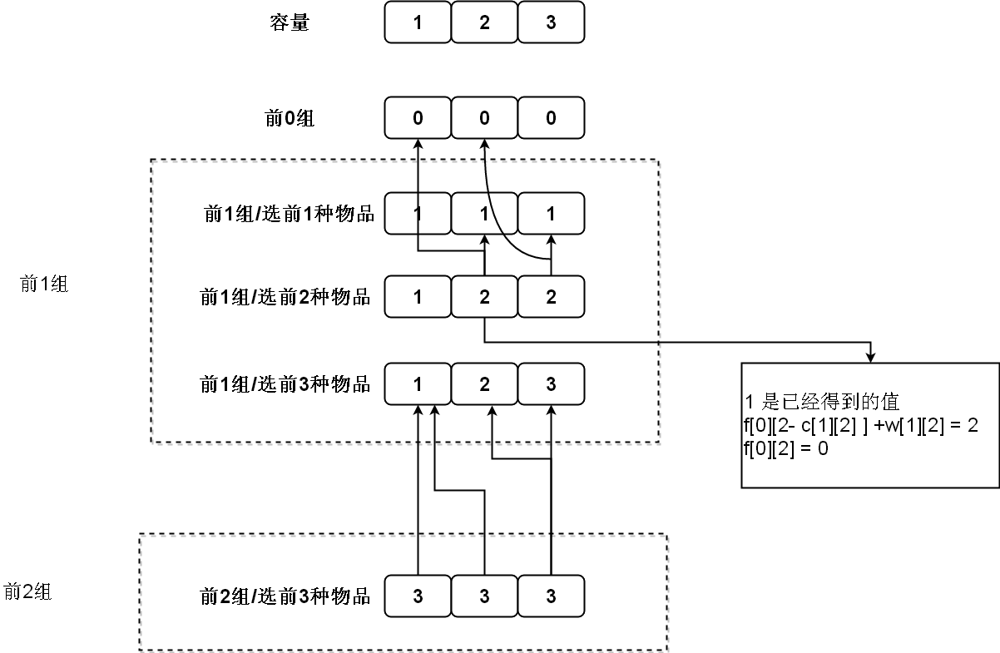
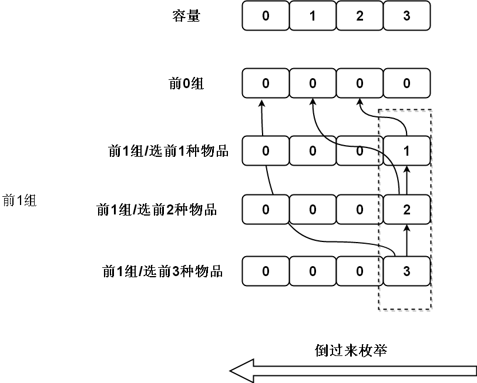

# 分组背包

题目:

 - cogs 810
 - [hdu 1712 ACboy needs your help](https://vjudge.net/problem/HDU-1712)

## 题目 ACboy needs your help

### 题目描述

ACboy这个学期有$$N$$节课,他计划最多只花费$$M$$天来学习.当然不同课程花费不同时间来学习,获得的学分不同.如何来安排M天来学习N节课才能得到最大的学分?

### 输入格式

有多组数据,每组数据以$$N$$和$$M$$开头.接下来是一个$$N \times M$$(行*列)的矩阵,其中$$a[i][j]$$
表示第$$i$$节课花费$$j$$天学习得到的学分.当$$N==0,M==0$$时,输入结束


### 输出格式

每行输出一组数据的最大学分.

### 样例输入

```
2 2
1 2
1 3
2 2
2 1
2 1
2 3
3 2 1
3 2 1
0 0
```

### 样例输出

```
3
4
6
```


## 解析

对数据$$a[i][j]$$可以想像成一个物品,消耗容量$$j$$(天),得到价值$$a[i][j]$$,只不过对于$$a[1][j] -> a[N][j]$$这$$N$$个物品,每种只能选一个,可以把分成一组.  

这就是标准的**分组背包**了:组内物品只能选一个.

我们设$$f[k][v]$$表示前$$k$$组物品在容量为$$v$$的条件下能得到的最大价值,显然有状态转移方程:

```math
f[k][v] = 
\left\{\begin{matrix}
 f[k-1][v] \\ 
 f[k][v] \\
 f[k-1][v-c[k][i]]+w[k][i]
\end{matrix}\right.
```

边界:$$f[0][v] = 0$$

其中:
 
 - $$f[k-1][v]$$ 表示前$$k-1$$组物品在容量为$$v$$的条件下能得到的最大价值
 - $$f[k][v]$$ 表示前$$k$$组物品,第$$k$$组物品的前$$i-1$$个物品,在容量为$$v$$的条件下,能得到的最大价值
 - $$c[k][i]$$ 第$$k$$组第i个物品的体积
 - $$w[k][i]$$ 第$$k$$组第i个物品的价值


以下数据:

```
2 3         //2节课 3天
1 2 3
3 2 1
```

**递推过程**




## 二维转一维




根据01背包的经验,二维转一维,根据上图,可以写出如下**伪代码**

```c
for(i=1;i<=k;i++) 
    for(v=V;v>0;v--)
        for(j=1;j=nums[k];j++){ //第k组的每个物品
            if( v- c[k][j] >=0) //能放下
            {
                f[v] = max(f[v],f[v-c[k][j]] +w[k][j])
            }
        }
```
记住:**这里三层循环的顺序保证了每一组内的物品最多只有一个会被添加到背包中。**


## 代码

```c
#include <cstdio>
#include <cstring>
#include <cmath>
#include <vector>
#include <deque>
#include <list>
#include <queue>
#include <stack>
#include <map>
#include <set>
#include <algorithm>
using namespace std;

#define mmax 110
int n,m;
int a[mmax][mmax];
int f[mmax] = {0};
int main(){

    int i,j,v;
    while(1){
        scanf("%d%d",&n,&m);
        if( n== 0 && m == 0 ) break;

        for(i=1;i<=n;i++)
            for(j=1;j<=m;j++)
                scanf("%d",&a[i][j]);

        //dp
        memset(f,0,sizeof(f));
        for(i=1;i<=n;i++) //前i组
            for(v=m;v>0;v--) // 拥有的天数
                for(j=1;j<=v;j++){ // 只[1,v]天的课能在最多天数v下能上
                    f[v] = max(f[v],f[v-j]+a[i][j]);
                }
        printf("%d\n",f[m]);

    }
    return 0;
}
```

============================================================

## 题目 2: I love sneakers!

来源[hdu 3033 变形的分组背包](http://acm.hdu.edu.cn/showproblem.php?pid=3033)

### 题目描述

在经过数月的努力工作后,Iserloh获得了可观的奖学金,作为一个球鞋迷,他决定在一个鞋店里把所有钱的都买鞋子.  


<center>

</center>

这里有多个品牌的鞋,Iserloh都想买,每个品牌又有不同的型号.Iserloh决定每一品牌至少买一个.  

Iserloh 根据自己的喜好给每个型号设定了一个价值,他想知道最大价值是多少.当然,每个型号不会买两次.

### 输入格式

### 输出格式

### 样列输入

```
5 10000 3
1 4 6
2 5 7
3 4 99
1 55 77
2 44 66
```

### 样列输出

```
255
```


