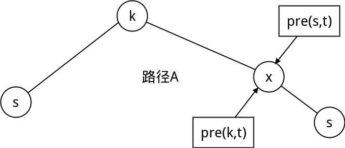
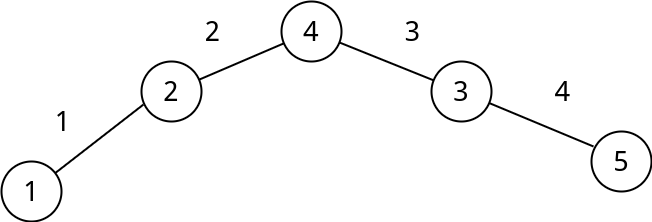

## floyed 算法原理


资料

链接: http://pan.baidu.com/s/1jHIOxee 密码: 724i

<br>
<center style="font-size:2em">
**floyed是用来求图上任意两点的最短路径的算法**
</center>
<br>

floyd算法是一个经典的动态规划算法。用通俗的语言来描述的话，首先我们的目标是寻找从点$$i$$到点$$j$$的最短路径。从动态规划的角度看问题，我们需要为这个目标重新做一个诠释（这个诠释正是动态规划最富创造力的精华所在），floyd算法加入了这个概念

$$A^k(i,j)$$：**表示从i到j中途不经过索引比k大的点的最短路径**。

这个限制的重要之处在于，它将最短路径的概念做了限制，使得该限制有机会满足迭代关系，这个迭代关系就在于研究：假设$$A^{k-1}(i,j)$$已知，是否可以借此推导出$$A^{k}(i,j)$$

假设我现在要得到$$A^k(i,j)$$，而此时$$A^k(i,j)$$已知，那么我可以分两种情况来看待问题：

 - $$A^k(i,j)$$沿途经过点k；
 - $$A^k(i,j)$$不经过点k。

如果经过点$$k$$，那么很显然,$$A^k(i,j) = A^{k-1}(i,k)+A^{k-1}(k,j)$$，为什么是$$A^{k-1}$$呢？因为对`(i,k)`和`(k,j)`，由于k本身就是源点（或者说终点），加上我们求的是$$A^k(i,j)$$，所以满足不经过比k大的点的条件限制，且已经不会经过点k，故得出了$$A^{k-1}$$这个值。那么遇到第二种情况，$$A^k(i,j)$$不经过点k时，由于没有经过点k，所以根据概念，可以得出$$A^k(i,j)=A^{k-1}(i,j)$$。现在，我们确信有且只有这两种情况:1经过点k，2不经过点k，没有第三种情况了，条件很完整，那么是选择哪一个呢？很简单，求的是最短路径，当然是哪个最短，求取哪个，故得出式子：

```math
A^k(i,j) = min\{A^{k-1}(i,j),A^{k-1}(i,k)+A^{k-1}(k,j)\}
```

**边界**: 我们认为$$A^0(i,j)$$,不经过任何点的时候i和j的最短距离,即直接相连的距离.
**初始化** 如果$$i$$与$$j$$相连,那么$$A(i,j) = W[i][j]$$,否则,$$A(i,j) = INF$$


## 压缩一维(k维)

原始的状态转移方程为: $$A^k(i,j) = min \\{ A^{k-1}(i,j),A^{k-1}(i,k)+A^{k-1}(k,j) \\}$$

因为$$A^k(i,k) = A^{k-1}(i,k)$$成立,所以我们在可以把$$k$$压缩掉.

```math
A(i,j) = min\{A(i,j),A(i,k)+A(k,j)\}
```


我们不用担心转移的过程中覆盖掉我们需要的状态

解释图:


todo


<br>
一句话算法:
<center style="font-size:2em">
floyd算法的原理: i,j 经过中间点k的最短路径,不停的枚举k
</center>
<br>

**核心代码:**

```c
void floyd(){
    int k,i,j;
    for(k=1;k<=n;k++){ //k在最外层

        for (i=1;i<=n;i++)
            for(j=1;j<=n;j++)
                if(f[i][k]+f[k][j]<f[i][j]){ //松弛法,如果能更小,那就更小
                    f[i][j] = f[i][k]+f[k][j]; 
                }
    }
}
```


## 如何输出路径




如果我们要输出$$s \rightarrow t$$的最短路径,我们先设$$pre(i,j)$$表示$$ i \rightarrow j$$的最短路上的$$j$$前面的那个点.

根据:$$f(s,t) = min\{f(s,t),f(s,k)+f(k,t)\}$$  
如果$$f(s,t)$$能被$$ f(s,k)+f(k,t)$$更新,那么$$pre(s,t) = pre(k,t)$$,我们设$$pre(k,t) = x$$


根据**最优子结构的性质**:如果路径$$A$$是$$ s \rightarrow t $$ 的最短路径.那么路径$$A$$的一部分$$s \rightarrow x $$ 一定是$$s$$到$$x$$最短的,所以最短路径$$s \rightarrow t$$的前一个点的前一个点一写是$$pre(s,x)$$

边界:

 - $$pre(i,i) = -1$$
 - $$pre(i,j) = i$$,$$i$$与$$j$$相连

## 代码:


如下图:


**输入:**

 - 第一行:n个点,m条边
 - 第二行:起点s,终点t
 - 以下m行:边的起点,终点,权值

**输出:**
 - 第一行:s到t的最短路
 - 第二行:输出s到t的最短的路径

数据1:

```c
5 7
1 5
1 2 2
1 3 4
1 4 7
2 3 1
3 4 1
2 5 2
3 5 6
```

数据2:



```c
5 5
1 3
1 2 1
1 5 10
2 4 2
4 3 3
3 5 4
```


代码:


```c
/*============================================================================
* Title : floyd 算法的实现
* Author: Rainboy
* Time  : 2016-04-12 11:13
* update: 2018-07-04 08:10
* © Copyright 2016 Rainboy. All Rights Reserved.
*=============================================================================*/

/*  floyd 算法的本质:DP
 *      f(i,j) = min{f(i,j),f(i,k)+f{k,j}}
 *  floyd算法的原理: i,j 经过中间点k的最短路径
 * */
#include <cstdio>
#include <cstring>

#define N 100
const int INF = 0x7f7f7f7f/3; //这里要这样写,防止溢出
int f[N][N],pre[N][N]; //pre 记录前趋
int n,m;//n个点,m条边
int s,t;//起点 终点

void floyd(){
    int k,i,j;
    for(k=1;k<=n;k++){ //k在最外层

        for (i=1;i<=n;i++)
            for(j=1;j<=n;j++)
                if(f[i][k]+f[k][j]<f[i][j]){ //松弛法,如果能更小,那就更小
                    f[i][j] = f[i][k]+f[k][j]; 
                    //pre[i][j]=k;
                    pre[i][j] = pre[k][j];
                }
    }
}

int main(){
    int i,j,k,l;
    scanf("%d%d",&n,&m);
    scanf("%d%d",&s,&t);

    /* 初始化 */
    memset(pre,-1,sizeof(pre));

    for(i=1;i<=n;i++)
        for(j=1;j<=n;j++){
            f[i][j] =INF;
            if( i == j) f[i][j] = 0;
        }
    for(k=1;k<=m;k++){
        scanf("%d%d%d",&i,&j,&l);
        f[i][j]=f[j][i]=l;//边界,也就是不经过任何点的时候,两个点的最短路径
        pre[i][j] = i; // pre的边界
        pre[j][i] = j;
    }

    /* 调用floyd */
    floyd();

    /* 输出dis */
    printf("%d\n",f[s][t]);

    /* 输出路径 */
    //printf("%d ",t); //终点
    for(j=t;j!=-1;j=pre[s][j])
        printf("%d ",j);

    return 0;
}

```


