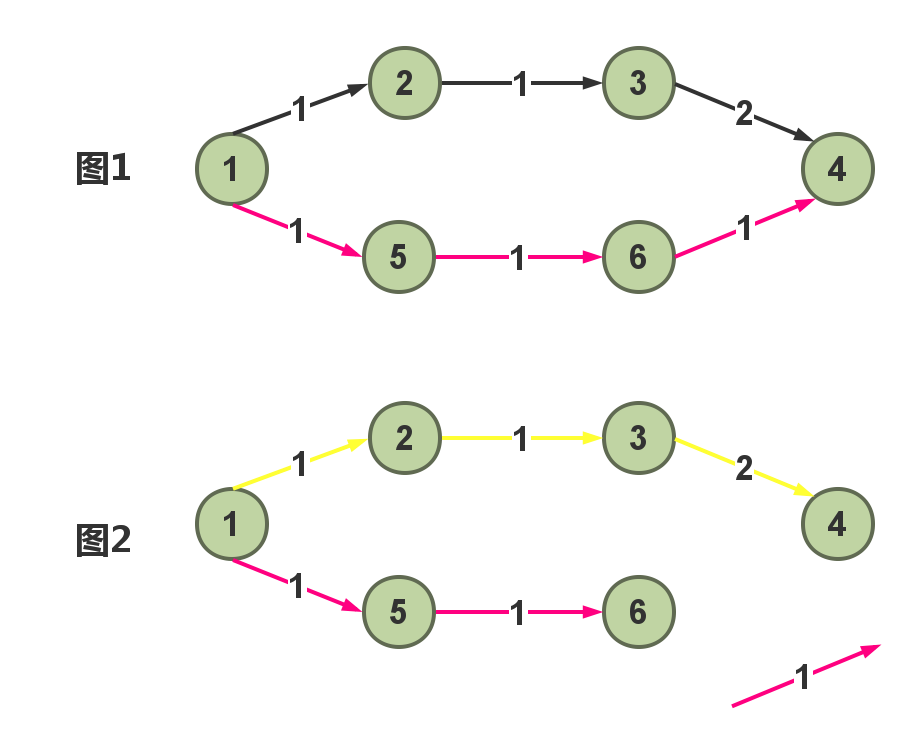

次最短路径

### 解释

我们要对一个有向赋权图(无向图每条边可以看作两条相反的有向边)的顶点S到T之间求次短路径，首先应求出S的单源最短路径。这样我样先求出`S->T`的最短路径X.
`E{x}`表示x上的边的集合,现在我们每一次去掉`E{x}`里的一边条,去求`S->T`的最短路径`Y`,求出的`Y`的集合为`{Y}`,那`{Y}`中最小的值,就是**次最短路径**.

### 原理:

<strong>割断最短路径去求</strong>

### 探讨

在实际的图中**最短路径X**和**次最短路径Y**两者有这样的关系:

**1.X==Y**

看作是从S到T有不止一条最短路径

**2.X < Y**

答案就是每次删边后大于原最短路径的S到T的最短路径长度的k最小值

### 算法复杂度分析 

用Dijkstra+堆求单源最短路径，则每次求最短路径时间复杂度为$$O(Nlog(N+M) + M)$$，所以总的时间复杂度为$$O(NM*log(N+M) + M^2)$$。该估计是较为悲观的，因为一般来说，在最短路径上的边的条数要远远小于M，所以实际效果要比预想的好。

### 具体代码
