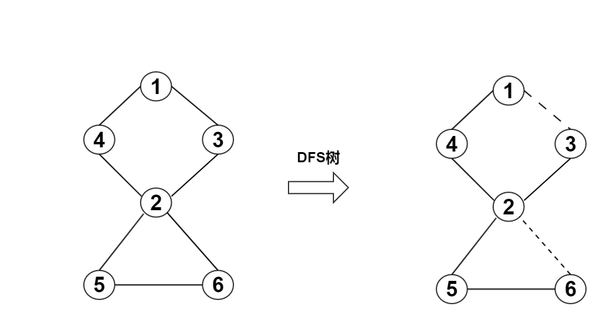
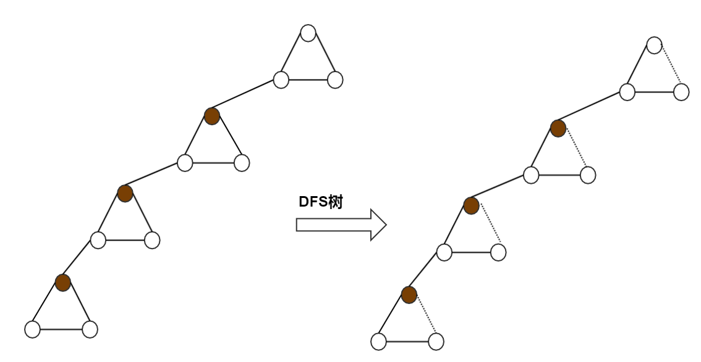

# 求无向图割点

## 定义

在无向连通图中，删除一个顶点v及其相连的边后，原图从一个连通分量变成了两个或多个连通分量，则称顶点v为割点，同时也称关节点(Articulation Point)。一个没有关节点的连通图称为重连通图(biconnected graph)。若在连通图上至少删去k 个顶点才能破坏图的连通性，则称此图的连通度为k。

 > 关节点和重连通图在实际中较多应用。显然，一个表示通信网络的图的连通度越高，其系统越可靠，无论是哪一个站点出现故障或遭到外界破坏，都不影响系统的正常工作；又如，一个航空网若是重连通的，则当某条航线因天气等某种原因关闭时，旅客仍可从别的航线绕道而行；再如，若将大规模的集成电路的关键线路设计成重连通的话，则在某些元件失效的情况下，整个片子的功能不受影响，反之，在战争中，若要摧毁敌方的运输线，仅需破坏其运输网中的关节点即可。

## 简单的例子

(a)中G7 是连通图，但不是重连通图。图中有三个关节点A、B 和G 。若删去顶点B 以及所有依附顶点B 的边，G7 就被分割成三个连通分量{A、C、F、L、M、J}、{G、H、I、K}和{D、E}。类似地，若删去顶点A 或G 以及所依附于它们的边，则G7 被分割成两个连通分量。





## 求割点的方法

暴力的方法：

 - 依次删除每一个节点$$v$$
 - 用DFS（或BFS）判断还是否连通
 - 再把节点$$v$$加入图中

若用邻接表，需要做$$V$$次DFS，时间复杂度为$$O(V \times (V+E))O(V \times (V+E))$$。

## 有关DFS搜索树的概念

在介绍算法之前，先介绍几个基本概念

 - **DFS搜索树：**用DFS对图进行遍历时，按照遍历次序的不同，我们可以得到一棵DFS搜索树，如图(b)所示。
 - **树边：**（或称为父子边），在搜索树中的实线所示，可理解为在DFS过程中访问未访问节点时所经过的边。
 - **回边：**（或称为返祖边、后向边），在搜索树中的虚线所示，可理解为在DFS过程中遇到已访问节点时所经过的边。

## 基于DFS的算法

该算法是R.Tarjan发明的。观察DFS搜索树，我们可以发现有两类节点可以成为割点：

 - 对根节点u，若其有两棵或两棵以上的子树，则该根结点u为割点`证明1`；
 - 对非叶子节点u（非根节点），若其子树的节点均没有指向u的祖先节点的回边，说明删除u之后，根结点与u的子树的节点不再连通；则节点u为割点。`证明2`
 - 对于根结点，显然很好处理；但是对于非叶子节点，怎么去判断有没有回边是一个值得深思的问题。

### 证明1

如果一个点`u`是DFS树的根结点,那么:

 - 如果去掉`u`后剩下的点是连通的,那根`u`只有一个子树,`u`不是割点
 - 如果去掉`u`后剩下的点不是连通的,那根`u`不只一个子树,`u`是割点

### 证明2

我们用`dfn[u]`记录节点u在DFS过程中被遍历到的次序号，`low[u]`记录节点u或u的子树通过非父子边追溯到最早的祖先节点（即DFS次序号最小），那么low[u]的计算过程如下：

```math
low[u] = \left\{\begin{matrix}
\min \{ low[u],\ low[v]\} & Note 1\\ 
\min \{ low[u],\ dfn[v]\} & Note 2
\end{matrix}\right.
```

 - $$Note1:$$ `(u,v)`为树边
 - $$Note2:$$ `(u,v)`为回边,且`u`不为`v`的父亲

下表给出图(a)对应的dfn与low数组值。

| i      | 0 | 1 | 2  | 3  | 4  | 5  | 6 | 7 | 8 | 9 | 10 | 11 | 12 |
|--------|---|---|----|----|----|----|---|---|---|---|----|----|----|
| vertex | A | B | C  | D  | E  | F  | G | H | I | J | K  | L  | M  |
| dfn[i] | 1 | 5 | 12 | 10 | 11 | 13 | 8 | 6 | 9 | 4 | 7  | 2  | 3  |
| low[i] | 1 | 1 | 1  | 5  | 5  | 1  | 5 | 5 | 8 | 2 | 5  | 1  | 1  |

下给出图(2)对应的dfn与low数组值。


对于情况2，当(u,v)为树边且`low[v] >= dfn[u]`时，节点u才为割点。该式子的含义：以节点u为根的子树所能追溯到最早的祖先节点不超过自己本身`u`

 - 如果`low(v) = dfn[u]`,证明`u`的子树的点最早只能回到点`u`,子树上至少有一条**回边**连接`u`
 - 如果`low(v) > dfn[u]`,证明`u`的子树的点最早能回到点到达不了点`u`,子树上没有**回边**连接`u`


## 讨论:什么是 low[u] = min(low[u], dfn[v]);

当点`u`在DFS过程中,边`(u,v)`是一条回边,什么这样更新: `low[u] = min(low[u], dfn[v]);`而不是:`low[u] = min(low[u], low[v]);`?

```c
else if(v != fa[u]) { // fa[u] != v 证明(u,v) 不是树边
    low[u] = min(low[u], dfn[v]);
}
```

看下图:


DFS的顺序为:`1,4,2,3,5,6`,如果我们使用:`low[u] = min(low[u], low[v]);`,那么访问到点`6`的时候,`low(6) = low(2) = 1`,这说明点`6`能回到理早的点`1`,但是是通过割点`2`回去的!!

如果使用:`low[u] = min(low[u], low[v]);`更新,那么一个存在割点的连通无向图,那每个点都能回到最早的点,那就求不出最早的点.就求不出来割点.

如果使用:`low[u] = min(low[u], dfn[v]);`,那么一个点能通过的**回边**回到的较早点就是**回边的另一个点**,这样不会通过割点回到更早的点,顶多通过**回边**回到割点.


### 体会下面的图:



红点为一部分割点,虚线为回边,我们不希望通过**连接割点的回边**回到更早的点


红点为割点,在DFS的过程中,通过`low[u] = min(low[u], dfn[v]);`,蓝点能回到的更早的只能是割点:红点.所有的蓝点都被**局限在**红点以下

通过回边更新时,应该描述为:点`u`通过回边能到达的更早的值为相临的点`v`,且`(u,v)`为回边

## 具体代码

**图:**


**数据:**

第一行表示n个点,m条边
第2行到第m+1行表示边

```
6 7
1 3
1 4
4 2
2 6
2 5
3 2
5 6
```


### 代码
```c
#include <cstdio>
#include <cstring>

#define N 100

int n,m;//存点 边

bool vis[N] = {0}; // 是否访问过
int fa[N] = {0}; //存父亲
int dfn[N] = {0}; //存点的时间序号
int low[N] = {0};
int cnt = 0; // 序号记数

struct Edge {
    int v;
    int next;
}E[N];
int size = 0;
int head[N];

void addEdge(int x,int y){
    size++;
    E[size].v = y;
    E[size].next = head[x];
    head[x] = size;
}

int min(int a,int b){
    if(a <b) return a;
    return b;
}

void tarjan(int u){
    cnt++; // 记数
    int child = 0;
    vis[u] = 1;

    dfn[u] = low[u] = cnt;

    int i;
    for(i=head[u];i!=-1;i=E[i].next){
        int v = E[i].v;
        if(vis[v] == 0){ // 没有访问过,(u,v)为树边
            child++;
            fa[v] = u;
            tarjan(v);
            low[u] = min(low[u],low[v]);
            // 情况1
            if(fa[u] == -1 && child > 1){
                printf("ge dian is :%d\n",u);
            }
            // 情况2
            else if ( fa[u] != -1 && low[v] >= dfn[u]){
                printf("ge dian is :%d\n",u);
            }
        }
        // v 已经访问过,(u,v)为回边
        else if( v != fa[u]){ //如果fa[u] = v , 那(v,u) 是树枝,不能能过树枝更新
            low[u] = min(low[u],dfn[v]);
        }
    }
}

int main(){
    memset(head,-1,sizeof(head));
    memset(fa,-1,sizeof(fa));
    scanf("%d%d",&n,&m);
    int i,j;
    for(i=1;i<=m;i++){
        int x,y;
        scanf("%d%d",&x,&y);
        addEdge(x,y);
        addEdge(y,x);
    }

    tarjan(1);
    return 0;
}
```

## 一句话算法

**`low[v] >=dfn[u]`**代表`u`的孩子`v`找不到另一条路绕过点`u`,`u`为割点

## 说明

部分抄自 http://www.cnblogs.com/en-heng/p/4002658.html
