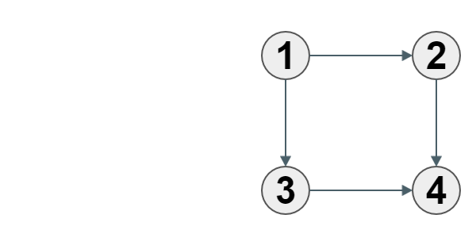
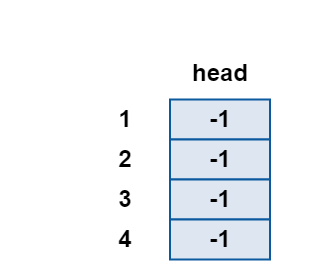
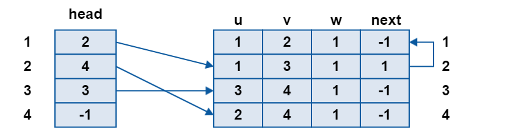

## 边集数组

todo!!

## 静态链表(向量星)

有没有一种数据结构既有**邻接表的优点**(占用内存少,查找时间快),又**不用指针**呢?

在边集数组的基础上,创建了一种数据结构:**向量星**

这一种方式是我们常常用的,所以一定要**记住**.

有关**静态链表**的实现原理,请自己下载这个文件来看

链接: http://pan.baidu.com/s/1boNgdI3 密码: 8qd7

我们通过开两个数组的方式来实现:

 - `head数组`:模拟表头,`head[i]`表式第一个以点`i`为起点的边的编号
 - `Edge`边集数组
    - `E[i].u`:表示编号为`i`的边的起点
    - `E[i].v`:表示编号为`i`的边的终点
    - `E[i].w`:表示编号为`i`的边的权值
    - `E[i].next`:表示下一条同起点(u)的边的编号,-1表示没有下一边同起点


**图例**

原图


head数组


存储后


**代码模版**

```c
//最多N个点,M条边
int head[N];
int size = 0;
struct Edge {
    int u,v,w,next;
}E[M];

memset(head,-1,sizeof(head));

void addEdge(int x,int y,int z){
    size++;
    E[size].u = x;
    E[size].v = y;
    E[size].w = z;
    E[size].next = head[x];
    head[x] =size;
}
for(i=0;i<m;i++){
    int x,y,z;
    scanf("%d%d%d",&x,&y,&z);
    addEdge(x,y,z);
}
```
**如果想存无向图,可以把每条边存两遍!**`addEdge(x,y,z); addEdge(y,x,z);`


检查从**a**出发的所有边

```c
for(i=head[a];i!=-1;i = E[i].next){
    //u[i]  起点
    //v[i]  终点
    //w[i]  权
}

```

**一个实际的代码**

输入和上面一样

```c
#include <cstdio>
#include <cstring>

#define M 100
#define N 100

//最多N个点,M条边
int head[N];
int size = 0;
struct Edge {
    int u,v,w,next;
}E[M];

void addEdge(int x,int y,int z){
    size++;
    E[size].u = x;
    E[size].v = y;
    E[size].w = y;
    E[size].next = head[x];
    head[x] =size;
}

int n,m;

int main(){

    memset(head,-1,sizeof(head));
    int i,j;

    scanf("%d%d",&n,&m);

    int x,y,z;
    for(i=0;i<m;i++){
        scanf("%d%d%d",&x,&y,&z);
        addEdge(x,y,z);//无向图存两次
        addEdge(y,x,z);
    }

    //检查从**a**出发的所有边
    int a = 0;
    for(i=head[a];i!=-1;i = E[i].next){
        //u[i]  起点
        //v[i]  终点
        //w[i]  权
        printf("{%d->%d}:%d\n", E[i].u, E[i].v, E[i].w);
    }

    return 0;
}
```

