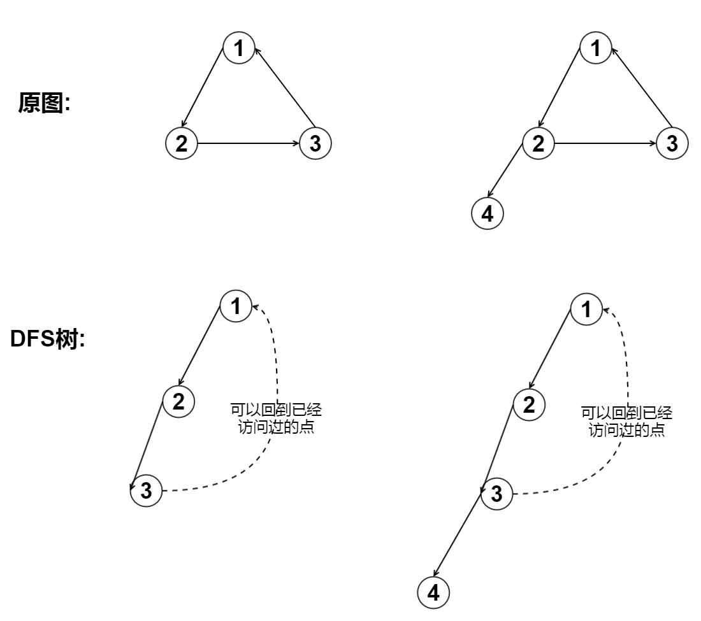

# TarjanDFS求强连通分量

## 前面

在有向图G中，如果两个顶点间至少存在一条路径，称两个顶点强连通(strongly connected)。如果有向图G的每两个顶点都强连通，称G是一个强连通图。非强连通图有向图的极大强连通子图，称为强连通分量(strongly connected components)。

下图中，子图{1,2,3,4}为一个强连通分量，因为顶点1,2,3,4两两可达。{5},{6}也分别是两个强连通分量。


直接根据定义，用双向遍历取交集的方法求强连通分量，时间复杂度为O(N^2+M)。更好的方法是Kosaraju算法或Tarjan算法，两者的时间复杂度都是O(N+M)。本文介绍的是Tarjan算法。

如点A和点B开始DFS,如果A可以访问的点的集合{A}中有B点,且B的集合中有{A},那A和B是可以相互访问的,我们对任意两个点进行这种操作,共进行$$N^2$$次.


## 体会

写出要求强连通分量图中的点DFS访问顺序,找规律.


假设我们从1开始DFS，那么到达1的时间为1，到达2的时间为2，到达3的时间为3。同时，点1能直接或间接到达的点中，最小时间为1，点2能通过3间接到达点1，所以点2可到达最早的点时间为1，点3可以直接到达点1，故点3到达的最早的点的时间为1。


我们发现在一个重要性质:**强连通分量上的点可以互相到达,那么在DFS过程中,如果一个点是强连通分量,那么这个点可以到达更早的点,除非它是强连通分量所形成的子树的根**

## 原理

**例:原图**


**DFS形成的树:**


1.在DFS中,同一强连通分量内的所有顶点都在同一棵深度优先树搜索树中,也就是说强连通分量一定是DFS树的子树

2.如果我们从DFS树的最底层**每个强连通分量的根**以下的点都输出,那就可以一个个输出强连通分量了

3.如何确定DFS树中的某个点是一个强联通分量的根?

有这样的一些性质:

 - 因为强连通分量里的点都可以互相访问
 - 在DFS的过程中,如果某个点A能访问比自己访问时间更早的点B,那A和B可以互相访问
 - 如果点A不能找到一个比自己访问时间更早的点B,那这个点一定当前强联通分量的根

**反证法证明第三点:**

如果点A不是强联通分量的根,点A一定属于某个强连通分量,那一定有某个回路可以让A回到祖宗(根),那A一定可以访问到比较自己时间更少的点


### 解决输出强连通分量问题

我们按点的访问顺序压入栈$$S$$中:

 - 在dfs过程中,强连通分量一定是某一个子树
 - 当回溯到点$$u$$时,那么U的子树上点都被压入$$S$$中了
 - 如果此时点$$u$$是强连通分量所在的子树的根,
 - 那么栈里的在$$u$$上面的点都是$$u$$子树(属于其它强连通分量的点都被输出过了)
 - 把这些点输出

证明一个点$$u$$是强连通分量子树根后,只要输出那些还没有被输出过的点,且访问时间比点$$u$$晚的点就行了,栈只是正好满足我们的要求

## 算法过程

我们维护两个数组,**index[i]**,**low[i]**,一个堆栈**stack**

 - `index[i]`表示点`i`开始访问的时间序号,也写作`DFN[i]`
 - `low[i]`表示点`i`能访问访问过点中的最小的时间序号(其时,只要比当前点的时间序号小就可以)
 - `stack`按访问顺序压入点,DFS回溯到强连通分量的根的时候,弹出根后面的点

根据定义我们知道:


```
low[i] = min {
    index[i],
    low(j),(i,j)存在边i-->j,dfs树的树枝边
    index(j),(i,j)存在,但j已经访问过了,为指向栈中节点的后向边
}
```
当$$index(i)=Low(i)$$时，以i为根的搜索子树上所有节点是一个强连通分量


伪代码:

```c
tarjan(u)
{
    DFN[u]=Low[u]=++Index                      // 为节点u设定次序编号和Low初值
    Stack.push(u)                              // 将节点u压入栈中
    for each (u, v) in E                       // 枚举每一条点u开头的边
        if (v is not visted)               // 如果节点v未被访问过
            tarjan(v)                  // 继续向下找
            Low[u] = min(Low[u], Low[v])
        else if (v in S)                   // 如果节点v还在栈内
            Low[u] = min(Low[u], DFN[v]) //Low[u] = min(Low[u], low[v]) 理论上这样写也可以
    if (DFN[u] == Low[u])                      // 如果节点u是强连通分量的根
        while(u != v)
            v = S.pop                  // 将v退栈，为该强连通分量中一个顶点
            print v
}
```

## 一句话算法:

<center>
 - 当(u,v)是树枝边时`low[u] = min(low[u],low[v])
 - 当(u,v)是回边,且另一个点没有被输出(在stack内)时,`low[u] = min(low[u],dfn[v])`
 - 当dfs退出点u,判断u是不是强连通分量的根,`dfn[u] == low[u]`
</center>


## 具体代码

**算法实现过程:**

 - 对于dfs中的每个点
 - 初始化`index[x]`和`low[x]`
 - 对`x`的所有临接点'v':
  - 如果没有被访问过,则访问v,同时维护low[x]
  - 如果被访问过,但没有被输出,就维护low[x]
 - 如果`index[x] == low[x]`,输出


数据:

第1行表示:有m条边和n个点
第2行到第m+1行表示有向边

```
8 6
1 3
3 5
5 6
1 2
4 1
4 6
3 4
2 4
```

**代码:**

```c
/* -----------
 *  原理,:一个分量里的点都可以互相访问
 * 算法实现:
 *      1.初始化 dfn[i], low[i]
 *      2.对i所有相临的结点j
 *          1.if !vis[j] dfs[j]
 *          2.if vis[j] low[i] =dfn[j]
 *      3.if dfn[i] = low[i]
 * */

#include <cstdio>
#include <cstring>
#define maxn 1000 //最多的点
int n,m; // n个点,m条边
bool instack[maxn] ={0}; // 是否在栈里
int low[maxn];
int dfn[maxn] ={0};
int color[maxn]; // color[i] 点i的强连通分量编号,给强连通分量涂色
int stack[maxn],top=0; // 自己维护的stack ,可以用 STL stack
int cnt =0; //记录有几个强连通分量
int idx = 0; // 点的访问时间序号
int vis[maxn] = {0}; // 标记是否访问
//存图

struct Edge{
    int u,v;
    int next;
}E[maxn];
int head[maxn];
int size = 0;

//压栈,top永远指向栈顶
void push(int a){
    stack[++top] = a;
}

//弹栈,top永远指向栈顶
int pop(){
    return stack[top--];
}

void addEdge(int x,int y){
    size++;
    E[size].u = x;
    E[size].v = y;
    E[size].next = head[x];
    head[x] = size;
}

int min (int a,int b){
    if( a< b) return a;
    return b;
}

void tarjan(int u){
    vis[u] =1;//标记访问
    dfn[u] = low[u] = ++idx;
    instack[u] =true; //在栈内,可以用来判断这个是不是已经被访问过
    push(u);
    int i;
    for(i=head[u]; i != -1; i = E[i].next){
        int v = E[i].v;
        if(vis[v] == 0) // vis[j] == 0 表示 这个点没有被访问过
        {
            tarjan(v);
            low[u] = min(low[u],low[v]);//(u,v)是树边
        }
        // (u,v) 是回边
        else if(instack[v]) //更新,访问过没有被删除
            low[u] = min(low[u],dfn[v]);
            //low[u] = min(low[u],low[v]);
    }

    if(dfn[u] == low[u])//强连通分量树的根
        {
            cnt++;//强连通分量个数+1
            int t;
            do{
                t = pop();
                instack[t] = false;
                color[t] = cnt;
            }
            while(t != u);
        }
}
int main(){
    int i,j;
    memset(head,-1,sizeof(head));
    scanf("%d%d",&m,&n);
    //读取图 这里用边集数组
    for(i=1;i<=m;i++){
        int x,y;
        scanf("%d%d",&x,&y);
        addEdge(x,y);
    }
    for(i=1;i<=n;i++){ // 遍历所有点
        if(vis[i]==0) // 没有被访问过
            tarjan(i);
    }
    printf("%d\n",cnt);
    return 0;
}
```


## 如何证明TarjanDFS是对的?


low() 一个操作一定是对的

在DFS中,同一强连通分量内的所有顶点都在同一棵深度优先树搜索树中,也就是说强连通分量一定是DFS树的子树

这个子树的元素在栈中一定是相临的,且root在子树所有元素的下面
dfn用来记录

强连通分量是由若干个环组成的。所以，当有环形成时（也就是搜索的下一个点已在栈中），我们将这一条路径的low值统一，即这条路径上的点属于同一个强连通分量。

如果dfn=low,那这个点一定是root,输出


按我们的定义,DFS子树上的low 值应该一样,这是一种理解状态,但是算法的过程中,应该能实际达到一样.

猜想:当点i low[i]=dfn[i] 时 i为root点,输出 stack.top -> stack.i的元素,

如果一个点i已经 遍历完它的所有相临点,有如果有一个点j,且点`dfn[j] < dfn[i]`那low[i] 一定会变得比dfn[i] 小(但是不是理论值,dfn[root])

low[i] 应该是代表i相连的最早的点

-------------------

DFS 中一个强连通分量 里的点 可以相互访问,所以一定在一棵DFS树中,又因为一个DFS树可能有多个强连通分量,所以一定是DFS对的子树

DFS在


验证 
根据我们自己构造的数据,确实是这这样的,

## 讨论low[u] = min(low[u], low[v])

```c
else if (v in stack) 
    low[u] = min(low[u], dfn[v]) => low[u] = min(low[u], low[v])
```
low[i]是点i可达点集的最小dfn，且dfn[i]和i是双射的，记dfn−1[dfn[i]]=i。如果low[v]=a，则说明v可以到达dfn−1[a]，而u又能到达v，故u也能到达dfn−1[a]则low[v]<low[u]时，确实可以让low[u]取到low[v]。而dfn[v]>=low[v]，不禁要怀疑原来的式子是不是不够紧？ 
想了想，其实这两种方法求出的强连通分量是相同的，只是过程有些不一样。给出下面5幅图，dfs顺序为从上到下，从左到右。要保证v比u先入栈，且v可能比u的根更早入栈（图1，2），或更晚（图3，4，5），且v可能回溯成环（图2，4，5），实际上图3，4不会存在，因为v随着自己的强连通分量被弹出栈了！虽然u的low值会被带歪，但是可以保证的是，只有能囊括所有最大强连通分量的根才会出现low值等于dfn值，并提出该强连通分量。 
low 


如果哪天遇到反例了一定要告诉我啊

## 一句话算法

tarjan算法的本质是利用DFS过程中可以尝试访问更早的点的性质,来确定哪些点可以互相访问,形成强连通分量.

**`low[u] == dfn[u]`**表明`u`的孩子`v`可以

在dfs的过程中,如果v是u的孩子,那么证明u可以到v,且`dfn[u] < dfn[v]`

存在一条回边让v回到更更早的点j,那v的祖先也可以通过v到达j,如果j是v的祖先,那形成了一个环,它们可以互相访问了

low[u] 可以通过孩子来更新,一个强连通分量内的能回到的最早点一个是这个分量内最先被DFS的点,那这个点x:`low[x] == dfn[x]`


(u,v)是回边时,

为什么`low[u] = min(low[u],dfn[i])`是正确的?

我们只要证明一个点能回到更早的点就行了,这个点可以通过那个点继续回到更早的点,但是有一个点不能回到更早的点:强连通分量子树的根,我们主要是找这个点.

## 引用
 
- https://www.byvoid.com/blog/scc-tarjan/
- http://www.cnblogs.com/saltless/archive/2010/11/08/1871430.html
- http://blog.csdn.net/danliwoo/article/details/51839290
