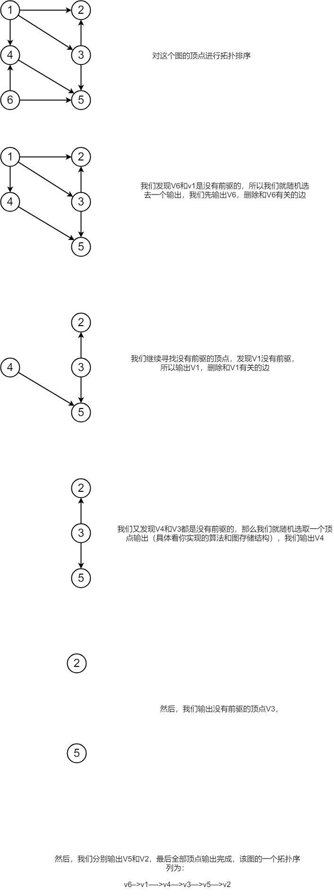

# 拓扑排序

拓扑排序可用来解决什么问题呢？比如说课程排序，编译依赖，类似凡是涉及到相关顺序的时间安排；还可以用来**判断一幅有向图是否无环**。

题目地址:[P1038 神经网络](https://www.luogu.org/problemnew/show/P1038)

**拓扑排序算法思想**

1. 在DAG网络中选一个没有直接前驱的顶点, 并输出之;
2. 从图中删去该顶点, 同时删去所有它发出的有向边;
3. 重复以上步骤, 直到全部顶点均已输出，拓扑有序序列形成，拓扑排序完成；


数据1:

```
6 8
1 2
1 3
1 4
3 2
3 5
4 5
6 4
6 5
```

```
6 1 4 3 5 2
```

```
13 15
1 2
1 6
1 7
3 1
3 4
4 6
6 5
7 4
7 10
8 7
9 8
10 11
10 12
10 13
12 13
```

```
9 8 3 1 7 10 12 13 11 4 6 5 2
```

## Kahn算法

### 拓扑排序示例手动实现



### 代码实现

Kahn的算法的思路其实就是我们之前那个手动展示的拓扑排序的实现，我们先使用一个栈保存入度为0 的顶点，然后输出栈顶元素并且将和栈顶元素有关的边删除，减少和栈顶元素有关的顶点的入度数量并且把入度减少到0的顶点也入栈。具体的代码如下：

 1. 初始化:将所有入度为0的点入栈
 2. 从栈中取出一个元素a,更新a的后趋点的入度,如果发现有入度为0的点加入栈
 3. 重复2,直到栈为空
 4. **如果栈空了还有元素没有被输出,证明有环**


```c
/*  kahn拓扑排序
 *
 * */
#include <cstdio>
#include <cstring>

#define N 10000
int n,m;

int indgree[N] = {0}; //入度

int first[N];
int edge_cnt = 0;
struct _e{
    int u,v,w,next;
}e[N];

void addEdge(int u,int v,int w){
    edge_cnt++;
    e[edge_cnt].u = u;
    e[edge_cnt].v= v;
    e[edge_cnt].w=w;
    e[edge_cnt].next = first[u];
    first[u] = edge_cnt;
}

/* 栈的操作 */
int stack[N];
int idx = 0;

//压栈
void push(int x){
    stack[idx++] = x;
}

//弹出
int pop(){
    return stack[--idx];
}

//栈是否为空
bool empty(){
    return idx == 0;
}

int kahn(){
    //count用于计算输出的顶点个数
    int count=0;
    int i,j,k;
    //把入度为0的顶点入栈
    for (i=1;i<=n;i++){
        if( indgree[i] == 0)
            push(i);
    }

    while (!empty()) {//如果栈为空，则结束循环
        int t = pop();
        printf("%d ",t); //输出
        count++;

        // t点周围的点,入度-1
        for(i=first[t];i!=-1;i = e[i].next){
            int v = e[i].v;
            indgree[v]--;
            if( indgree[v] == 0) //如果入度减少到为0，则入栈
                push(v);
        }
    }

    return count++;
}

int main(){
    memset(first,-1,sizeof(first));
    scanf("%d%d",&n,&m);
    int i,j,k;
    int t1,t2;
    for(i=1;i<=n;i++){
        scanf("%d%d",&t1,&t2);
        indgree[t2]++;
        addEdge(t1,t2,0);
    }
    kahn();
    return 0;
}
```


## DFS的方法

dfs搜索本质就是利用栈这种数据结构,那么我们可以用DFS来写拓扑排序吗?当然是可以的,想一想,在DFS的过程中:

 - 边界:一个点没有后趋了,把它存入栈中,
 - 一个点回溯了,那这个点后面的点都已经访问过了.把它存入栈中
 - 输出中栈中元素

具体看代码

```c
/*  dfs拓扑排序
 *
 * */
#include <cstdio>
#include <cstring>

#define N 10000

int first[N];
int edge_cnt = 0;
struct _e{
    int u,v,w,next;
}e[N];

void addEdge(int u,int v,int w){
    edge_cnt++;
    e[edge_cnt].u = u;
    e[edge_cnt].v= v;
    e[edge_cnt].w=w;
    e[edge_cnt].next = first[u];
    first[u] = edge_cnt;
}

int n,m;
bool instack[N] = {0};

int stack[N];
int stack_index = 0;

void push(int x){
    stack[stack_index++] = x;
}


void topSort_dfs(int u){

    int i;
    for(i=first[u];i!=-1;i=e[i].next){
        int v = e[i].v;
        if( ! instack[v]){ //不在栈中,没有被输出
            topSort_dfs(v);
            //没有后趋
        }
    }
    instack[u] = 1;
    push(u);
}

int main(){
    memset(first,-1,sizeof(first));
    scanf("%d%d",&n,&m);

    int i,j,k;
    int t1,t2;
    for (i=1;i<=m;i++){
        scanf("%d%d",&t1,&t2);
        addEdge(t1,t2,0);
    }

    for (i=1;i<=n;i++){
        if( ! instack[i]) // 没有在栈中
            topSort_dfs(i);
    }

    for(i=stack_index-1;i>=0;i--)
        printf("%d ",stack[i]);
    return 0;
}

```

## 两种算法总结：

对于基于DFS的算法，增加结果集的条件是：顶点的出度为0。这个条件和Kahn算法中入度为0的顶点集合似乎有着异曲同工之妙，Kahn算法不须要检测图是否为DAG，假设图为DAG，那么在入度为0的栈为空之后，图中还存在没有被移除的边，这就说明了图中存在环路。而基于DFS的算法须要首先确定图为DAG，当然也可以做出适当调整，让环路的检测測和拓扑排序同一时候进行，毕竟环路检測也可以在DFS的基础上进行。
二者的复杂度均为O(V+E)。


## 练习题目

 - luogu P1137 旅行计划 普及+/提高
 - luogu P1347 排序 福建省历届夏令营 普及+/提高
 - luogu P1807 最长路_NOI导刊2010提高（07） NOI导刊 普及/提高-
 - luogu P1983 车站分级 NOIp普及组 2013 O2优化 高性能 普及+/提高
 - luogu P2149 [SDOI2009]Elaxia的路线 各省省选 2009 山东 高性能 省选/NOI-
 - luogu P2403 [SDOI2010]所驼门王的宝藏
