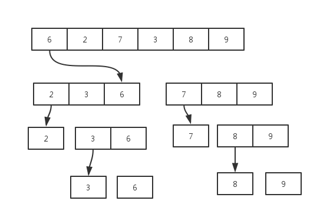
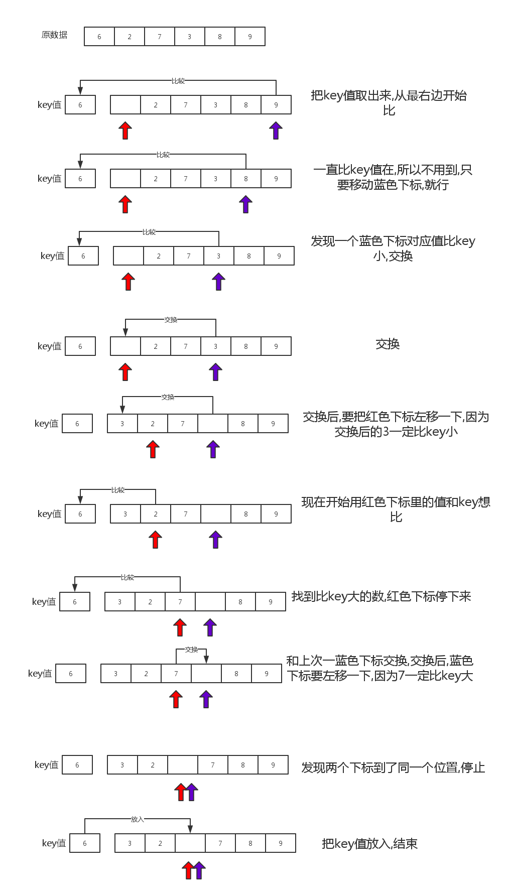

# 快速排序


**快速排序的基本思想:** 通过一趟排序将数组分成两个部分,其中一个部分都比**关键字**小,另一个部分都比**关键字**大,然后再分别对这两部分进行这种操作,最后就可以达到全部有序.通常我们取待排序部分的第一个值为**关键字**.




我们能不能把步骤想的更具体一点,怎么样做才能把数分成这样的两个部分?



上面的图片解释了一趟快速排序的原理,如果你有足够的想想象力,可以把红色,蓝色下标想象成两个**机器人,它们不停的移动去判断值,一但符合条件,就把箱子里的值仍给另一个机器人,自己停止,另一个机器人又开始工作**,这样的不停往返的下去,就可以把数分成两个部分了.


快速排序代码

```c
/* 
 *   快速排序本质:
 *      用key值,把数据分成两个部分,一部分比较key小,一部分比key大
 * */

#include <cstdio>

int a[]={6,2,7,3,8,9};

void quicksort(int l,int r){
    if( l < r) {
    int s=l,t=r;
    int key =a[l]; // 取第一个值为key
    
    while(s < t){
        while( s <t && a[t] >= key) --t;// 如果a[t] >= key,t下标不停变小,直到a[t] < key
        if(s < t) a[s++] = a[t];        //停下来的时候,看一看,是不是到中点,如果不是 交换值
        while(s<t && a[s] <= key) ++s;  //如果a[s] <= key  s的下标不停变大,直到a[s] > key
        if(s<t ) a[t--] = a[s];         //停下来的时候,看一看,是不是到了中点,如果不是,交换值
    }
    a[s] = key;  //上面while停止的时候,一定是s ==t
    quicksort(l,s-1);
    quicksort(s+1,r);
}
}

int main(){
    int len_a = sizeof(a)/sizeof(a[0]);
    quicksort(0,len_a-1);
    return 0;
}

```


## 练习题目

 - luogu P3887 [GDOI2014]世界杯
 - luogu P2909 [USACO08OPEN]牛的车Cow Cars
 - luogu 三值的排序 Sorting a Three-Valued Sequence
 - luogu P2920 [USACO08NOV]时间管理Time Management 
 - luogu P2777 [AHOI2016初中组]自行车比赛
 - luogu P2878 [USACO07JAN]保护花朵Protecting the Flowers USACO 2007 普及/提高-
 - luogu P3111 [USACO14DEC]牛慢跑Cow Jog_Sliver
 - luogu P2255 [USACO14JAN]记录奥林比克Recording the M…
