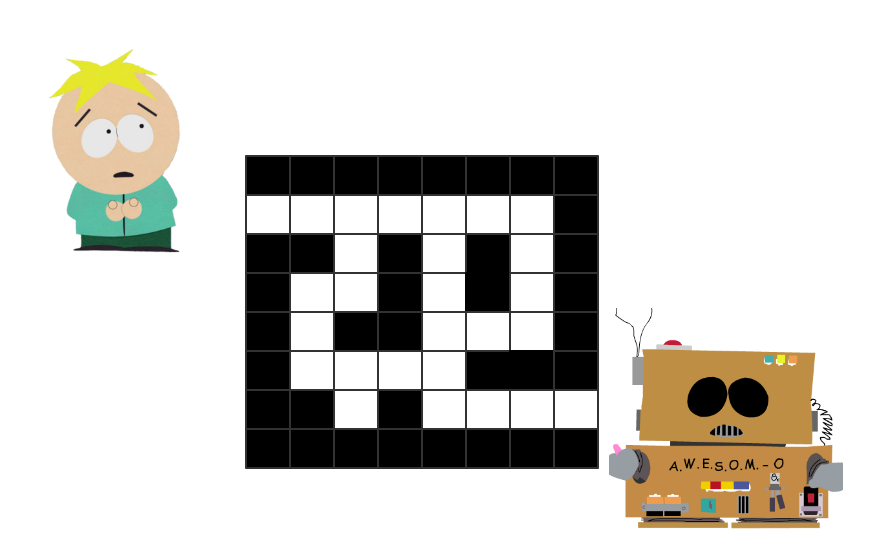

## 迷宫问题引入: 求解迷宫问题是否有解


### [问题描述]

你是一个善良的男孩Butter,有一天你被邪恶的巫师Cartman抓到了**黑暗迷宫**,黑暗迷宫的魔法可以让所有进入的人失明.迷宫中**黑色**的格子是**诅咒陷阱**,进入就会死亡(迷宫的外围是火海),白色的格子是安全的格子.

在你一无所措的时候,有一个善良机器人**AWRSOM-O**向你发信息.它可以告诉你所在的格子的**上下左右**的四个格子是哪种格子,而且还可以告诉你某个格子是不是以前走过了.

问你能走出迷宫吗?如果能就输出:**YES**,不能输出:**NO**



### [输入格式]

 - 第一行一个数:$$n$$,表示这是一个$$ n \times n$$ 的迷宫,起点为坐标`1,1`
 - 第二行4个数,分别表示迷宫的入口和出口
 - 接下来n行每一行有n个数,由0,1组成
 - 0表示白色的格子,1表示黑色的格子


### [输出格式]

如果迷宫有解输出`YES`,否则输出`NO`

### [输入样列]


```
8
2 1 7 8
1 1 1 1 1 1 1 1
0 0 0 0 0 0 0 1
1 1 0 1 0 1 0 1
1 0 0 1 0 1 0 1
1 0 1 1 0 0 0 1
1 0 0 0 0 1 1 1
1 1 0 1 0 0 0 0
1 1 1 1 1 1 1 1
```

### [输出样列]


```
YES
```

## 解析

我们要设一个值`vis[x][y]`表示x,y点是不是已经走过,因为走以前走过的路,没有意义

如果方向先左走,如下图`1`表示已经走过的点,如果不设访问过标记`vis[x][y]`,会不停的往回走

```
+---+---+---+---+---+
| 1 | 1 | 1 |   |   |
+---+---+---+---+---+
    <-------------- 方向优先
```


这里采用的是DFS的想法:

 - 如果下一个格子能走就往下走
 - 走过的格子的不能走
 - 如果4个方向的可能性都尝试过了且都不能走:就回溯

**cgdb**调试一遍看看

## 代码

```c
#include <cstdio>

#define ms 100 //迷宫最大大小

int n; //迷宫大小
int sx,sy,zx,zy;// 起点与终点
int fx[4][2] = {  {-1,0},{0,1},{1,0},{0,-1}};
int mg[ms][ms]; //存迷宫
bool visted[ms][ms] = {0};


//x,y是不是在迷宫内
bool in_mg(int x,int y){
    if(x <= n && x>=1 && y <=n && y >=1)
        return true;
    return false;
}

//调用了 dfs 相当于进入了x,y这个点
bool dfs(int x,int y){

    visted[x][y] =1; //设这个点走过
    if(x == zx && y == zy) //表示已经到了终点
        return true;

    int i;
    for(i=0;i<4;i++){
        
        int tx = x+fx[i][0];
        int ty = y+fx[i][1]; //tx,ty 下一个格子的坐标

        //判断tx,ty 是不是可以走的格子
        if( in_mg(tx,ty) && mg[tx][ty]!=1 && visted[tx][ty] !=1){ 
            if( dfs(tx,ty) == true)
                return true;//只要返回true 这层函数就结束了
                            // 上层函数也会接着返回true
                            // 整个递归就会不停的回溯
        }

    }
    return false;
}

int main(){
    scanf("%d",&n);
    scanf("%d%d%d%d",&sx,&sy,&zx,&zy);
    int i,j;
    for(i=1;i<=n;i++)
        for(j=1;j<=n;j++)
            scanf("%d",&mg[i][j]);


    if( dfs(1,1))
        printf("YES");
    else
        printf("NO");
    return 0;
}
```


## 说明

 这里的dfs算法一但开始`return true`,就会不停的回溯,直到回到最开始调用它的`main`函数
