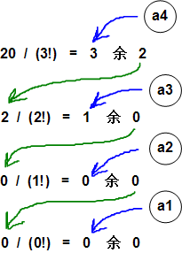

## 说明

抄袭自 http://blog.csdn.net/zhongkeli/article/details/6966805


<p style="text-align: center;font-size:35px">康托展开的本质是对排列进行压缩的一种hash</p>

## 康托展开

康托展开的公式是:

```math
X=a_n*(n-1)!+a_{n-1}*(n-2)!+...+a_i*(i-1)!+...+a_2*1!+a_1*0!
```

其中，$$a_i$$为当前未出现的元素中是排在第几个（从0开始）。


这个公式可能看着让人头大，最好举个例子来说明一下。例如，有一个数组 $$s = ["A", "B", "C", "D"]$$，它的一个排列 $$s1 = ["D", "B", "A", "C"]$$，现在要把 $$s1$$ 映射成 $$X$$(一个整数)。其中$$n$$ 指的是数组的长度，也就是4，所以:

```math
X(s1) = a_{4} \times 3! + a_3 \times 2! + a_2 \times 1! + a_1 \times 0!
```

关键问题是 $$a4,a3,a2$$ 和 $$a1$$ 等于啥？

a4 = "D" 这个元素在子数组 ["D", "B", "A", "C"] 中是第几小的元素。"A"是第0小的元素，"B"是第1小的元素，"C" 是第2小的元素，"D"是第3小的元素，所以 a4 = 3。

a3 = "B" 这个元素在子数组 ["B", "A", "C"] 中是第几小的元素。"A"是第0小的元素，"B"是第1小的元素，"C" 是第2小的元素，所以 a3 = 1。

a2 = "A" 这个元素在子数组 ["A", "C"] 中是第几小的元素。"A"是第0小的元素，"C"是第1小的元素，所以 a2 = 0。

a1 = "C" 这个元素在子数组 ["C"] 中是第几小的元素。"C" 是第0小的元素，所以 a1 = 0。（因为子数组只有1个元素，所以a1总是为0）

所以:

$$X(s1) = 3 \times 3! + 1 \times 2! + 0 \times 1! + 0 \times 0! = 20$$

同理我们对$$[A,B,C]$$三个字符就是全排列,可以得到:


| 排例  | 对应数字 |
|-------|----------|
| A B C | 0        |
| A C B | 1        |
| B A C | 2        |
| B C A | 3        |
| C A B | 4        |
| C B A | 5        |


## 通过康托逆展开生成全排列

如果已知 $$s = ["A", "B", "C", "D"],X(s1) = 20$$,能否推出 $$s1 = ["D", "B", "A", "C"]$$ 呢？

因为已知 $$X(s1) = a4*3! + a3*2! + a2*1! + a1*0! = 20$$,所以问题变成由 20 能否唯一地映射出一组 a4、a3、a2、a1？如果不考虑 ai 的取值范围，有

```math
\begin{aligned}
3*3! + 1*2! + 0*1! + 0*0! = 20 \\
2*3! + 4*2! + 0*1! + 0*0! = 20 \\
1*3! + 7*2! + 0*1! + 0*0! = 20 \\
0*3! + 10*2! + 0*1! + 0*0! = 20 \\
0*3! + 0*2! + 20*1! + 0*0! = 20 \\
\end{aligned}
```

等等。但是满足 $$0 <= ai <= n-1$$ 的只有第一组。可以使用**辗转相除的方法**得到 ai，如下图所示：



知道了$$a4,a3,a2,a1$$的值，就可以知道:
 - $$s1[0]$$是子数组$$["A", "B", "C", "D"]$$中第$$3$$小的元素 $$"D"$$
 - $$s1[1]$$ 是子数组 $$["A", "B", "C"]$$ 中第$$1$$小的元素$$"B"$$
 - $$s1[2]$$ 是子数组 $$["A", "C"]$$ 中第$$0$$小的元素$$"A"$$
 - $$s1[3]$$ 是子数组$$ ["C"]$$ 中第$$0$$小的元素$$"C"$$
 - 所以$$s1 = ["D", "B", "A", "C"]$$。

这样我们就能写出一个函数`decoding()`，它可以返回$$S$$的第$$m$$个排列。


## 代码模板


假如我有一个有字符串str,长度8,里面的字符是[1,8],现在要求这个,字符串排列的所对应的康托展开?当然还要有康托逆展开;

```c
/*============================================================================
* Title : 康托展开 ver1.0
* Author: Rainboy
* Time  : 2016-06-03 17:49
* update: 2018-04-15 09:54
* © Copyright 2016 Rainboy. All Rights Reserved.
*=============================================================================*/
#include <cstdio>
#include <cstring>

/* 在我们用char 类型的数组的时候,把它定义的比实际使用的大一点
  (不然有可能会出现各种莫名奇妙的错误),因为
    字符串的末尾是'\0' 实际长度比较长一个单位,
*/
char str[100] = {'3','1','2','4','5','6','7','8'};


// 有序的原数组,从小到大排序
char lx[100] = {'1','2','3','4','5','6','7','8'};
bool isExit[10];

// 存 阶乘的值
int fac[10];

//康托展开
/*str 字符串,strlen 总长度*/
int encoding(char str[],int len){
    int num =0,i,j;
    for(i=0;i<len;i++){
        int tmp = 0;
        for(j=i+1;j<len;j++)   //从后面一个数开始,计算有几个数
            if(str[j] < str[i])//比str[i]小,如果有0个比str[i]
                tmp++;         //str[i]就是第0小
        num += tmp*fac[len-i-1];
    }
    return num;
}

//逆展开
void decoding(int num,int len,char str[]){
    memset(isExit,0,sizeof(isExit));
    int i,j,cnt;
    for(i=0;i<len;i++){
        int y = num / fac[len-i-1];//需要找第y小的数
        num = num % fac[len-i-1];

        //从存在的数里找到
        cnt = -1; //找到一个数后,cnt++ == 0 表示第0小
        for(j=0;j<len;j++){
            if(isExit[j] == 0) { //存在
                cnt++;
                if(cnt == y) //
                    break;
            }
        }

        isExit[j] = 1;
        str[i] = lx[j];
    }
}

int main(){
    int i,j;
    fac[0] =1;
    for(i=1;i<=8;i++)
        fac[i] = fac[i-1]*i;
    int ans = encoding(str,8); //康托展开
    printf("%d\n",ans);
    char tmp[10] ={0};
    decoding(ans,8,tmp); // 康托逆展开
    printf("%s",tmp);
    return 0;
}
```

康托展开要用到阶乘,采用秦九韶算法可以节省时间,如下(没有写完,因为这个好像没有多大的用):

```math
4 \times 3! + 2 \times 2! + 3 \times 1! + 1 \times 0!  = 0! \times ()
```


## 康托展开 class 的写法

我们可以把康托展开写成class,更好记,更好理解


```c
代码随后
```

