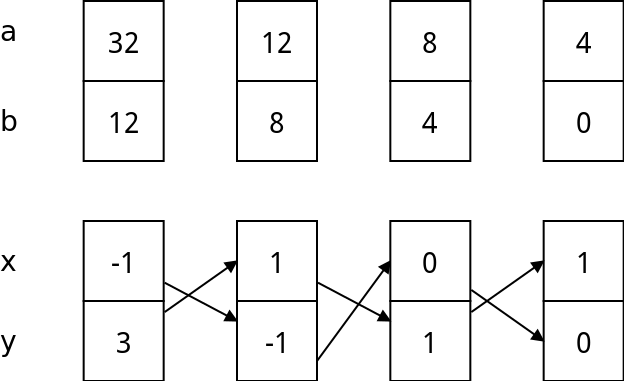

# 拓展欧基里得算法

## 贝祖定理

有二元一次方程如下:

```math
ax+by = gcd(a,b)
```
其中$$a,b$$是整数,那么存在整数解$$x,y$$,使方程成立.这个公式我们称为**标准贝祖等式**


同样的,我们也可以推出如下:

```math
ax+by = k*gcd(a,b)
```
其中k为整数,当标准贝祖等式有整数解的时候,这个公式也一定有解,设标准贝祖等式的一组解为:$$(x_0,y_0)$$,那么这个公式的对应的一组解为:$$(k \cdot x_0,k \cdot y_0)$$

**更一般的定义:**

二元一次方程:$$ax+by=c$$存在整数解的充分必要条件:$$ c \bmod (gcd(a,b)) == 0$$


## 拓展欧几里得算法详解

求解问题：在求解两数的最大公约数同时，可以求得二元一次不定方程$$ax+by=gcd(a,b)$$的一组解


### 算法原理

**原理1:**我们知道在求$$gcd(a,b)$$的过程中:$$gcd(a,b) = gcd(b ,a \%b)=......=gcd(m,0)$$

那么在边界的时候,显示有:

```math
m*x+0*y= gcd(a,b) =gcd(m,0) =m
```

根据**标准贝祖等式**这个方程是有整数解,显示其中的一组解为

```math
\left\{\begin{matrix} x=1 \\  y=0\end{matrix}\right.
```

**原理2:**根据贝祖等式,$$gcd(a,b),gcd(b,a \% b)$$可以形成下面的公式
```math
\left\{\begin{matrix}
now&:&ax+by = gcd(a,b) \\
nxt&:&bx_0+(a \%b)y_0 = gcd(b,a\%b)
\end{matrix}\right.
```

它们都是有整数的解的,那它们解之间有什么关系呢?

因为$$gcd(a,b),gcd(b,a \% b)$$,所以如下:

```math
\begin{matrix}
ax+by &=& bx_0+(a \%b)y_0 \\
\Longrightarrow &=& bx_0 +(a-(a/b) \times b)y_0 \\
\Longrightarrow &=& ay_0+b(x_0-(a/b)\times y_0) \\
ax+by &=&  ay_0+b(x_0-(a/b)\times y_0)  \\
\end{matrix}
```

所以我们可以得到相邻的两层的gcd形成的二元一次方程组的解的关系如下:

```math
\left\{\begin{matrix}
x&=&y_0  \\ 
y&=&x_0-(a/b)\times y_0
\end{matrix}\right.
```

其中$$a/b$$表示整除

### 样例

如果我们要求$$32 \cdot x + 12 \cdot y = 4$$的一组解,解的过程如下:


### 代码


```c
int exgcd(int a,int b,int &x,int &y){//ax+by=gcd(a,b)
    if(b==0){x=1,y=0;return a;}
    int gcd=exgcd(b,a%b,x,y);
    int _x=x;
    x=y;
    y=_x-(a/b)*y;

    return gcd;
}
```

## 应用1 求贝祖等式的一组解

对于一般性的贝祖等式$$ax+by=c$$，如果$$c \bmod gcd(a,b) != 0$$，那么表明：对于给定的$$a,b,c$$不存在整数解。否则，对于解出的某一组特解$$x,y$$（标准贝祖等式下），其真正解出的特解应为$$x=x_0 \times \frac{c}{gcd(a,b)}$$。


## 应用2 求通解

已知一个标准贝祖等式:$$ax+by=gcd(a,b)$$的一组解,如果求其它的解?如果等式有解,那就无数组解

```math
\begin{matrix}
ax+by=gcd(a,b) \\
\Longrightarrow \frac{a}{gcd(a,b)}x + \frac{b}{gcd(a,b)}y = 1 \\
\end{matrix}
```

我们构造出下面的公式:

```math
 \frac{a}{gcd(a,b)}(x+\frac{b}{gcd(a,b)} \times t) + \frac{b}{gcd(a,b)}(y-\frac{a}{gcd(a,b)} \times t) = 1 ,t \in Z
```

于是我们得到:

```math
\left\{\begin{matrix}
x&=&x_0+\frac{b}{gcd(a,b)} \times t \\ 
y&=&y_0+\frac{a}{gcd(a,b)} \times t
\end{matrix}\right.
```
其中$$t \in Z$$,如是我们可以说只要有一组解,就可以得到无限的解

### 应用3 得到最小正整数解

当我们得到的一个解x是正数里,因为$$x=x_0 +m\times t$$,所以最小正整数解为$$x_0= x \bmod m$$,注意$$m$$取绝对值

如果$$x$$是负数,那我们用

```c
int a = (x % abs(m) ) + abs(m)
```


## 练习1:noip 2012 同余方程

题目地址:[luogu P1082 同余方程](https://www.luogu.org/problemnew/show/P1082)

**解析:**

$$a \cdot x \equiv 1 (\bmod b)$$推导出$$a \cdot x \% b = 1$$,这就是**乘法逆元**,进而推导出:$$ a \cdot x - b \cdot y = 1$$,
也就是$$ a \cdot + b \cdot y  =1$$,让我们求出最小正整数解.

**代码**

```c
#include <cstdio>
#include <cstring>
#include <cmath>

int exgcd(int a,int b,int &x,int &y){//ax+by=gcd(a,b)
    if(b==0){x=1,y=0;return a;}
    int gcd=exgcd(b,a%b,x,y);
    int _x=x;
    x=y;
    y=_x-(a/b)*y;
/*
    int gcd=exgcd(b,a%b,y,x);
    y-=(a/b)*x;
*/
    return gcd;
}

int main(){
    int n,m;
    scanf("%d%d",&n,&m);
    int x,y;
    int t = exgcd(n,m,x,y);

    int m1 = m / t; //根据题意,m1 一定是正数
    if( x >= 0)
        printf("%d\n",x % m1);
    else
        printf("%d\n",(x % m1) + m1);
    return 0;
}
```

## 练习题目


| PID              | 题目名称        |
|------------------|-----------------|
| luogu P1292 倒酒 | 倒酒            |
| cogs 2057        | [ZLXOI2015]殉国 |
| cogs 2547        | 军队            |
| luogu P1516  | 青蛙的约会      |

经典的裸题SDOI2011 计算器,综合了快速幂取余,exgcd,bsgs

题目解析 http://hzwer.com/5878.html


