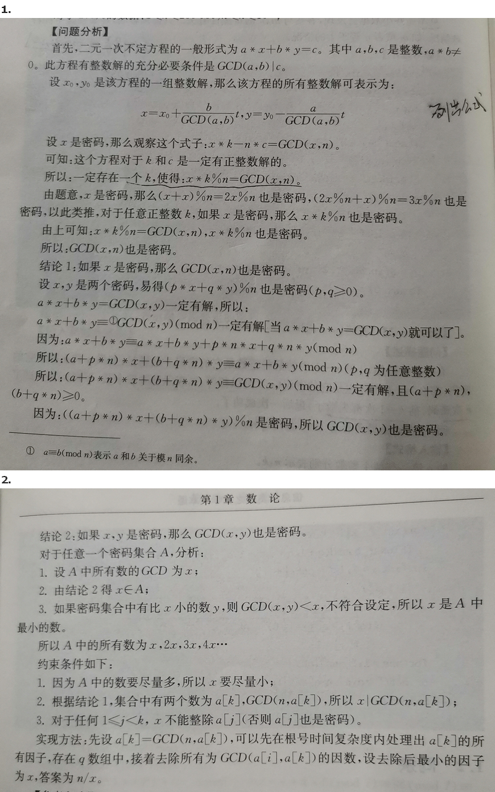

出自《数学一本通》【例1.1-2】密码（strongbox.,64MB,4秒）

## 题目：密码
### 【问题描述】

有一个密码箱,0到n-1中的某些整数是它的密码。且满足:如果a和b都是它的密码,那么（a＋b）％n也是它的密码（a,b可以相等,％表示整除取余数,下同）,某人试了k次密码,前k-1次都失败了,最后一次成功了。
问:该密码箱最多有多少不同的密码。

### 【输入格式】
输入第一行两个整数分别表示n,k

第二行为个用空格隔开的非负整数,表示每次的密码

数据保证存在合法解。

### 【输出格式】
输出一行一个数,表示结果。

### 【输入和输出样例】

```
42 5
28 31 19 38 24
```

```
14
```

### 【数据规模】

- 对于10％的数据:$N \leq 10^4,k \leq 100$；
- 另有10％的数据:$N \leq 10^9,k \leq 100$
- 另有10％的数据:$N \leq 10^9,k＝1$；
- 对于前60％的数据:$k \leq 1000$；
- 对于100％的数据:$1 \leq k \leq 250000,k \leq n \leq 10^{14}$


## 分析



## 代码

```c
```

