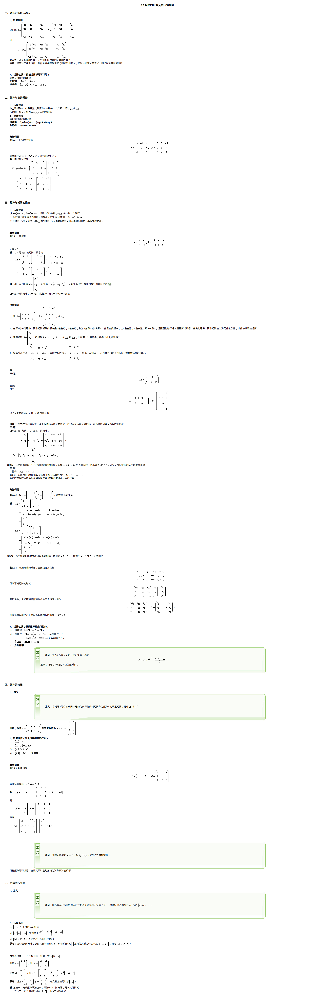

## 所需数学知识

[6.5 矩阵的运算及其运算规则](http://www2.edu-edu.com.cn/lesson_crs78/self/j_0022/soft/ch0605.html)

如果网页打开失败,展开下面

::: fold

:::

## 题目

luogu:

 - P3390:矩阵快速幂
 - P1939:矩阵加速
 - P1962:斐波那契数列

系列题目:按顺序做

