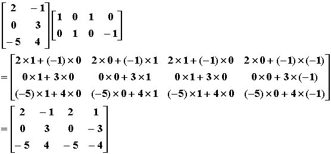

## 资料

 - [【AgOHの算法胡扯】矩阵快速幂](https://www.bilibili.com/video/av65360839)

## 定义

用数排出一个矩形

$2 \times 3$的矩阵,表示一个2行3列的矩阵

矩阵乘法:
第一个的矩阵的**列数**和第二个矩阵的**行数**相等
数据1:
```
2 3 2
1 2 3
4 5 6
1 2
3 4
5 6
```

数据2:

```
3 2 4
2 -1
0 3
-5 4
1 0 1 0
0 1 0 -1
```

::: center

:::

## 优化

```c
    for(i=1;i<=m;i++){ //枚举行
        for(j=1;j<=p;j++) //枚举列
            for(k=1;k<=n;k++) // 数的对应 相乘
                c[i][j] += a[i][k] * b[k][j];
    }
```

=> 交换kj的位置,见[【AgOHの算法胡扯】矩阵快速幂](https://www.bilibili.com/video/av65360839) 时间`11:30`

```c
    for(i=1;i<=m;i++){ //枚举行
        for(k=1;k<=n;k++) // 数的对应 相乘
            for(j=1;j<=p;j++) //枚举列
                c[i][j] += a[i][k] * b[k][j];
    }
```

## 代码

```c
#include <bits/stdc++.h>
using namespace std;

//第一个矩阵: m *n
//第二个矩阵: n*p
int m,n,p;
int a[100][100];
int b[100][100];
int c[100][100];

void read_matrix(int a[][100],int m,int n){
    int i,j;
    for(i=1;i<=m;i++){
        for(j=1;j<=n;j++){
            scanf("%d",&a[i][j]);
        }
    }
}

void print_matrix(int a[][100],int m,int n ){
    int i,j;
    for(i=1;i<=m;i++){
        for(j=1;j<=n;j++){
            scanf("%d",&a[i][j]);
            printf("%d ",a[i][j]);
        }
        printf("\n");
    }
}

/* 矩阵乘法 */
void matrix_mul(int c[][100],int a[][100],int b[][100],int m,int n,int p){
    int i,j,k;

    for(i=1;i<=m;i++){ //枚举行
        for(k=1;k<=n;k++)
            for(j=1;j<=p;j++) //枚举列
                c[i][j] += a[i][k] * b[k][j];
    }
}

int main(){
    scanf("%d%d%d",&m,&n,&p); 
    read_matrix(a, m, n);
    read_matrix(b, n, p);
    print_matrix(a, m, n);
    printf("\n");
    printf("\n");
    print_matrix(b, n, p);

    matrix_mul(c, a, b, m,n, p);
    printf("\n");
    printf("\n");
    print_matrix(c, m, p);


    return 0;
}
```
