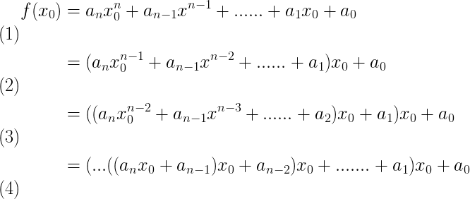

## 秦九韶算法

### 问题引入

已知一个一元n次多项式函数

```math
f(x) =a_nx^n+a_{n-1}x^{n-1}+......+a_1x+a_0
```

已知$$x_0$$,求$$f(x_0)$$.

当然可以把$$x_0$$直接代入,便是很慢,时间复杂度$O(n^2)$$

秦九韶算法如下:



我们令$$v_k=(...((a_nx_0+a_{n-1})x_0+......+a_{n-(k-1)})x_0)+a_{n-k}$$


**再看一个样列**


可以得到:

```math
\begin{aligned}
V0 =& 0+a_3 \\ 
 V1=& v0*x+a2 \\
 V2=& v1*x+a1 \\
 V3=& v2*x+a0 \\
\end{aligned}
```


那就得到一个重要的递推公式:

```math
\left\{\begin{matrix}
v_0=&a_n\\ 
v_k=&v_{k-1}\times x+a_{n-k}
\end{matrix}\right.
```


## 题目:解方程

题目地址:[noip2014 luogu P2312 解方程](https://www.luogu.org/problemnew/solution/P2312)

这里的多项式运算要用到秦九韶算法，具体的讲，我们要计算： 

```math
\begin{matrix}
a_0+a_1x+a_2x^2+..+a_nx^n \\
a_0+x(a_1+a_2x+..+a_nx^{n-1} \\
... \\
a_0+x(a_1+x(a_2+..+a_nx^{n-2})) \\
a_0+x(a_1+x(a_2+..+x(a_{n-1}+a_nx)))

\end{matrix}
```


很显然，到了这一步我们只用计算出$$x(a_{n-1}+a_nx)$$，再将这个结果化为新的常数，再跟$$x$$相加，相乘，继续这么算下去就好了。因为题目是让我们求$$x$$，就可以先枚举$$x$$，再按照上文所述的秦九韶算法来验证这个代数式是否等于$$0$$。 
然而问题是，这道题的数据范围是：$$|a_i|<=1010000$$,$$a_n!=0$$。由于这个代数式是否等于$$0$$与其是否模去一个数无关，因此我们就可以把$$|ai|$$模去$$1e9+7$$。 

**代码**

```c
#include<cstdio>
#include<cstring>
#include<algorithm>
#define ll long long
#define N 100
#define M 1000000
#define mod 1000000007
//如果用const就会T三个点
using namespace std;
ll n,m;
ll a[N+5];
ll ans[M+5],num;
inline ll read()//负数取模容易出问题，因此写一个读优取模较为稳妥
{
    ll x=0,f=1;
    register char ch=getchar();
    while(ch<'0'||ch>'9'){if(ch=='-')f=-1;ch=getchar();}
    while(ch>='0'&&ch<='9')x=(x*10%mod+ch-'0')%mod,ch=getchar();
    return x*f;
}
inline bool check(ll x)
{
    register ll sum=0;
    for(register ll i=n;i>=1;i--)sum+=a[i],sum*=x,sum%=mod;//如果改成sum=*(sum%mod+a[i]%mod)%mod，sum=sum*x%mod就会T
    sum+=a[0];
    if(sum==0)return true;
    return false;
}
int main()
{
    n=read(),m=read();
    for(register ll i=0;i<=n;i++)a[i]=read();
    for(register ll i=1;i<=m;i++)if(check(i))ans[++num]=i;
    printf("%lld\n",num);
    for(register ll i=1;i<=num;i++)printf("%lld\n",ans[i]);
    return 0;
}
```
