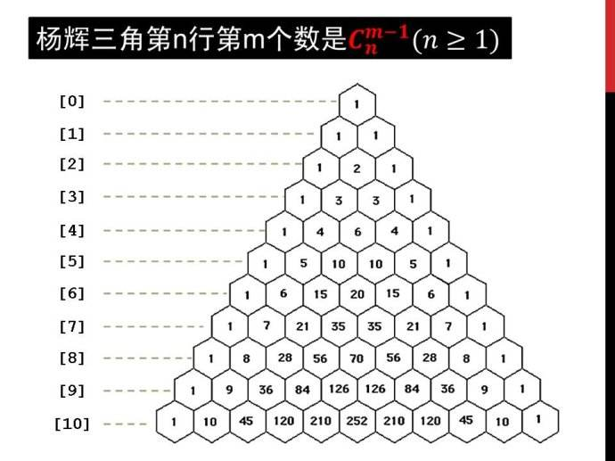
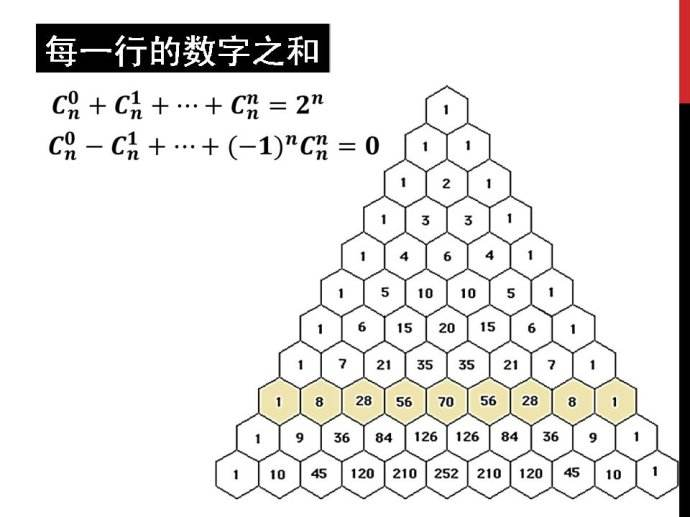
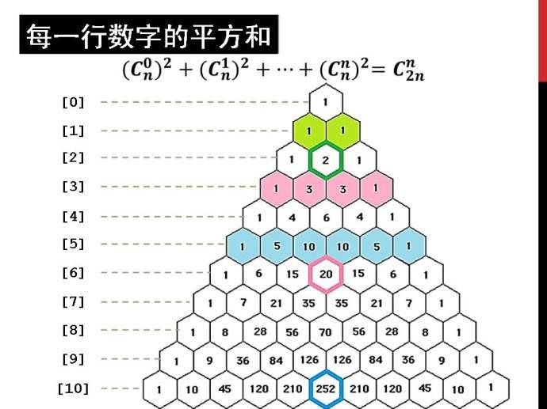

## 组合数的计算

#### (1)加法递推  -- $O(n^2)$

使用的公式:

```math
C_{n}^{m} = C_{n-1}^{m-1}+C_{n-1}^{m}
```

边界:

```math
C_n^0=C_n^n = 1
```

这个也是二项式定理,杨辉三角

```c
int c[1001][1001]; //根据实际需要开数组,必要的时候彩高精度,
                   //具体看 高精度组合
............
memset(c,0,sizeof(c));
int i,j;
c[0][0] =1; //边界
for(i=1;i<=n;i++){
    c[i][0] = 1;
    for(j=1;j<=i;j++){
        c[i][j] = c[i-1][j-1]+c[i-1][j];
    }
}
```
原理图:


样例代码:

https://www.jianguoyun.com/p/DedQ8BkQ4MjlBRjHlxU


#### (2)乘法递推  -- $O(n)$

使用的公式: 

```math
C_n^m= \frac{n-m+1}{m} \times C_n^{m-1}
```

**注意:必须先乘后除,否则除不开**

边界:

```math
C_n^0=1
```

一个小的优化: $n> \frac{n}{2}$的时候使用

```math
C_n^m = C_n^{n-m} 
```


```c
int c[1001]; //必要的时候使用组合高精
.............
c[0]=1;
if( m >n-m) m = n-m;
for(int i =1;i<=m;i++){
    c[i] = (n-i+1)*c[i-1] / i;
}

```

代码demo

https://www.jianguoyun.com/p/DWbWlTYQ4MjlBRjKlxU

## 一般组合的产生

从n个元素里取m个元素,有多少种取法,把所有的取法都输出

一个合法的组合有这样的特点:

<p style="text-align: center;font-size:24px">排在后面的数字一定严格大于左面的数字</p>

```c
#include <cstdio>

int n,m;

int stack[10000];
void print(){
    int i;
    for (i=1;i<=m;i++)
        printf("%d ",stack[i]);
    printf("\n");
}
void dfs(int depth,int p){
    if(depth == m+1){
        print();
        return ;
    }
    int i;
    /*  p+1 <= k <=n-(m-depth) */
    for (i=p+1;i<=n-(m-depth);i++){
        /* 由于后面的数一定比较前面的数大,不用标记 */
        stack[depth]=i;
        dfs(depth+1,i);
    }

}

int main(){
    scanf("%d%d",&n,&m);
    dfs(1,0);
    return 0;
}
```


## 全组合

有n个元素,求这n个数构成的集合的所有非空子集

```c
#include <cstdio>
int n;
int item[10001]={0};

void full_combinatiom(int pos,int val){
	int i;
	/* i < pos pos代表正要选的位置,还没有选*/
    for(i=1;i<pos;i++)//输出已有的值
        printf("%d ",item[i]);//进入函数就输出
    printf("\n");
	
    for(i=val;i<=n;i++){
        item[pos] = i;
		/*位置+1,当前可以选的最小值+1*/
        full_combinatiom(pos+1,i+1);
		
    }
}

int main(){
	
	n = 3;
	full_combinatiom(1,1);
	return 0;
}
```

原理:按一定的规则填数字


仔细看图:

发现规律: 填数字

 1. 每填一个数字,就输出
 2. 每个位置都有数字下限和上限,就是比左边的大,上限为n
 3. 可以用两个值(pos和val)的变化来表示这种规律
    -  pos 当前位置,但是还没有选数,只是要选
    -  val 代表当前可以填入的最小值


**注:**可以用一个整数来表示一个集合或者组合,因为第一位不是0就是1:具体可以看容斥原理

## 由上一组合产生下一组合

 1. 从右边向左寻找可以往下取的元素的数,位置为j
 2. 数列的j位到n位的重取元素

  - 右边的元素一定严格大于左侧的元素
  -


代码有可能错误,但是思想正确,因为没有验证

```c
int a[M];//a[i] 字典序的最小排序
....

int j =m-1;
while((j >=0) && (a[j]==n-(m-1-j))) j--;
if( i >=0){
    a[j]++;
    int k;
    for(k=j+1;k<m;k++) 
        a[k]=a[k-1]+1;
}

```

## 杨辉三角



<br>


<br>



## 练习题目

 - luogu P3414 SAC#1 - 组合数
 - luogu P2822 组合数问题
 - [noip2006 luogu P1066 2^k进制数](https://www.luogu.org/problemnew/show/P1066)
