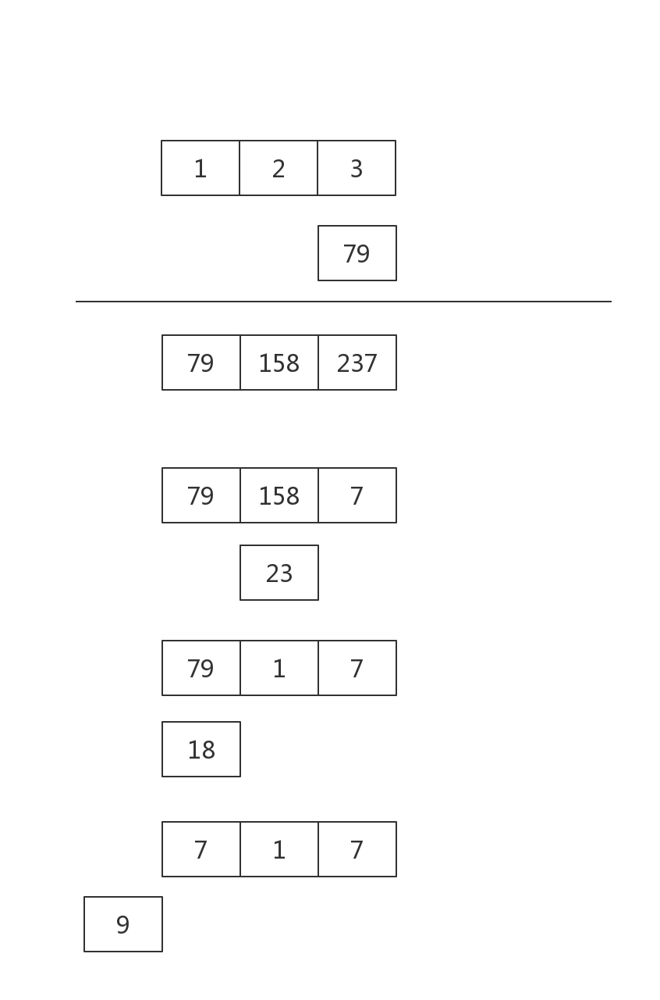

<p style="text-align: center;font-size:35px">高精度乘法</p>

# 高精度×单精度

**算法原理**




### 朴素 高精度×单精度

```c
<%-include("高精乘单精_朴素.cpp")%>
```
### 万进制 高精度×单精度

```c
<%-include("高精乘单精_万进制.cpp")%>
```

# 高精度×高精度


原理:


**一句话算法**:**$a[i] \times b[j]$ 的结果放在$c[i+j]$里**

## 代码

```c
/*============================================================================
* Title : 朴素高精度乘法
* Author: Rainboy
* Time  : 2016-04-14 11:06
* update: 2016-05-09 10:33
* © Copyright 2016 Rainboy. All Rights Reserved.
*=============================================================================*/
/*  思想:
 *          模拟运算,a[]="123" b[] = "123"
 *          a[1]*b[1]  放在c[1+1]
 *          a[1]*b[0] 放在c[1+0]
 *  原理:
 *      a,b以0下标开始,a[i]*b[i]放在c[i+j]位置上
 * */
#include <cstdio>
#include <cstring>


char s1[250],s2[250]; // 存字符串

int a[250],b[250],c[250]; //数据存储

/* c= a*b 返回位数 */
int mul(int a[],int la,int b[],int lb,int c[]){
    int lc = la+lb;
    int i,j;
    for(i=0;i<la;i++){
        for(j = 0;j<lb;j++){
            c[i+j] =c[i+j] + a[i]*b[j];
        }
    }

    /* 一次处理 */
    for(i=0;i<lc;i++){
        c[i+1] = c[i+1] + c[i] / 10;
        c[i] = c[i] % 10;
    }
    /* 查找最高位 是哪个 */
    /* 最高位的下标只可是 lc-1 或者lc-2 ,如果a,b的最高位不为0 */
    if( c[lc-1] == 0 ) lc--;
        
    return lc; //返回长度
}

void str2num(char str[],int x[],int lx){
    int i;
    for(i=0;i<lx;i++)
        x[i] = str[lx-1-i] -'0';
}

int main(){
    scanf("%s%s",s1,s2);
    
    int la,lb,lc;
	int i;
    
    la = strlen(s1);
    lb = strlen(s2);
    if((la == 1 && s1[0] == '0') || (lb==1 && s2[0] == '0'))
        printf("0");
    else {
        str2num(s1,a,la);
        str2num(s2,b,lb);
        lc = mul(a,la,b,lb,c);
		for(i=lc-1;i>=0;i--)
			printf("%d",c[i]);
    }
    /* 处理最高位 */
    /* n位数 * m位数 ,最多有n+m位,最少n+m-1位 */
    return 0;
}
```

###  万进制高精乘

这里没有用亿进制的原因:一个`int`型存不两个$10^8$大小的数相乘的结果


```c
/*============================================================================
* Title : 万进制高精度乘法
* Author: Rainboy
* Time  : 2016-04-14 11:06
* update: 2016-06-12 10:11
* © Copyright 2016 Rainboy. All Rights Reserved.
*=============================================================================*/
/*  思想:
 *      四位一存
 * */
#include <cstdio>
#include <cstring>

char sa[250],sb[250]; // 存字符串

int a[250],b[250],c[250]; //数据存储

const int base = 4;
const int base2 =10000;

/* c= a*b 返回位数 */
int mul(int a[],int la,int b[],int lb,int c[]){
    int lc = la+lb;
    int i,j;
    for(i=0;i<la;i++){
        for(j = 0;j<lb;j++){
            c[i+j] =c[i+j] + a[i]*b[j];
        }
    }

    /* 一次处理 */
    for(i=0;i<lc;i++){
        c[i+1] = c[i+1] + c[i] / base2;
        c[i] = c[i] % base2;
    }
    /* 查找最高位 是哪个 */
    /* 最高位的下标只可是 lc-1 或者lc-2 ,如果a,b的最高位不为0 */
    if( c[lc-1] == 0 ) lc--;
    return lc; //返回长度
}

int str2num(char x[],int y[]){
    int i,j=0,k=1;
    int lenx= strlen(x);
    for(i=lenx-1;i>=0;i--){
        if(k==base2) j++,k=1;
        y[j] += k*(x[i]-'0');
        k*=10;
    }
    return j+1;
}

int main(){
    memset(a,0,sizeof(a));
    memset(b,0,sizeof(b));
    memset(c,0,sizeof(c));
    
    scanf("%s%s",sa,sb);
    int la,lb,lc;
	int i;

    la = strlen(sa);
    lb = strlen(sb);
    if((la == 1 && sa[0] == '0') || (lb==1 && sb[0] == '0'))
        printf("0");
    else {
        la = str2num(sa,a);
        lb = str2num(sb,b);
        /* 处理最高位 */
        /* n位数 * m位数 ,最多有n+m位,最少n+m-1位 */
        lc = mul(a,la,b,lb,c);
       

        /* 输出最高位 */
        printf("%d",c[lc-1]);
        for(i=lc-2;i>=0;i--)
            printf("%04d",c[i]);
    }
    return 0;
}
```

