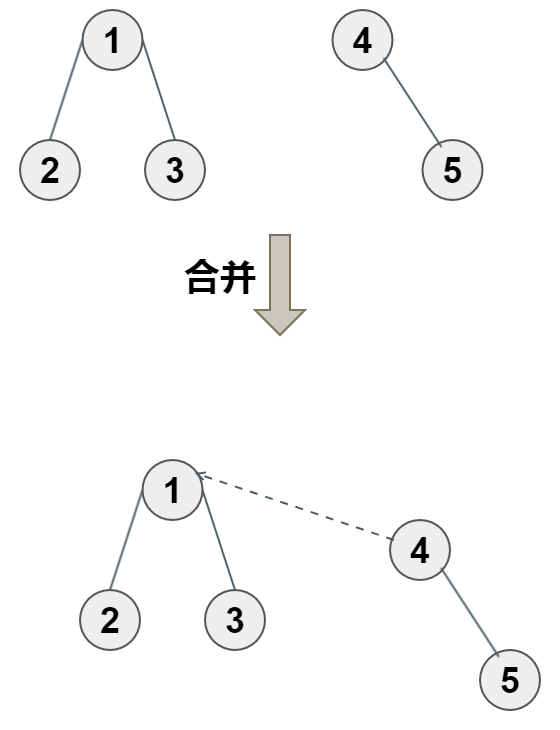
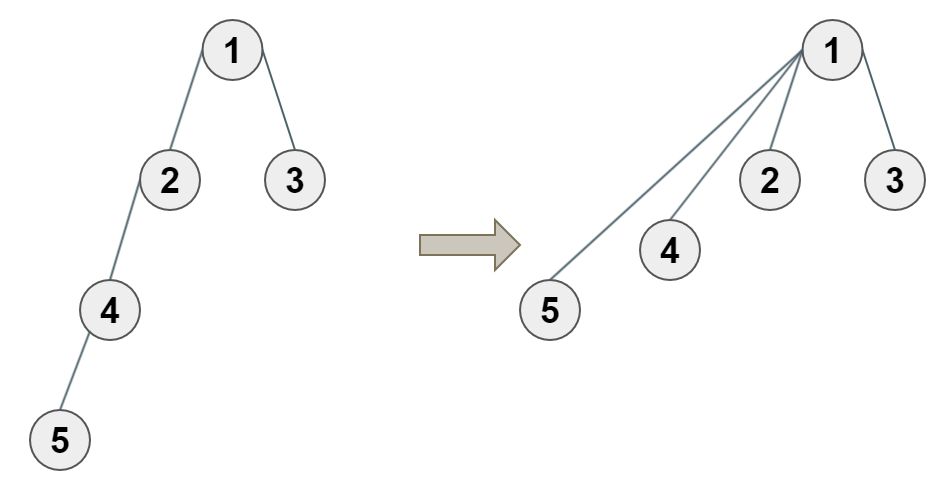

# 并查集

信息学竞赛中有很多有关集合相关的问题，比如说有m个集合，每个集合有n个元素，要你判断a、b是否在同一个集合？
如果使用搜索法，那么在O(mn)时间内能够得到结果。
如果m、n都很大时，时间效率非常差；而且对于需要动态地合并两个不相交的集合时，时间效率更差，易超时。
对于这种情况，可以用并查集解决。


**并查集**：顾名思义，就是专门处理一些不相交集合的合并和在集合中快速地查询等问题。

并查集可以用数组、链表、树型结构来实现，其中，最适用、最易实现的是树型结构。

树型数据结构有其独特性，一棵树可以看做一个完整的集合，该树中的结点代表集合中的元素。

 - 要查询时，只需要查询树根是否一样；
 - 要合并时，只需将两棵树的树根之间连一条边，合并成一棵树。

并查集就是利用树的这一良好特性，有效的实现了合并与查询操作。

## 并查集的理解与实现

并查集的实现分为三个基本操作：
 - 初始化
 - 查询
 - 合并


### 初始化

如果刚开始的时候,每个元素的所在的集体都是自己本身,那么我们用树中的父亲表示法,认为每个点的父亲就是自己本身.


```c
int fa[MAXN]; //父亲表示法存树
for(i=1;i<=n;i++)
    fa[i] = i;
```

### 查询

如果元素已经行成集合,那我们如何证明两个元素在同一个集合呢?如下图,如何证明点`2`,`3`在同一个集合,点`2`,`5`不在同一个合呢?

假如我们有一个`find(i)`操作,它能找到点`i`最远祖先(也就是树的根),那么如果`find(i) == find(j)`,证明点`i`,`j`在同一个集合,反之,不在同一个集合.


```c
int find(int x){ 
    if( fa[x] == x) return x;
    return find(fa[x]);
}
```

**查询两个元素是不是同一个集合时**

```c
bool query(int x,int y){
    if( find(x) == find(y))
        return true;
    return false;
}

```

### 合并

当某两个元素u、v不在同一棵树中，需要合并时，方法为分别找到u、v最远的祖先结点编号，即u、v各所在树的树根，在树根之间连一条边，让u的树根指向v的树根，将两棵树合并成一棵树。



```c
void union(int x,int y){
    int rx = find(x);
    int ry = find(y);
    if( rx != ry)
        fa[ry] = rx;
}
```

## 优化1:路径压缩

如果一个元素的位置很深,路径很长(如下图点5),那么每次对这个点进行`find`操作的时候,都要递归多次,能不能查询一次后,直接把这个点指向根,那么下一次查询的时候就不用递归多次了.

**路径压缩:**在`find`操作时,把路径上的所有点都指向根




```c
int find( int x){
    if( fa[x] == x) return x;
    fa[x] = find(fa[x]);
    return fa[x];
}
```

## 优化2:非递归实现

核心想法: 走两遍,选找到根,然后第二遍走的时候,把路径上的所有点都指向root点.
```c
//查找并路径压缩 非递归
int find(int x){
    int t =x;
    while(fa[t] != t) //不停的往上走
        t=fa[t];
    int i = x,j;//路径压缩，再走一便路程，把走过的点都指向根
    while(i != t){
        j= fa[i];
        fa[i] = t; // 把这个点指向根
        i = j;
    }
    return t;
}
```

## 题目

 - 亲戚(SCOI2004)
 - 团伙(BOI2003)
 - 银河英雄传说(NOI2002)
 - 食物链(NOI2001)
