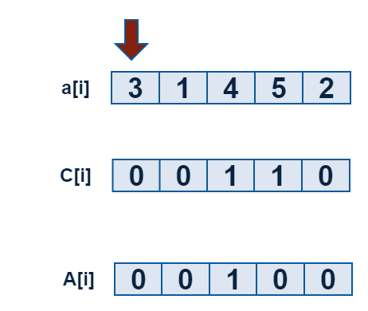

# 树状数组

## 定义

树状数组(Binary Indexed Tree(BIT), Fenwick Tree)是一个查询和修改复杂度都为$$log(n)$$的数据结构。主要用于查询任意两位之间的所有元素之和,但是每次只能修改一个元素的值;经过简单修改可以在$$log(n)$$的复杂度下进行范围修改,但是这时只能查询其中一个元素的值


## 求逆序对

### 什么是逆序对

设 A 为一个有 n 个数字的有序集 (n>1),其中所有数字各不相同。
如果存在正整数 i, j 使得 1 ≤ i < j ≤ n 而且 A[i] > A[j],则 <A[i], A[j]> 这个有序对称为 A 的一个逆
序对,也称作逆序数。
例如,数组(3,1,4,5,2)的逆序对有(3,1),(3,2),(4,2),(5,2),共4个。


### 利用树状数组求逆序对原理


我们有以下的设定

  - `a[]={0,3,1,4,5,2}`其中`3,1,4,5,2`是我们求逆序对序列
  - `c[6]={0}`是一个树状数组,初始为空
  - `A[i]` 表示大小为$$i$$的数出现了几次

如图:





核心:**在我操作第i个数的时候,已经有k个数比第i个数大,那这个时刻我们知道有k个逆序对.**

**想一想:**

如果我们进行下面的操作

```c
for(i=1;i<=5;i++){
    update(a[i],1);
}
```

 - `i=1`的时候,`c[3]=1,c[4]=1`,那么`query(3)=1,query(4)=1`
 - `query(3)=1`表示`1->3`范围内的数字有一个
 - `query(3)=1`也可以表示,前1个数中,`<=3`的数有一个
 - `1-query(3)=0`表示:前1个数中,`>3`的数有0个
 - 同理`i=2`,时候`update(a[2],1)`
 - `query(a[2])`表示前2个数中,`<=a[2]`的数有`query(a[2])`个
 - `2-query(a[2])`表示前2个数中,`>a[2]`的数有`2-query(a[2])`个

**核心思想:在处理到第i个数的时候,$$i-lowbot(i)$$表示有几个数比第i个数大$$

**过程:**


**求逆序对代码:**

```c
#include <cstdio>

int n = 5;
int a[]={0,3,1,4,5,2};

int c[100]={0}; //存数状数组

int lowbit(int x){
    return x & (-x);
}

void update(int pos,int num){
    while(pos<=n){  //n代码数组A的长度
        c[pos]+=num;
        pos+=lowbit(pos);
    }
}

int query(int pos){
    int sum = 0;
    while(pos > 0 ){
        sum+=c[pos];
        pos -= lowbit(pos);
    }
    return  sum;
}


int main(){
    int i;
    for(i=1;i<=n;i++){
        update(a[i],1);
        printf("%d ",i-query(a[i])); // 输出前面有几个数比自己小
    }
    return 0;
}

```

练习题目:

 - luogo P1908 逆序对

## 区间修改,单点查询


题意: 有10000个数,可以任意对一段区间里的值进行加减,问,进行这种操作n次后,某个点的值是多少.

 - 原数组:a[i],每一个元素的值
 - 差分数组:b[i],下标i的元素存放`a[i]-a[i-1]`的差值,`b[1]=a[1]`
 - 树状数组:c[i],针对数组b行成的树状数组

我们就行成了下面的这种数据结构:


我们发现对于树状数组$$C[i]$$来说,$$query(i) = a[i]$$,也就是对应数的值.

如果我们想`2->4`的数加10怎么办?我们只要修改`b[i]`数组如下(想一想):

 - $$b[2]+10$$
 - $$b[4+1]-10$$

我们就行成了下面的数据:


我们发现,这时:

```math
query(i) = a[i]
```

所以按这种操作我们可以进行,区间修改,单点查询,核心代码如下:

```c
const int MAXN = 10000;//最多的点
int a[MAXN];// 原数组
int c[MAXN] = {0};// 树状数组

//原单点更新
void update(int pos,int num){
    while(x<=MAXN){
        c[x]+=num;
        pos+=lowbit(pos);
    }
}

//修改一段区间的值
void update_range(int i,int j,int n){
    update(i,n);
    update(j+1,-n);
}
//初始化,形成数状数组
for(i=1;i<=MAXN;i++){
    update(i,a[i]- a[i-1])
}

//查询,也就是单点的值
int query(int pos){
    int sum = 0;
    while( pos > 0 ){
        sum += c[pos];
        pos -= lowbit(pos);
    }
    return sum;
}
```


## 区间增减 区间查询

 - 原数组:a[i],每一个元素的值
 - 差分数组:b[i],下标i的元素存放`a[i]-a[i-1]`的差值,`b[1]=a[1]`

我们可以得到下面的公式:

<a href="http://www.codecogs.com/eqnedit.php?latex=\begin{align*}&space;a[1]&space;&plus;a[2]&plus;......&plus;a[n]&=(b[1])&space;&plus;(b[1]&plus;b[2])&space;&plus;......&plus;(b[1]&plus;b[2]&plus;......&plus;b[n])&space;\\&space;&=n&space;\times&space;b[1]&plus;(n-1)&space;\times&space;b[2]&plus;(n-2)&space;\times&space;b[3]&plus;....1&space;\times&space;b[n]\\&space;&=n&space;\times&space;(b[1]&plus;b[2]&plus;......&plus;b[n])&space;-&space;(0&space;\times&space;b[1]&space;&plus;1*\times&space;b[2]&plus;2\times&space;b[3]&plus;......&plus;(n-1)&space;\times&space;b[n])\\&space;&=(n&plus;1)(b[1]&plus;b[2]&plus;......&plus;b[n])&space;-(1&space;\times&space;b[1]&space;&plus;2*\times&space;b[2]&plus;3\times&space;b[3]&plus;......&plus;n&space;\times&space;b[n])\\&space;&=(n&plus;1)\sum&space;\limits_{i=1}^n&space;b[i]&space;-&space;\sum&space;\limits_{i=1}^n&space;i&space;\times&space;b[i]&space;\end{align*}" target="_blank"></a>

于是,我们得到了一个**重要的公式**:

```math
\sum \limits_{i=1}^n a[i]= (n+1)\sum \limits_{i=1}^n b[i] - \sum \limits_{i=1}^n i \times b[i]
```

我们设:

 - `b1[i]`数组表示:`b1[i] = a[i]-a[i-1]`,差分数组
 - `b2[i]`数组表示:`b2[i] = i*b1[i]`
 - `c1[i]`针对b1的树状数组
 - `c2[i]`针对b2的树状数组


```c
void update(int pos,int num){
    int t = pos;
    while(pos<=n){  //n代码数组A的长度
        c1[pos]+=num;
        c2[pos] += t*num;
        pos+=lowbit(pos);
    }
}
void update_range(int i,int j,int n){
    update(i,n);
    update(j+1,-n);
}

int query1(int pos){
    int sum=0;
    while(pos >0){
        sum += c1[pos];
        pos -= lowbit(pos);
    }
    return sum;
}

int query2(int pos){
    int sum=0;
    while(pos >0){
        sum += c2[pos];
        pos -= lowbit(pos);
    }
    return sum;
}

int sum(i,j){
    return (j+1)*query1(j) - query2(j) -(i)*query1(i-1) +query(i-1);
}
```

## 区间最大值


 - a[i]
 - c[i]


可以发现：对于x，可以转移到x的只有，$$x-2^0$$，$$x-2^1$$，$$x-2^2$$，.......，$$x-2^k$$ (k满足$$2^k < lowbit(x)$$且$$2^(k+1)>=lowbit(x)$$)

若 x = 1010000

= 1001000 + lowbit(1001000) = 1001000 + 1000 = 1001000 + 2^3

= 1001100 + lowbit(1001100) = 1001100 + 100 = 1001100 + 2^2

= 1001110 + lowbit(1001110) = 1001110 + 10 = 1001110 + 2^1

= 1001111 + lowbit(1001111) = 1001111 + 1 = 1001111 + 2^0

<a href="http://www.codecogs.com/eqnedit.php?latex=x&space;=&space;1010000\\&space;=&space;1001000&space;&plus;&space;lowbit(1001000)&space;=&space;1001000&space;&plus;&space;1000&space;=&space;1001000&space;&plus;&space;2^3\\&space;=&space;1001100&space;&plus;&space;lowbit(1001100)&space;=&space;1001100&space;&plus;&space;100&space;=&space;1001100&space;&plus;&space;2^2\\&space;=&space;1001110&space;&plus;&space;lowbit(1001110)&space;=&space;1001110&space;&plus;&space;10&space;=&space;1001110&space;&plus;&space;2^1\\&space;=&space;1001111&space;&plus;&space;lowbit(1001111)&space;=&space;1001111&space;&plus;&space;1&space;=&space;1001111&space;&plus;&space;2^0\\" target="_blank"></a>

```c
void update(int x){
    int lx,i;
    while(x<n){
        h[x] = a[x]; // ?
        lx = lowbit(x);
        for(i=1;i<lx;i= i<<1)
            h[x] = max(h[x],h[x-i]);
        x+=lowbit(x);
    }
}
```

设`query(x,y)`求区间[x,y]之间的最值,

 - 因为`h[x]`表示`[x-lowbit(x)+1,x]`之间的最值
 - 若`y-lowbit(y) >x`,则`query(x,y) = max(h[y],y-lowbit(y))`;
 - 若`y-lowbit(y) <=x`,则`query(x,y) = max(a[y],query(x,y-1))`;


## 引用

 - [树状数组模板区间更新 区间询问](http://blog.csdn.net/lawrence_jang/article/details/8054173)
 - [树状数组的区间修改与区间查询](http://blog.csdn.net/qq_21841245/article/details/43956633)
 - [树状数组求区间最大值](http://blog.csdn.net/u010598215/article/details/48206959)
