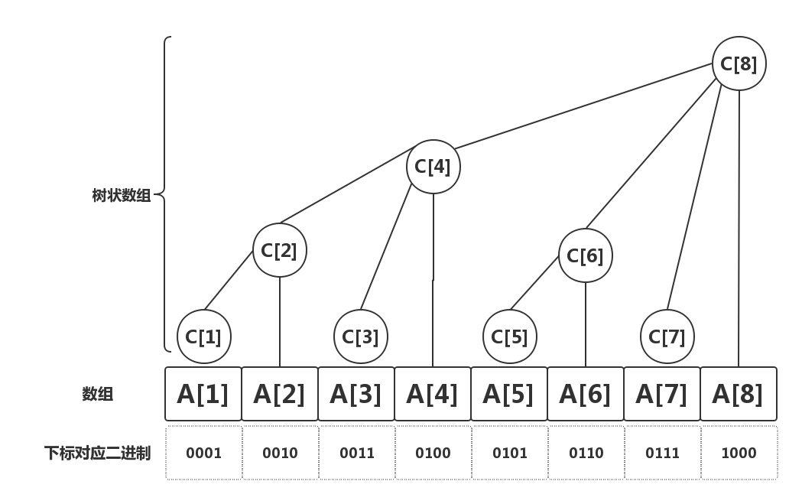

## 原理



## 规律

 - 下标i管辖的区域大小:是$$2^k$$(k表示i的`二进制末尾0 的数量`) 或者是$$2^{j-1}$$ (是表示i的二进制末尾第一次出现`1`的位置)
 - 下标i的父亲位置:如果`i`的管辖区域的大小是`k` ,那么父亲节点的下标是$$i+k$$ ,`lowbit(i)`表示`i`的管辖区域,那么`i+lowbit(i)`就表示i父亲结点的下标


**问题1:**我们如何去求$$2^k$$ :`i & (-i)`就会把i的二进制除最低位1外全部置0。例如:

 - 所有的数字在内存中都是补码存储的
 - 数字4的补码是$$00000100$$
 - 数字-4的补码是$$11111100$$

$$4\&(-4) = 00000100\&(11111100b) = 100b = 4$$

这个运算我们就叫做`lowbit(i)`,正好可以得到下标`i`的管辖区域


**问题2:** 如何求一段区域的和(前缀和):

 - 如果我们要求$$S[12] = A[1]+A[2]+......+A[12]$$
 - 我们知道:$$C[12]=A[12]+A[11]+A[10]+A[9]$$因为:`lowbit(12)= 4`,表示`C[12]`管辖大小:`4`
 - `12-lowbit(12) = 12-4=8`
 - `lowbit(8) = 8` 所以 `8-lowbit(8)=0`
 - 所以: `A[1]+A[2]+......+A[12] =C[12] + C[8]`

## 核心操作

### 管辖区域范围:`lowbit(i)`

```c++
int lowbit( int x){
    return (x & -x);
}

//---inline--
inline int lowbit( int x){
    return (x & -x);
}
```

### 单点更新(不停的更新父亲)

```c++
void update(int pos,int num){
    while(pos<=n){  //n代码数组A的长度
        c[pos]+=num;
        pos+=lowbit(pos);
    }
}
```


### 区间求值(前缀和)

```c++
int query(int pos){
    int sum = 0;
    while(pos > 0 ){
        sum+=c[pos];
        pos -= lowbit(pos);
    }
    return  sum;
}
```

**注意:**

 - 上面这三个操作就是树状数组最重要的操作了,是其它操作的基础
 - $$pos+pos \& (-pos)$$ 得到pos父亲的位置
 - $$pos-pos\&(-pos)$$就得到了下一个无联系的节点(也就是pos管辖区域没有覆盖的结点)

**练习题目:**

 - luogu P3374 【模板】树状数组 
 - luogu P3368 【模板】树状数组
 - luogu P3865 【模板】ST表 
 - luogu P1774 最接近神的人_NOI导刊2010提高（02）
 - luogu P2527 [SHOI2001]Panda的烦恼
