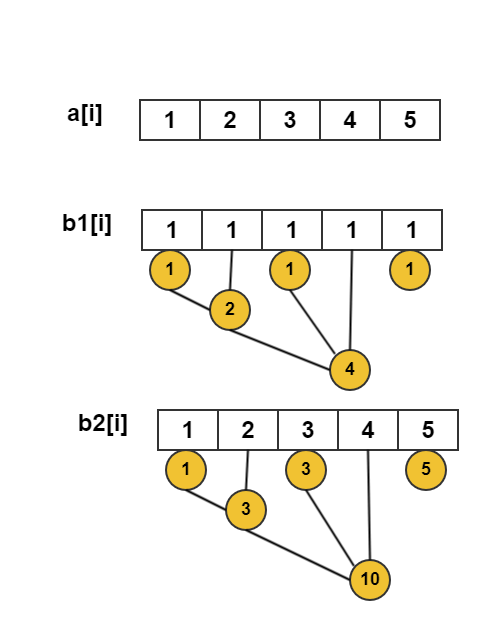

## 区间增减 区间查询

 - 原数组:a[i],每一个元素的值
 - 差分数组:b[i],下标i的元素存放`a[i]-a[i-1]`的差值,`b[1]=a[1]`

我们可以得到下面的公式:

<a href="http://www.codecogs.com/eqnedit.php?latex=\begin{align*}&space;a[1]&space;&plus;a[2]&plus;......&plus;a[n]&=(b[1])&space;&plus;(b[1]&plus;b[2])&space;&plus;......&plus;(b[1]&plus;b[2]&plus;......&plus;b[n])&space;\\&space;&=n&space;\times&space;b[1]&plus;(n-1)&space;\times&space;b[2]&plus;(n-2)&space;\times&space;b[3]&plus;....1&space;\times&space;b[n]\\&space;&=n&space;\times&space;(b[1]&plus;b[2]&plus;......&plus;b[n])&space;-&space;(0&space;\times&space;b[1]&space;&plus;1*\times&space;b[2]&plus;2\times&space;b[3]&plus;......&plus;(n-1)&space;\times&space;b[n])\\&space;&=(n&plus;1)(b[1]&plus;b[2]&plus;......&plus;b[n])&space;-(1&space;\times&space;b[1]&space;&plus;2*\times&space;b[2]&plus;3\times&space;b[3]&plus;......&plus;n&space;\times&space;b[n])\\&space;&=(n&plus;1)\sum&space;\limits_{i=1}^n&space;b[i]&space;-&space;\sum&space;\limits_{i=1}^n&space;i&space;\times&space;b[i]&space;\end{align*}" target="_blank"></a>

于是,我们得到了一个**重要的公式**:

```math
\sum \limits_{i=1}^n a[i]= (n+1)\sum \limits_{i=1}^n b[i] - \sum \limits_{i=1}^n i \times b[i]
```

我们设:

 - `b1[i]`数组表示:`b1[i] = a[i]-a[i-1]`,差分数组
 - `b2[i]`数组表示:`b2[i] = i*b1[i]`
 - `c1[i]`针对b1的树状数组
 - `c2[i]`针对b2的树状数组




```c
void update(int pos,int num){
    int t = pos;
    while(pos<=n){  //n代码数组A的长度
        c1[pos]+=num;
        c2[pos] += t*num;
        pos+=lowbit(pos);
    }
}
void update_range(int i,int j,int n){
    update(i,n);
    update(j+1,-n);
}

int query1(int pos){
    int sum=0;
    while(pos >0){
        sum += c1[pos];
        pos -= lowbit(pos);
    }
    return sum;
}

int query2(int pos){
    int sum=0;
    while(pos >0){
        sum += c2[pos];
        pos -= lowbit(pos);
    }
    return sum;
}

int sum(i,j){
    return (j+1)*query1(j) - query2(j) -(i)*query1(i-1) +query(i-1);
}
```

## 练习题目

 - poj 4047
 - codevs 1082
 - luogu p3373
