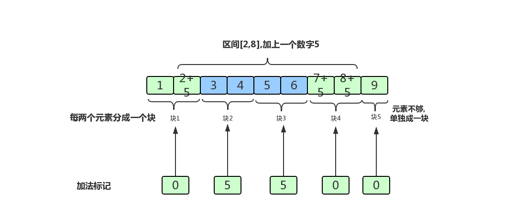

## 一.题目

网上OJ地址[LOJ 6277](https://loj.ac/problem/6277)

### [题目描述]

给出一个长为 $$n$$ 的数列，以及 $$n$$ 个操作，操作涉及区间加法，单点查值。
### [输入格式]

第一行输入一个数字 $$n$$。

第二行输入 $$n$$ 个数字，第 $$i$$ 个数字为 $$a_i$$,以空格隔开。

接下来输入 $$n$$ 行询问，每行输入四个数字 $$opt,l,r,c$$，以空格隔开。

若 $$opt = 0$$，表示将位于$$ [l,r]$$的之间的数字都加 $$c$$。
若 $$opt=1$$,表示询问 $$a_r$$的值（$$l$$和 $$c$$忽略）。

### [输出格式]

对于每次询问，输出一行一个数字表示答案。

### [样例输入]
```
4
1 2 2 3
0 1 3 1
1 0 1 0
0 1 2 2
1 0 2 0
```
### [样例输出]
```
2
5
```

### [数据范围与提示]

对于 $$100\%$$ 的数据,$$1\leq n \leq 5000;-2^{31} \leq others,ans \leq 2^{31}-1$$，

## 二.解析

**题目含义: 给出一个长为n的数列，以及n个操作，操作涉及区间加法，单点查值。**


这是一道能用许多数据结构(树状数组,线段树)优化的经典题，可以用于不同数据结构训练。


数列分块就是把数列中每m个元素打包起来，达到优化算法的目的。

以此题为例，如果我们把每m个元素分为一块，共有n/m块，每次区间加的操作会涉及O(n/m)个整块，以及区间两侧两个不完整的块中至多2m个元素。

我们给每个块设置一个加法标记（就是记录这个块中元素一起加了多少），每次操作对每个整块直接O(1)标记，而不完整的块由于元素比较少，暴力修改元素的值。

如下图的一种分块方法:


如果我们想修改区间[2,8],区间上的每个数都加上5,过程如下图所示



每次询问时返回元素的值加上其所在块的加法标记。

这样每次操作的复杂度是O(n/m)+O(m)，根据均值不等式，当m取√n时总复杂度最低，为了方便，我们都默认下文的分块大小为√n。

## 三.代码核心

n表示几个数字,`m=sqrt(n)`表示每一块几个元素,`a[i]`原数组,`tag[i]`标记数组,`b[i]`原数组的第i个元素对应的是哪个块

### 1.如何得到`b[i]`

```c
for(i=1;i<=n;i++)
    b[i] = (i-1)/m +1;
```


### 2.如何确定暴力修改的左区间的范围

 - 如果要修改的区间为`[x,y]`
 - 下标x对应的元素所在的块为:`b[x]`
 - 下标x对应的元素所在的块的结尾为:`b[x]*m`
 - 有可能`y< b[x]*m`,表示`x,y`在同一个块,且`y`不是块尾

代码描述
```c
int end = min(b[x]*m,y);
for(i=x;i<=end;i++)
    a[i]+=c;
```

### 3.如何确定暴力修改的右区间的范围

 - 修改的区间为`[x,y]`
 - 如果`x,y`在同一个块,修改左区间的时候已经修改过了
 - 如果`x,y`不在同一个块:
    - y对应的区间的开头:`(b[y]-1)*m+1`
    - 所以要修改的区间为:`[(b[y]-1)*m+1,y]`

### 4.如何修改整块的地方

 - 修改的区间为`[x,y]`
 - 左区间`[x,b[x]*m]`已经修改了
 - 右区间`[(b[y]-1)*m,y]`已经修改了
 - 只要修改标记`[b[x]+1,b[y]-1]`就行了
 - 但是要**注意:x,y不应该在同一个区间**

```c
//修右区间
if(b[x] != b[y]){
    for(i=(b[y]-1)*m+1;i<=y;i++)
        a[i]+=c;
}
```

### 4.单点查询

 - 查询的值应该为:`a[y]+tag[b[y]]`

## 代码

```c
#include <cstdio>
#include <cstring>
#include <cmath>
#include <algorithm>
using namespace std;

typedef long long ll;
const ll N = 50002;

ll n,m;
ll a[N],b[N],tag[N];
ll opt,x,y,c;

void addtag(ll x,ll y,ll c){
    ll i;
    ll end = min(b[x]*m,y);
    //修左区间
    for(i=x;i<=end;i++)
        a[i] +=c;

    //修右区间
    if(b[x] != b[y]){
        for(i=(b[y]-1)*m+1;i<=y;i++)
            a[i]+=c;
    }

    //修改标记
    for(i=b[x]+1;i<=b[y]-1;i++)
        tag[i] +=c;
}

int main(){

    memset(tag,0,sizeof(tag));
    ll i,j;
    scanf("%lld",&n);

    m = sqrt(n);
    for (i=1;i<=n;i++){
        scanf("%lld",&a[i]);
    }

    // 分块
    for (i=1;i<=n;i++)
        b[i] = (i-1)/m+1;


    // 操作
    for (i=1;i<=n;i++){
        scanf("%lld%lld%lld%lld",&opt,&x,&y,&c);

        if(opt == 1)
            printf("%lld\n",a[y]+tag[b[y]]);
        else
            addtag(x,y,c);
    }

    return 0;
}
```
