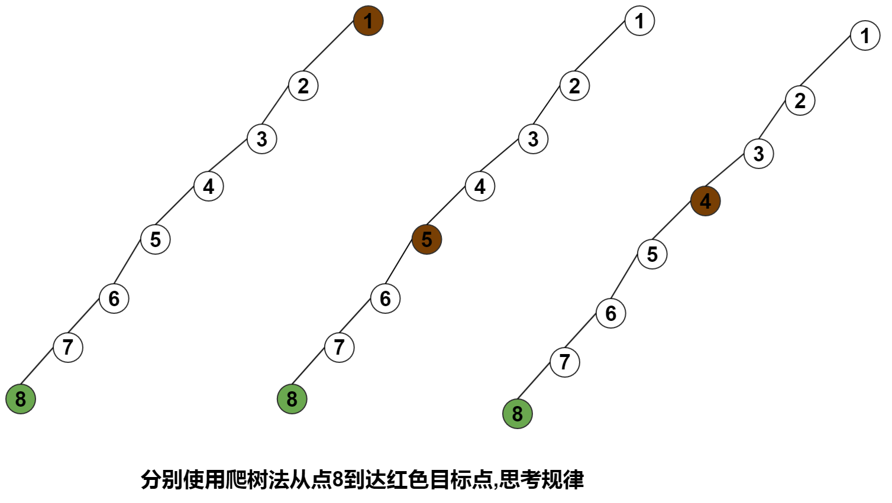
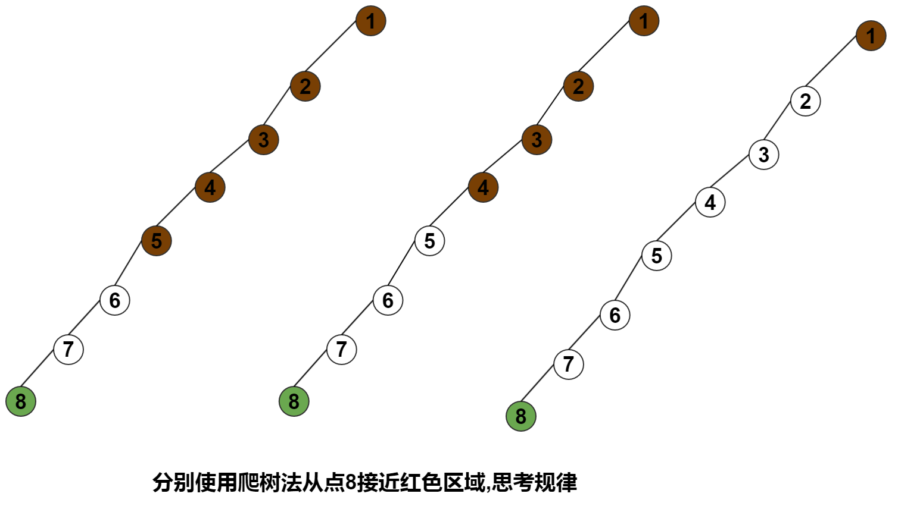
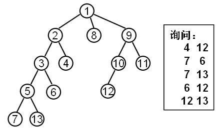

LCA在线算法
=====================

 LCA: 求树上两个点最近公共祖先的算法

## 原理

在讲解之前,我们先想两个问题,这两个问题也是LCA在线算法的核心:


### 问题1:

如上图左部,7点有一个`超能力`--超能爬树,这个能力分为两个:
 - 可以爬到$$2^j$$远的上面的结点上
 - 可以查看$$2^j$$远的结点的性质:
   - 是否比目标点低
   - 如果是目标点,也算是低

例如爬到$$2^0$$远的结点就是5,$$2^2$$远的结点是1,现在问:

 - **结点7如何快速的到达点d**? 
 - **结点7如何快速的到达它上面的任意点?**


那我们按下面的方法来找:

如上图左部的步骤:

 - 7先到最远的点,距离$$2^2$$远的点,也就是1看看,发现高了`[注1]`
 - 因为了高了,那7到距离$$2^1$$远的点3看看,发现在低了
 - 因为低了,说明要到达的点d在点3的上面,那7就爬到点3
 - 7到距离$$2^0$$远的点d看看,发现就是这个点,7爬到这个点.算法结束.

注1:先到最远的点$$2^k$$看,因为$$2^k$$的点上面还有点

**我们发现:**

 - 每一次向上爬的范围都比上次少,且一定是$$2^k,k=n,...,2,1,0$$
 - $$k==0$$的时候,停下的就是你想要到的点
 - 按这种方法,我们可以到达任意想到的点
 - 它的数学原是:**二进制可以表示任意数**

如:

```math

13(dec) = 1101(bin) = 2^3+2^2+2^0
```
这说明如果一个点要爬比它高$$13$$的点,它先要爬$$2^3$$,然后爬$$2^2$$,最后爬$$2^0$$

我们$$d[i]$$表示每个点的深度,$$d[root]=1$$,那么伪代码如下:


```c
int s;//起始
int t;//目标
int k = (int)(log(d[s]-1)/log(2));

for(i=k;i>=0;i--)
    if( d[s] - (2^i) >= d[t]) // s向在爬了(2^i),如果还是低
    {
        s = s向上爬(2^i);
    }
```

**一句话:高查低爬,k--**

体会:



### 问题2


看上图,树上的点依然有它的`超能爬树`这个能力,现在最上面的点`1,2`是有色的点,点7不能到达有色的点,但是它想到离有色部分最近的点怎么做?

如上图的步骤:

  - 设点7为f
  - f先到最远的点,距离$$2^2$$远的点,也就是2看看,发现是有色,不能到
  - 那f到距离$$2^1$$远的点,也就是5看看,发现无色
  - 因为5是无色,那f就爬到点5,但是5上面还有可能有无色的点(想一想哪个范围是),f爬到点5
  - f到距离$$2^0$$远的点3看看,发现是无色,能到达,算法停止.f最后停下的地方就是最接近有色区域的点.
  
更抽象的步骤:

通过`问题1`,点f可以通过不停减少k的方式,快速到达想要到达的点,你把有色区域想成一个点,按这种方式,f最后一次爬树会到达这个点,但是你加上了一个限制条件: **有色区域不能到达!**.f的行为就是尽可能的接近,那最后f停下的位置就是**最接近有色区域的位置**




伪代码:

```c
int tree[N];
int f;
for(i=k;k>=0;k--){
    int tmp_f = f+2^k;
    if( tree[tmp_f] 没有色){
        f= tmp_f;
    }
}
```

**一句话:不是就爬,k--**

## 转为代码


看这个图,我们分为这几个步骤来做

 - 初始化,也是ST部分,求任意点i的$$2^j$$倍祖先:$$p[i,j]$$
 - 把点`9`和点`12`移到同一层,也就是找`10`和`9`的这同一层的点的祖先
 - 上面我们已经知道`LCA(9,12) == LCA(9,10)`,
 - 点1,3都是祖先,但是不知道哪个点是最近公共祖先,所心只要我们近可能的接近`祖先区域`,那最近停下时候的点的父亲,就是所求.
 
## ST 预处理

 已知:点i的父亲是f[i],深度是d[i],`p[i][j]`表示点i的$$2^j$$倍祖先,那么根据DP思想,我们得到一个重要的公式:


$$p[i,j]=\left\\{\begin{matrix} & father[i] &j=0 \\\\ & p[p[i,j-1],j-1] &j>0\end{matrix}\right.$$


那么ST代码:

```c
int d[100] = {0};//每个点的深度
int f[100];//每个点的父亲
int p[100][100];

void st(){
    int i,j;
    memset(p,-1,sizeof(p));//想一想:为什么是-1
    for(i=1;i<=n;i++) // n个点,dp边界
        p[i][0]=f[i];
    
    //n个点,理论最深是n,也就是最大有n-1倍祖先,我们算大一点:算成n倍祖先
    // 2^j <=n --->j=int(log(n)/log(2))
    for(j=1;j<=(int)(log(n)/log(2));j++) 
        for(i=1;i<=n;i++)
            if(p[i][j-1] != -1)// [1] p[i][j-1] != -1 表明可以用自己去更新别人,为什么要有这个判断?
                p[i][j] = p[p[i][j-1]][j-1];
}
```

注意细节如下:


如图,我们初始完毕,且设$$fa[root]=-1$$,这样我就不用更新$$p[1,1],p[1,2],p[1,3]......$$,也不用更新$$p[2,1],p[2,2],p[2,3]......$$

## 两个点到同一层

```c
/*    先判断是否 d[a] > d[b] ，如果是的话就交换一下(保证 a 的深度小于b，方便下面的操作) */
int i;
if(d[a] > d[b])
{
    int tmp =a;
    a=b;
    b=tmp;
}

/* 转为找同层结点  d[a] <= d[b] */
/* 这种找法 能成功的原因,看折半查找原理*/

int k = (int)(log(d[b]-1)/log(2));//公式 root 点是b点d[b]-1倍祖先
for(i=k;i>=0;i--){
    if(d[b]-(1<<i) >=d[a]) //1<<i ==2^i,>=d[a] 没有a的高,还要往上爬
        b=p[b][i];
}
if(a == b)    //这种情况:b是a的子树
    return a;
```


## 同一深度的点一起向上爬

我们认为:$$d[i]$$表示点的深度,那么$$d[root]=1$$

那么点$$i$$有$$d[i]-1$$个祖先,所以点$$i$$能一次爬树的最大范围是:$$k = (int)(log(d[b]-1)/log(2))$$

```c
//爬树中,原理:拆半查找原理
k = (int)(log(d[b]-1)/log(2));

for(i=k;i>=0;i--)
    if(p[a][i] != p[b][i])
    {
        a=p[a][i];
        b=p[b][i];
    }
return p[a][0]; //返回父亲
```


## 完整代码


数据
```
13 5
1 2
1 8
1 9
2 3
2 4
9 10
9 11
3 5
3 6
10 12
5 7
5 13
4 12
7 6
7 13
6 12
12 13
```

```c
#include <cstdio>
#include <cstring>
#include <cmath>


#define N 100

int n,m,root;//n个点,m个询问

struct Edge {
    int u,v,w;
    int next;
}E[100];
int size = 0;
int head[N];

void addEdge(int x,int y,int z){
    size++;
    E[size].u =x;
    E[size].v =y;
    E[size].w =z;
    E[size].next = head[x];
    head[x] = size;
}

int fa[N]; //存点的父亲
int d[N]; // 每个点的深度
int p[N][N]; //p[i][j] 点i的2^j倍祖先

void dfs(int s){
    int i;
    for(i=head[s];i!=-1;i=E[i].next){
        int y = E[i].v;
        d[y] = d[s] +1; //深度+1
        dfs(y);
    }
}
//预处理
void st(){
    //找到root点
    memset(p,-1,sizeof(p));

    root =1;
    while( fa[root] != 0)
        root = fa[root];//停下来的时候root 就是根的编号
    fa[root] = -1;
    d[root] = 1;
    dfs(root);  //处理每个点的深度

    int i,j;
    //边界
    for(i=1;i<=n;i++)
        p[i][0] = fa[i];

    //n个点,理论最深是n,也就是最大有n-1倍祖先,我们算大一点:算成n倍祖先
    // 2^j =n --->j=log(n)/log(2)
    int k = int( log(n)/log(2)); //
    for(j=1;j<=k;j++) // 遍历最大深度可能1-->k
        for(i=1;i<=n;i++){
            if( p[i][j-1] != -1)// p[i][j-1] 存在,那p[i][j] 有可能存在
                p[i][j]  = p[ p[i][j-1]][j-1];
        }
}

//爬树法
int lca(int a,int b){
    
    /*    先判断是否 d[a] > d[b] ，如果是的话就交换一下(保证 a 的深度小于b,保证一定是b往上升到a同层) */
    if( d[a] > d[b]){
        int tmp = a;
        a=b;
        b=tmp;
    }

    int k = (int )(log(d[b] - 1)/log(2));//公式 root 点是b点d[b]-1倍祖先
    int i;
    for(i=k;i>=0;i--){
        if( d[b]-(1<<i) >= d[a]) // 1<<i ==2^i,>=d[a] 没有a的高,还要往上爬
            b = p[b][i];
    }

    if( a== b) // 这表明b是a的子树的点
        return a;

    //同时向上爬,到达最接近共同祖先的点
    k = (int)(log(d[b]-1)/log(2));
    for(i=k;i>=0;i--)
        if(p[a][i] != p[b][i])
        {
            a=p[a][i];
            b=p[b][i];
        }
    return p[a][0];
}
int main(){
    memset(head,-1,sizeof(head));
    scanf("%d%d",&n,&m);
    int i,j;
    for(i=1;i<n;i++){ //n-1条边
        int x,y;
        scanf("%d%d",&x,&y);
        addEdge(x,y,1);//默认边权为1
        fa[y] = x;
    }

    //预处理
    st();

    //处理询问
    for(i=1;i<=m;i++){
        int x,y;
        scanf("%d%d",&x,&y);
        int ans = lca(x,y);
        printf("%d\n",ans);
    }
}
```
