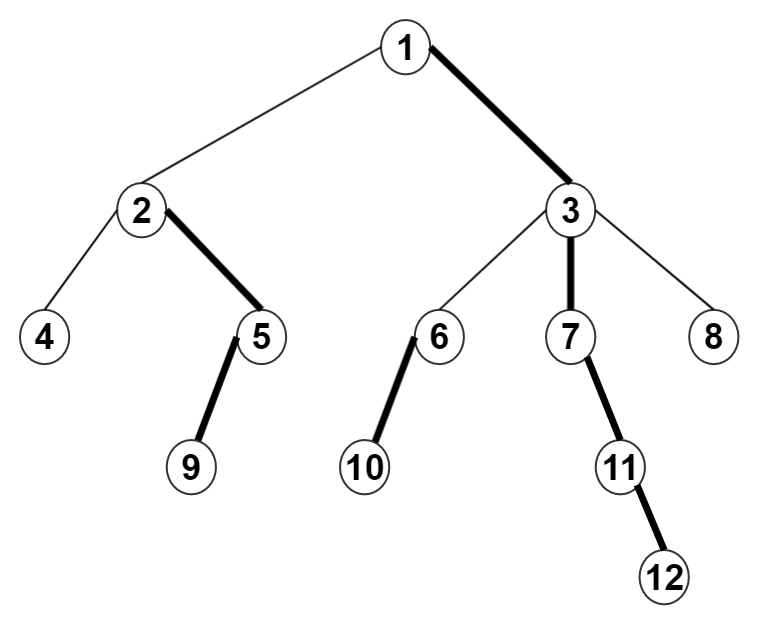
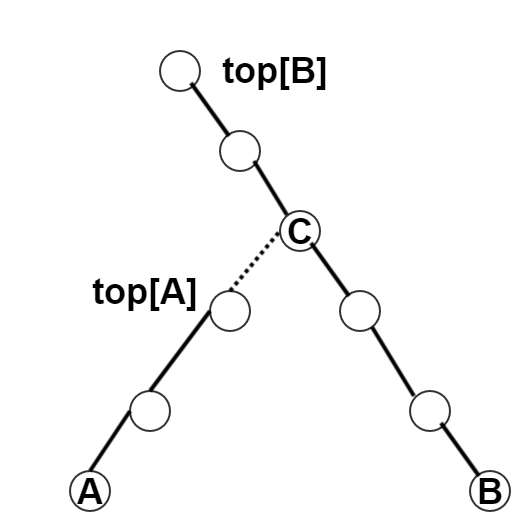
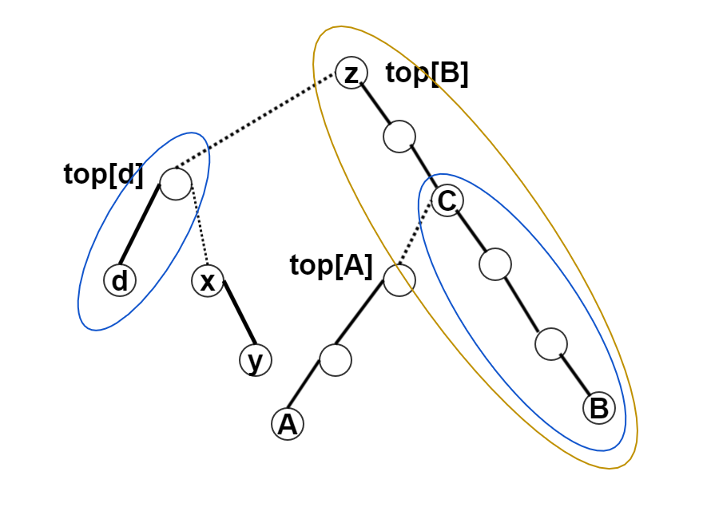
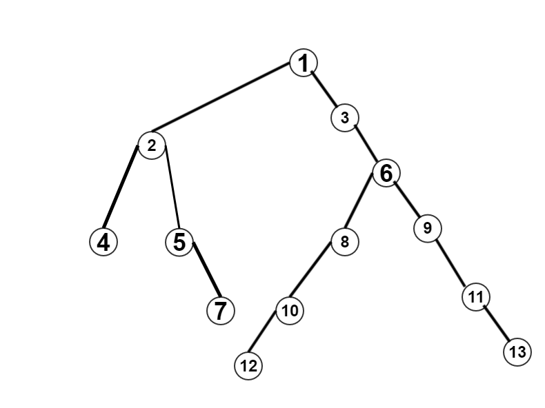

# 树链剖分求LCA

## 基本思想



### 情况1:在同一条重链上

第一种情况我们要比较的点在一条重链上，比如比较3和12，直接返回深度比较小的点就好了

### 情况2:不在同一条重链上


第二种情况我们要比较不在一条链上的两个数，比如我们想求一下10和8的LCA，我们只需要比较一下10和8的重链链顶的深度，我们发现竟然一样深，那我们就用比较早发现的10的链顶就好了，我们吧我们要比较的元素变为自己链顶的父亲（这样就可以实现垮链了），所以近下来我们只需要比较3和8就好，我们发现3和8不在一条链上，所以我们比较3和8链顶的深度，发现8的比较深，所以我们把我们要比较的数变成8的链顶的父亲，也就是3，所以这时候我们要比较的数就都在一条链上了，返回深度比较浅的数就好。


### **证明**

为什么上面的方法是对的呢?



点A和B不在同一条重链上,我们可以从图中看到$$lca(A,B)=C$$,按上面的方法A会爬到C,因为$$top[C]=top[B]$$,这时我它们就在同一条**重链**上了,且$$dep[C] < dep[B]$$ 

这里我们先提出两个概念:

**主链:**在树上有一个包含了根的重链

**支链:**非主链的重链

**我们可以把轻边上的点i想像成一个长度为0的重边**

如图,对于树z来说重链$$(z,b)$$是主链.对于子树C来说,重链$$(C,B)$$一条主链.对于子树top[d]来说,重链$$(top[d],d)$$是一条主链



如果我们求$$lca(A,B)$$,我们知道$$(z,B)$$(或者:$$(C,B)$$)是主链,$$(A,top[A])$$是支链,因为$$dep(top[A]) > dep(top[B])$$,所以节点$$A$$会爬到点$$C$$,相当于从支链迁移到主链上.这时,它们在同一条重链上,可以得到$$lca(A,B)$$的值.

如果我们求$$lca(d,y)$$,我们知道$$(d,top[d])$$是主链,$$(y,top[y])$$是支链,因为$$dep(top[y]) > dep(top[d])$$,所以节点$$y$$会爬到点$$top[d]$$,相当于从支链迁移到主链上.这时,它们在同一条重链上,可以得到$$lca(d,y)$$的值.

如果我们求$$lca(y,A)$$,从图中我们可以看出:
 - y所在的重链$$(y,top[y])$$是$$(d,top[d])$$的支链
 - 重链$$(d,top[d])$$是$$(B,z)$$的支链
 - 重链$$(A,top[A])$$是$$(B,z)$$的支链

过程:

 - 因为$$dep(top[y]) < dep(top[A])$$,所以点A爬到它所在的重链相对的主链上,来到点C.
 - 因为$$dep(top[y]) > dep(top[C])$$,所以点y爬到它所在的重链相对的主链上,来到点top[d].
 - 因为$$dep(top[d]) > dep(top[C])$$,所以点top[d]爬到它所在的重链相对的主链上,来对点z.
 - 这里因为$$ top[C] == top[z]$$ 它们在同一条重链上,所有可以得到$$lca(y,A)$$的值

我们发现利用树链剖分求lca,就是**在重链上不停的迁移的过程**


## 算法核心

我们用两遍DFS来求,`size[i],top[i],dep[i],son[i],fa[i]`

 - **size[i]:**用来保存以i为根的子树节点个数
 - **top[i]:**用来保存当前节点的所在重链的顶端节点,如果i不为重儿子,那么$$top[i] = i$$
 - **son[i]**用来保存重儿子
 - **dep[i]:**用来保存节点i的深度
 - **fa[i]:**用来保存节点i的父亲

其中`dep[root] == 1`

### 初始化

```c
int fa[Maxn];
int son[Maxn];
int dep[Maxn];
int size[Maxn];
int top[Maxn];
memset(son,-1,sizeof(son));
```

### 第一遍DFS

找重边,求出`fa,dep,son,size`

```c
// 当前点u,前趋点pre,当前深度d
void dfs1(int u,int pre,int d){ //
    dep[u] = d;
    fa[u] = pre;
    size[u] = 1;

    int i;
    for(i=head[u];i!=-1;i=E[i].next){
        int v= E[i].v;

        //因为存的路径是双向,不能走到父亲
        if(v != pre){
            //递归找到儿子的 dep[v],son[v],size[v]
            dfs1(v,u,d+1);
            size[u] +=size[v];

            //更新重儿子
            if(son[u] == -1 || size[v] > size[ son[u] ])
                son[u] = v;
        }
    }
}
```
### 第二遍DFS

连接重边为重链,求出`top`

以根节点为起点,沿重边向下拓展,拉成生链

不在当前重链上的点,都是该点为起点向下重新拉成一条重链

```c
// 当前点u,重链顶点sf:super father
void dfs2(int u,int sf ){ //
    top[u] = sf;
    if( son[u] != -1)//有重儿子
        dfs2(son[u],sf);
    else     //只有叶节点没有重儿子
        return;

    //更新它点
    int i;
    for(i= head[u]; i !=-1;i=E[i].next){
        int v = E[i].v;
        if( v != son[u] && v!= fa[u]){
            dfs2(v,v);
        }
    }
}
```

### 找lca的值

本质是进行跨链操作:**如果x,y不在同一条重链上,较深的点跨到另一条重链上,直到两个点都在同一条重链上**

```c
int find(int x,int y){
    //找到两个点的重链的顶端点
    int f1 = top[x],f2 = top[y];
    int tmp = 0;
    while(f1 != f2){

        //从深度较深的点 向上爬
        if( dep[f1] < dep[f2]){
            swap(f1,f2);
            swap(x,y);
        }
        //交换后 y所在重链的 dep[ top[y] ] < dep[ top[x] ]
        //x top[x] 较深

        //跨链
        x =  fa[f1];
        f1 = top[x];
    }

    //返回较浅的那个点
    if( dep[x] > dep[y])
        swap(x,y);
    return x;
}
```

## 具体代码



数据:
第一行表示有m条边,root点是那个
第2行到第m+1行,每行两个数i,j,表示一条边上的两个点,其中i为父点
第m+2行表示有n个询问
接下来n行,表示n个询问

```
12 1
1 2
1 3
2 4
2 5
5 7
3 6
6 8
6 9
8 10
10 12
9 11
11 13
3
12 13
4 7
7 12
```

**代码:**

```c
#include <cstdio>
#include <cstring>

#define maxn 100

int m,n;
int root;

int head[maxn];
struct edge {
    int next;
    int v;
}E[maxn<<1]; //存两遍边
int cnt = 0;

void addedge(int x,int y){
    cnt++;
    E[cnt].v = y;
    E[cnt].next = head[x];
    head[x] = cnt;
}

int son[maxn];
int top[maxn];
int dep[maxn];
int fa[maxn];
int size[maxn];

void dfs1(int u,int pre,int d){
    dep[u] = d;
    fa[u] = pre;
    size[u] = 1;
    int i;
    for(i=head[u];i!=-1;i=E[i].next){
        int v = E[i].v;
        dfs1(v,u,d+1);
        size[u] += size[v];
        if(son[u] == -1 || size[v] > size[ son[u] ])
            son[u] = v;
    }
}

void dfs2(int u,int sf){
    top[u] = sf;
    if(son[u] != -1)
        dfs2(son[u],sf);
    else
        return ;
    int i;

    for(i=head[u];i!=-1;i=E[i].next){
        int v = E[i].v;
        if( v!= son[u] && v != fa[u])
            dfs2(v,v);
    }
}

void swap(int &x,int &y){
    int t = x;
    x = y;
    y =t;
}

//找到lca(x,y)
int find(int x,int y){
    //找到两个点的重链的顶端点
    int f1 = top[x],f2 = top[y];
    int tmp = 0;
    while(f1 != f2){

        //从深度较深的点 向上爬
        if( dep[f1] < dep[f2]){
            swap(f1,f2);
            swap(x,y);
        }
        //交换后 y所在重链的 dep[ top[y] ] < dep[ top[x] ]
        //x top[x] 较深

        //跨链
        x =  fa[f1];
        f1 = top[x];
    }

    //返回较浅的那个点
    if( dep[x] > dep[y])
        swap(x,y);
    return x;
}

int main(){
    memset(head,-1,sizeof(head));
    memset(son,-1,sizeof(son));
    scanf("%d%d",&m,&root);
    int i;
    for (i=1;i<=m;i++){
        int x,y;
        scanf("%d%d",&x,&y);
        addedge(x,y);
    }
    dfs1(root,root,1);
    dfs2(root,root);
    
    scanf("%d",&n);
    int x,y;
    for(i=1;i<=n;i++){
        scanf("%d%d",&x,&y);
        int ans = find(x,y);
        printf("%d\n",ans);
    }

    return 0;
}
```
## 练习题目２　

题目地址：[【模板】最近公共祖先（LCA）](https://www.luogu.org/problemnew/show/P3379)


**代码**

```c
#include<iostream>
#include<cstdio>
#include<cstring>
#define maxn 500005
using namespace std;
int m,n,root;
struct edge{
	int next;
	int v;
}E[maxn<<1]; //存两遍边
int head[maxn];
int son[maxn],top[maxn],size[maxn],fa[maxn],dep[maxn];
int cnt=0;
void addEdge(int x,int y){
	cnt++;
	E[cnt].v=y;
	E[cnt].next=head[x];
	head[x]=cnt;
}
void dfs1(int u,int pre,int d){
	dep[u]=d;
	fa[u]=pre;
	size[u]=1;
	for(int i=head[u];i!=-1;i=E[i].next){
		int v=E[i].v;
		if( v == pre ) continue;
		dfs1(v,u,d+1);
		size[u]+=size[v];
		if(son[u]==-1 || size[v]>size[son[u]]){
			son[u]=v;
		}
	}
}
void dfs2(int u,int sf){
	top[u]=sf;
	if(son[u]!=-1){
		dfs2(son[u],top[u]);
	}
	else return ;
	for(int i=head[u];i!=-1;i=E[i].next){
		int v=E[i].v;
		if(v!=son[u] && v != fa[u]) 
		    dfs2(v,v);
	}
}
int find(int x,int y){
	int f1=top[x],f2=top[y];
	while(f1!=f2){
		if(dep[f1]<dep[f2]){
			swap(f1,f2);
			swap(x,y);
		}
		x=fa[f1];
		f1=top[x];
	}
	if(dep[x]>dep[y]){
		swap(x,y);
	}
	return x;
}
int main(){
	memset(son,-1,sizeof(son));
	memset(head,-1,sizeof(head));
	scanf("%d%d%d",&n,&m,&root);
	for(int i=1;i<=n-1;i++){
		int a,b;
		scanf("%d%d",&a,&b);
		addEdge(a,b);
		addEdge(b,a);
	}
	dfs1(root,root,1);
	dfs2(root,root);
	for(int i=1;i<=m;i++){
		int a,b;
		scanf("%d%d",&a,&b);
		printf("%d\n",find(a,b));
	}
	return 0;
}
```
