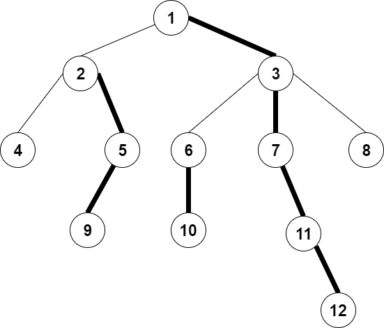
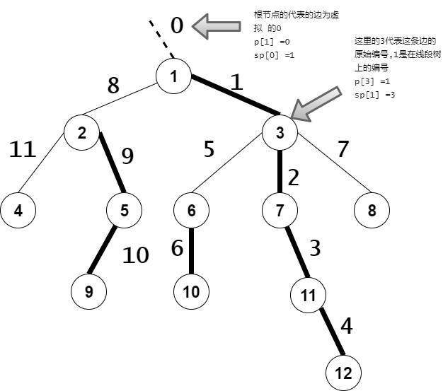
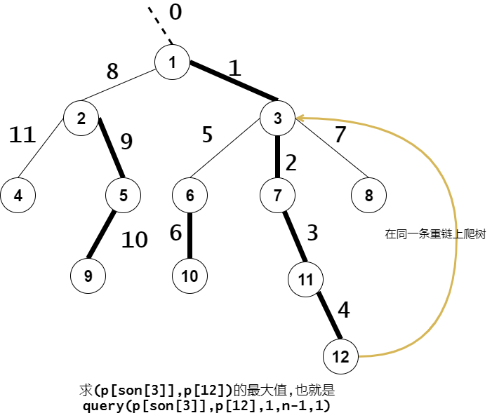
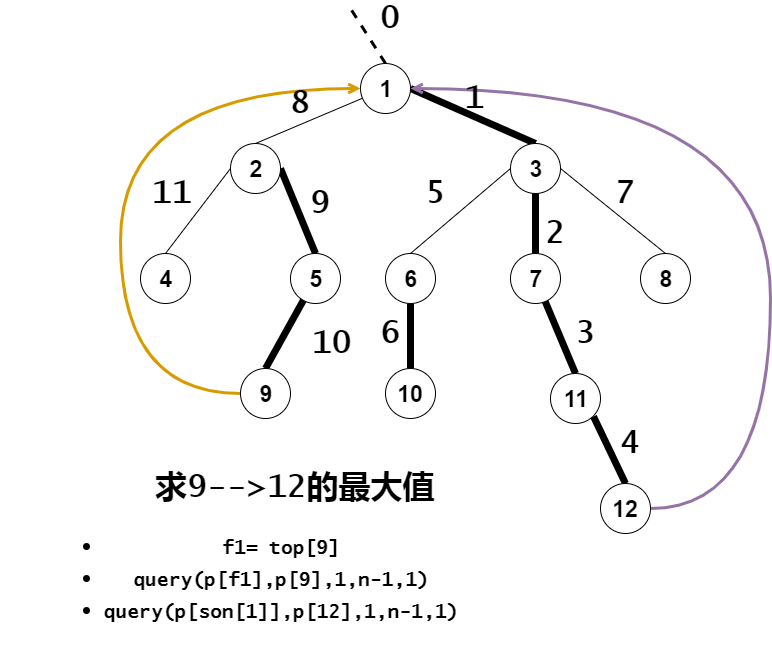

# 树链剖分-树上修改

## 题目引入

cogs 1672

## 解析

一条边有两种编号

 - 原编号,`p[i]`表示原编号为i的边,对应的线段树上的编号的值
 - 线段树上的编号,`sp[i]`表示线段树上编号为i的边,对应的原编号的值

### 基本思想

同一条重链的边的线段树上的编号是连续的

我们知道`跨链`的时候,一次走过一段重链,它们的编号正好是连续的,正好可以对应线段树的**区间修改**

图

### 边的编号问题

这里是修改边,如果一条边的`(a,b)`其中`b`是儿子节点,那么`b`就这个边的原始编号,且一条重链上的边的对应的线段树的编号是连续的,如果我们从点`i`跨链到`fa[top[i]]`,那么我们修改边的编号为`i-->son[i]`,正好对应的线段树上的编号是连续的

如图:


以根结点为编号的边为一条虚拟边(不存在),对就线段树上的编号为0(用不到)

如果是修改点

### 跨链注意点1 - 在同一条重链上

### 跨链注意点2 - 在不同的重链上







## 代码

```c
#include <cstdio>
#include <cstring>

#define maxn 10010
#define lson(rt) (rt<<1)
#define rson(rt) (rt<<1)|1
/* 全局变量 */
char str[100];
int n;//n个点
int size[maxn]; // 以点i为根的子树的结点数
int dep[maxn]; //点不的深度
int fa[maxn];  //点i的父亲
int top[maxn]; //点i所在的重链的顶
int son[maxn]; //点不的重儿子
int p[maxn]; //边i的对应的线段树的编号
int sp[maxn];//线段树上的编号i的点对应原来的边的编号
int root;//根节点,任意一个点都可以作为树的根节点

int idx = 0;
int st[maxn<<2]; //线段树
int fst[maxn<<2];//线段树的标记树
int st_edge[maxn]; //存边的值,建树的时候用

//静态链表
int cnt = 0;
struct Edge{
    int u,v,w,next;
}E[maxn<<1];
int head[maxn];

void addedge(int x,int y,int w){
    cnt++;
    E[cnt].u =x;
    E[cnt].v =y;
    E[cnt].w  = w;
    E[cnt].next = head[x];
    head[x] = cnt;
}

int max(int a,int b){
    if( a> b) return a;
    return b;
}

void swap(int &x,int &y){
    int t = x;
    x =y ;
    y =t;
}

/* 全局变量end */

/* 树链部分 */

//第一遍dfs,找重边
//son,size,fa
void dfs1(int u,int pre,int d){
    fa[u] = pre;
    size[u] =1;
    dep[u] = d;

    int i;
    for(i=head[u];i!=-1;i = E[i].next){
        int v = E[i].v;
        if( v != fa[u]){ // 是儿子

            dfs1(v,u,d+1);
            size[u] += size[v];

            //更新重儿子
            if( son[u] == -1 || size[v] > size[son[u]])
                son[u] =v;
        }
    }
}

//第二遍dfs,连重边为重链
//top,p
// 当前点u,重链顶点sf:super father
void dfs2(int u,int sf){ //
    top[u] = sf;
    // 进行编号
    p[u] = idx; //边u的线段树上编号
    sp[ p[u] ] = u; // 线段树的编号p[u] 对应的原边的编号
    idx++;
    if( son[u] != -1)//有重儿子
        dfs2(son[u],sf);
    else     //只有叶节点没有重儿子
        return;
    //更新其它点
    int i;
    for(i= head[u]; i !=-1;i=E[i].next){
        int v = E[i].v;
        if( v != son[u] && v!= fa[u]){ //非重儿子,非父亲
            dfs2(v,v);
        }
    }
}


/* 树链部分end */

/*----- 线段树部分 -----*/

void pushup(int rt){
    //左右孩子的较大值
    st[rt] = max(st[lson(rt)] ,st[rson(rt)]);
}

//更新--单点更新
void update(int node ,int c,int l,int r,int rt){
    if(l == r){
        st[rt] = c;
        return ;
    }
    int m = (l+r)>>1;
    if( node <= m) update(node,c,l,m,lson(rt));
    if( node > m) update(node,c,m+1,r,rson(rt));
    pushup(rt);
}

int query(int l1,int r1,int l,int r,int rt){
   if(l1<=l && r <= r1){//包含
        return st[rt];
    }
    //路过
    int ret = -0x7fffffff;
    int m = (l+r)>>1;
    if(l1 <= m) ret=max(ret,query(l1,r1,l,m,lson(rt)) );
    if(r1 > m ) ret=max(ret, query(l1,r1,m+1,r,rson(rt)) );
    return ret;
}

//建立线段树
void build(int l,int r,int rt){
    if( l==r){
        st[rt] = st_edge[l];
        return ;
    }
    int m = (l+r)>>1;
    build(l,m,lson(rt));
    build(m+1,r,rson(rt));
    pushup(rt);
}

/*----- 线段树部分end -----*/

//跨链找lca(u,v)
//在跨链的过程中进行线段树上的修改
int find(int u,int v){
    if( u == v)
        return 0;

    int f1 = top[u],f2 = top[v];//先找到两个端点的重链顶端节点，如果是轻儿子，就是它本身
    int tmp = -0x7fffffff;
    while(f1!=f2){
        //从深度较深的开始查询,保证v的链顶f2深度深
        if(dep[f1] > dep[f2]){
            swap(f1,f2);
            swap(u,v);
        }
        //查询一条重链上的最大值
        //p[f2]表明的边的编号 < p[v]
        tmp=max(tmp,query(p[f2],p[v],1,n-1,1));
        v=fa[f2];f2=top[v];
    }
    //如果f1=f2代表在同一条重链上m,如果u=v代表更新结束
    if(u==v)         // 同一个点,表明前面已经爬到同一个点
         return tmp; //这个时候有两种情况,1.本来两个点就是同一个点,2 跨链后到同一个点
                    //这里只可能是情况2,所以返回tmp
    if(dep[u]>dep[v]) // 保证 u浅 v深
        swap(u,v);
    // p[son[u]] 表明u的重儿子son[u]为编号的边对应的线段树上的编号
    tmp = max(tmp,query(p[son[u]],p[v],1,n-1,1));
    return tmp;

}

//初始化
void init(){
    memset(fa,-1,sizeof(fa));
    memset(son,-1,sizeof(son));
    memset(head,-1,sizeof(head));
    //建立标记树
    memset(fst,0,sizeof(fst));
}


int main(){
    //freopen("qtree.in","r",stdin);
    //freopen("qtree.out","w",stdout);
    init();
    scanf("%d",&n);
    int i,j;
    for(i=1;i<n;i++){
        int x,y,w;
        scanf("%d%d%d",&x,&y,&w);
        addedge(x,y,w); //正反都存一遍
        addedge(y,x,w);
    }
    root =1; //任意一个点都可以作为树的根节点

    //二次dfs
    dfs1(1,1,1);
    dfs2(1,1);

    //得到 边的值
    // 因为存二次边,所有边1,3,... 才是真正的原来的边
    for(i=1;i<=cnt-1;i = i+2){ 
        int u = E[i].u;
        int v = E[i].v;

        // 保证 v 比较深
        if( dep[v] < dep[u])
            swap(u,v);
        st_edge[ p[v] ] = E[i].w;
    }
    
    //建树,n个点,n-1条边
    build(1,n-1,1);
    while(1){
        int x,y;
        scanf("%s",str);
        if(str[0] == 'D')
            return 0;
        if( str[0] == 'Q'){
            scanf("%d%d",&x,&y);
            int ans = find(x,y);
            printf("%d\n",ans);
        }
        else if( str[0] == 'C'){
            scanf("%d%d",&x,&y);
            int u = E[x*2-1].u;
            int v = E[x*2-1].v;

            if( dep[v] < dep[u]) //保证v点深度深
                swap(u,v);
            update(p[v],y,1,n-1,1);
        }
    }

    return 0;
}
```
