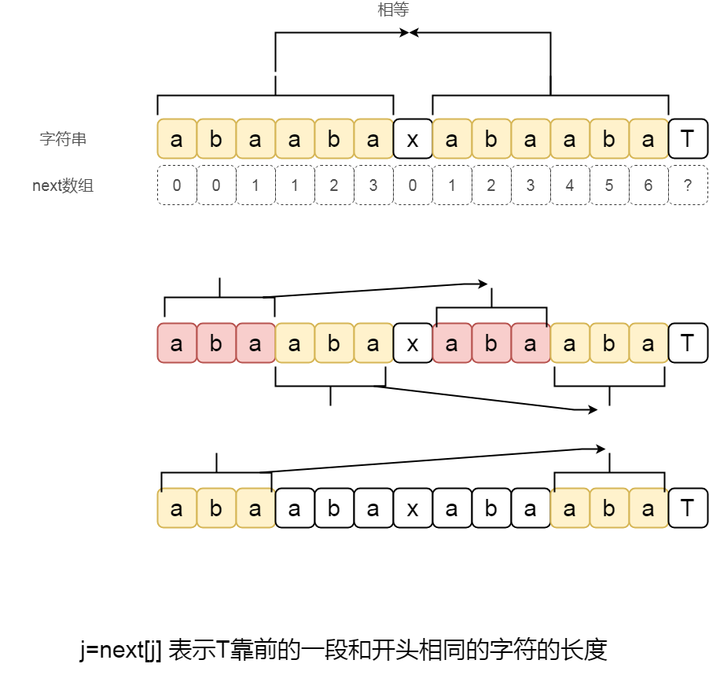
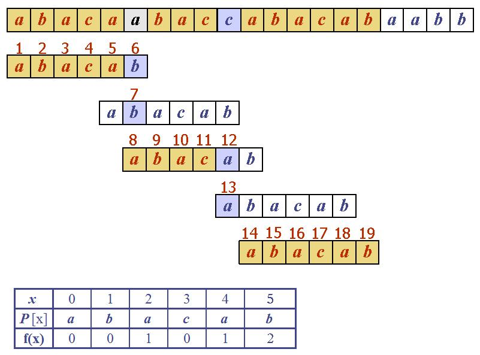

# KMP算法

kmp[i]的基本定义是：在第1-第i-1位中前缀与后缀相同的部分最长是多长。这样，即可以理解为，若第i位失配了，则至少要往前跳多少步，才可能重新匹配得上。这样便可以解释前面的例子了。

## 算法演示

 - http://whocouldthat.be/visualizing-string-matching/
 - https://people.ok.ubc.ca/ylucet/DS/KnuthMorrisPratt.html
 - http://whocouldthat.be/visualizing-string-matching/


```viz-dot
digraph title {
    node[shape=rect];
    "1.算法过程" -> "2.next数组的处理";
}
```

## 核心





## 第到next数组的值

## 匹配


当到达某个不匹配的地方的时候,需要重新匹配!kmp的匹配就一种类似递归的思想.只要理解了这种思想,$KMP$算法就简单了.

## 题目

题目地址: [luogu P3375 【模板】KMP字符串匹配](https://www.luogu.org/problemnew/show/P3375)

### 代码

```c
#include <cstdio>
#include <cstring>
#define maxn 1000005


char a[maxn];
char b[maxn];
int la,lb;
int next[maxn]={0};

void init(){
   scanf("%s",a+1);
   scanf("%s",b+1);
   la = strlen(a+1);
   lb = strlen(b+1);
}

// 自己匹配自己
/* 得到next数组 */
void deal_next(){
    int i,j=0;
    // 从第二个位置开始算,因为next[1] = 0
    for (i=2;i<=lb;i++){
        while(j && b[i] != b[j+1])
            j = next[j];
        if( b[j+1] == b[i]) j++;
        next[i] = j;
    }
}

void kmp(){
    int i,j=0;  //j代表第二个字符串有开头的j个字符和第一个字符串相等
    for (i=1;i<=la;i++){
        
        while(j && b[j+1] != a[i])  //
            j= next[j];             // 代表第二个字符串向右推

        if( b[j+1] == a[i])
            j++;
        if( j == lb){
            printf("%d\n",i-lb+1); //输出匹配的位置
            j = next[j];
        }
    }
}

int main(){
    init();
    deal_next();
    kmp();
    int i;
    for (i=1;i<=lb;i++){
        printf("%d ",next[i]);
    }
    return 0;
}
```

## 练习题目

 - loj #10057 「一本通 2.4 例 1」KeywordsSearch
 - loj #10058 「一本通 2.4 练习 1」玄武密码
 - loj #10059 「一本通 2.4 练习 2」Censoring
 - loj #10060 「一本通 2.4 练习 3」单词
 - loj #10061 「一本通 2.4 练习 4」最短母串
 - loj #10062 「一本通 2.4 练习 5」病毒
 - loj #10063 「一本通 2.4 练习 6」文本生成器


## 参考/引用

 - [Matrix67 KMP算法与一个经典概率问题](http://www.matrix67.com/blog/archives/366)
