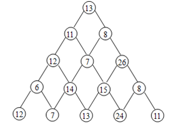
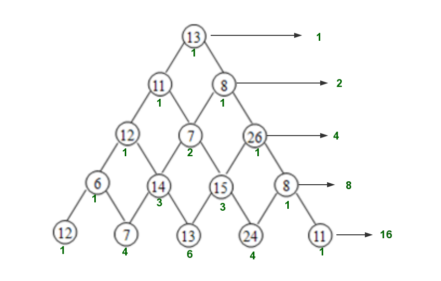
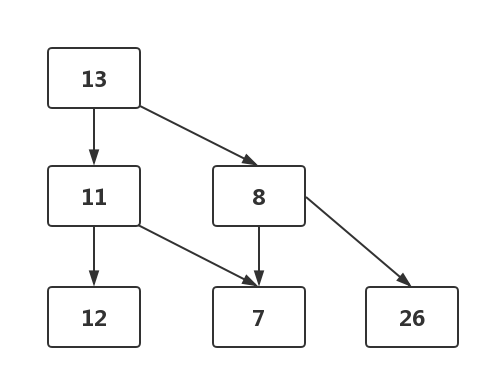
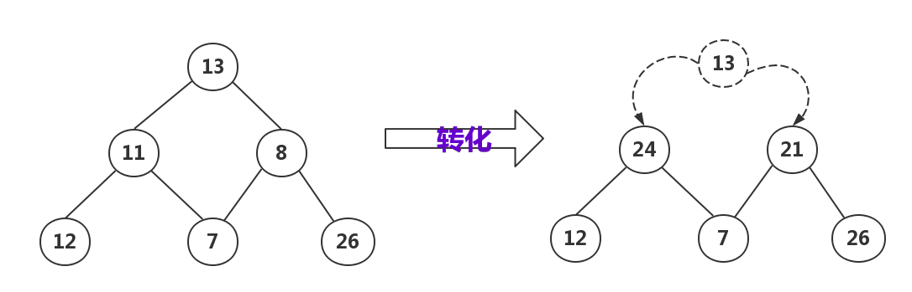
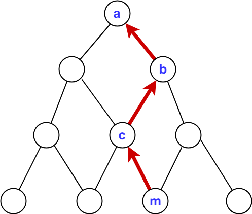

@[toc]


## 引入:数塔问题(NOIP)

题目地址:

 - cogs 77
 - [luogu P1216](https://www.luogu.org/problemnew/show/P1216)


### 问题描述

设有一个三角形的数塔，顶点结点称为根结点，每个结点有一个整数数值（小于3000）。从顶点出发，可以向左走，也可以向右走。如图所示：从根结点13出发，向左走到达11，再向右走到达7，再向左走到达14，再向左走到达7.由于7是最底层，无路可走。此时，我们找到一条从根结点开始到达底层的路径：

```
13--11--7--14--7
```

路径上结点中数字的和称为路径的值，如上面路径的值为13+11+7+14+7=52。同时，从图中可以看到除了上述路径外，还存在其他的路径，如：

```
13--11--12--14--13
```

其路径的值为63。

问题：当三角形数塔给出后，找出一条路径，使路径上的值为最大。若这样的路径存在多条，选根部偏左的路径。



### 【输入格式】

输入由若干行组成，第一行有一个整数，n（1≤n≤80）；n表示数塔的层数。第2至n+1行是数塔的信息。

### 【输出格式】

输出由两行组成，第一行有一个整数，为所选路径的值。

第二行有n个整数，为所选路径，中间用一个空格隔开。

### 【输入样例】

```
5
13
11 8
12 7 26
6 14 15 8
12 7 13 24 11
```
### 【输出样例】

```
86
13 8 26 15 24
```

## 分析1:使用搜索

如果使用DFS,可以使用下面的DFS树来表示搜索过程:



每个点上的值代表这个以这个点为结尾的**搜索路径**有多少种.

对于4层的数塔来说,一共搜索:$2^{4-1} =8$次,显然对于`n`层数塔来说,搜索次数如下:

$$
2^{n-1}
$$

如果有100层,搜索一定会超时.

我们可以写出一个搜索的代码:

```c
#include <cstdio>

//二维数组存数塔
int s[100][100];
int path[100];//存路径
int _path[100];//存路径
int n;
int max=0;
int sum=0;

void path_copy(){
    int i;
    for(i=1;i<=n;i++)
        _path[i] = path[i];
}

void dfs(int x,int y){
    if(x == n+1){
        if( max < sum){
            max =sum;
            path_copy();
            //memcpy(_path,path,100*4);
        }
        return;
    }
    int i,j;
    path[x] = s[x][y];
    sum += s[x][y];
    dfs(x+1,y);
    sum -= s[x+1][y];
    dfs(x+1,y+1);
    sum -= s[x+1][y+1];
}

int main(){
    scanf("%d",&n);
    int i,j;
    for(i=1;i<=n;i++)
        for(j=1;j<=i;j++)
            scanf("%d",&s[i][j]);
    dfs(1,1);
    printf("%d\n",max);
    for(i=1;i<=n;i++)
        printf("%d ",_path[i]);
    return 0;
}
```


## 分析2:使用动态规化的思想

我们按下面的方式来存数塔



通过上面我们已经知道:使用搜索面对小的数据可以求出答案,但是面对大的数据的时候就会运行很长的时间(超时:TimeError).

搜索慢的原因本质上是对子问题进行了重复的计算: 比如想知道到达`14`这个点的最大值,DFS要来到这个点三次,才能知道.


我们发现如果想知道到达`14`这个点的最大值,其时候只要需要知道从起点到达`12`,`7`的最大值就行了.如果把这种想法放到整体上来说:设$f[i][j]$从起点到达第i层第j个点的最大值.那么显示:

$$
f[i][j] = a[i][j]+max\{f[i-1][j-1],f[i-1][j]\}
$$

其中$a[i][j]$代表第i行,第j个点的值,$f[i-1][j-1],f[i-1][j]$代表$f[i][j]$上面的两个点

这样数塔问题可以形像化的如下图所示:



## 数塔的DP思想


### 重叠子问题

是上面所说如果我们想要求到达`14`这个点的最大值,通过搜索的话要多次达到这个点才能求出值.但是使用DP的话,我们只需要求出一次的值.

### 最优原理

原问题求**从起点到最后一层的最大值**,转换成到点$[i][j]$的最大值,记为:$f[i][j]$

问题$f[i][j]$,分成子问题:$f[i-1][j-1],f[i-1][j]$

### 多阶段决策

数塔的每一层都是一个阶段.如果想求出第n个阶段的值,必须要求出n-1这个阶段的值.

### 无后效性

当求出第n-1阶段的值后,那个n-1阶段的值只会影响第n阶段之后的值,不会影响`1->n-2`阶段的值.也就是说:**一旦作出决定,就不会变化了**

### 更加高效

- 对于n层数塔,使用搜索算:$2^{n-1}$
- 使用DP: $1+2+3+ \cdots +n$

$DP$可以非常高效的算出来。


## DP代码1: 只求最大值

```c
#include <cstdio>

//二维数组存数塔
int s[100][100]={0};
int f[100][100]={0};
int n;
int max=0;
int sum=0;

int main(){
    scanf("%d",&n);
    int i,j;
    for(i=1;i<=n;i++)//读入
        for(j=1;j<=i;j++)
            scanf("%d",&s[i][j]);
    f[1][1] = s[1][1];
    
    for(i=2;i<=n;i++)
        for(j=1;j<=i;j++){
            int m;
            if(f[i-1][j-1] >=f[i-1][j]){
                m = f[i-1][j-1];
            }
            else {
                m = f[i-1][j];
            }
            f[i][j] = s[i][j]+ m;
        }
    int _max = 0;
    int _max_index; // 最后一层,最大的那个下标
    for(i=1;i<=n;i++)
        if(max < f[n][i])
            max = f[n][i],_max_index = i;
    printf("%d\n",max);

    return 0;
}
```


## DP代码2: 输出路径


**如何输出路径呢?**  
想一想:每一个点都都需要选上一层和自己有联系的点中$f$值最大的那个点.我们设一个值$path[i][j]$表示:**第i行的第j个点是由第i-1行的哪一个点来(转移)的**.  
同时我们遍历最后一行的$f$值的时候,可以知道最后一行的哪个点最大.设它为$m$点.  
那么你就如下图的一种关系:



所以最终你只要倒过来查找一遍,然后正过来输出就ok了,具体看代码:

```c
// f[i][j] = max{f[i+1][j],f[i+1][j+1]} + a[i][j]
/* author: Rainboy email: rainboylvx@qq.com  time: 2021年 01月 15日 星期五 22:39:30 CST */
#include <bits/stdc++.h>
using namespace std;
typedef long long ll;
const int maxn = 1e6+5,maxe = 1e6+5; //点与边的数量

int n,m;
int a[1005][1005];
int f[1005][1005];

int main(){
    scanf("%d",&n);
    for(int i=1;i<=n;++i){ //行
        for(int j=1;j<=i;++j){
            scanf("%d",&a[i][j]);
        }
    }
    for(int i=1;i<=n;i++){ //求出边界
        f[n][i]  = a[n][i];
    }

    // 开始Dp
    for(int i = n-1;i>=1;i--){
        for(int j=1;j<=i;++j){
            f[i][j] = max(f[i+1][j],f[i+1][j+1]) + a[i][j];
        }
    }
    printf("%d",f[1][1]);
    return 0;
}
```

## 练习题目

<wc-pcs-list-by-tags base="<%- USER.pcs%>" tags="luogu-P1002,luogu-P2196" match="ids" preifx=""></wc-pcs-list-by-tags>
