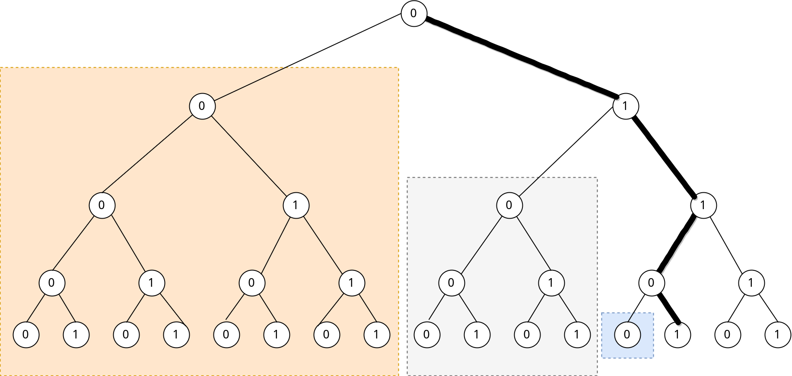

# Amount of Degrees
题目地址:[Amount of Degrees](https://vjudge.net/problem/URAL-1057)

## 题目描述

## 输入格式

## 输出格式

## 输入样例

## 输出样例

## 提示

## 思路

我们先把$$B$$是$$2$$,那就是让我们统计有多少个数的二进制中的$$1$$的数量为$$K$$

**难点1:什么时候算右转?**

二进制数中,从最高位到最低位遍历,

 - 如果是$$0 \rightarrow 0$$ 算左转,不用计算子树
 - 如果是$$0 \rightarrow 1$$ 算右转,计算左子树
