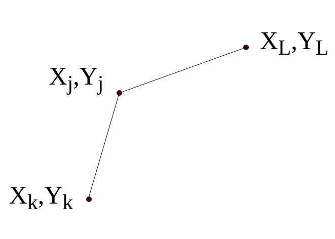
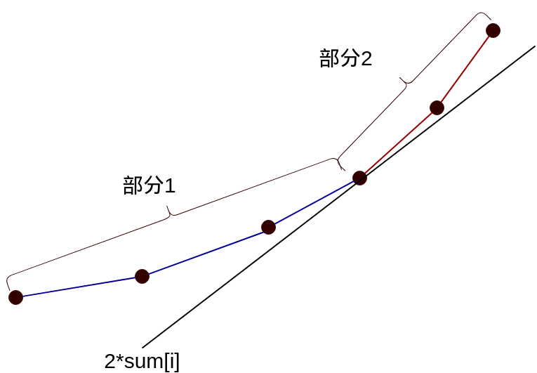
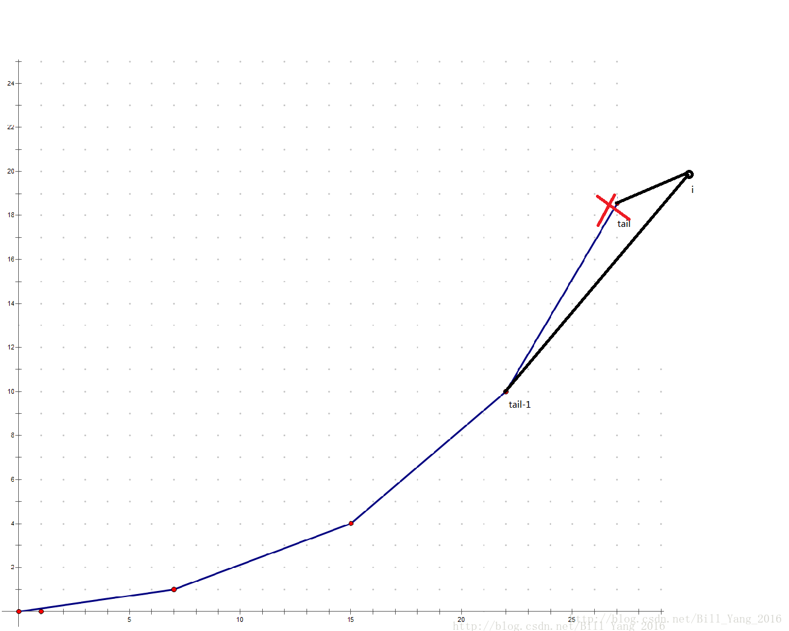

## 题目:打印文章

[题目地址](https://vjudge.net/problem/hdu-3507#author=qq1010903229)

## 解析

我们设$$dp[i]$$表示输出到i的时候最少的花费，$$sum[i]$$表示从$$a[1]$$到$$a[i]$$的数字和,也不是前缀和。

则有：

```math
dp[i] = min\{ dp[j]+ (sum[i]-sum[j])^2+M \} ( 0<=j <i)
```

计算的时候,需要枚举$$i,j$$,两层循环,所以时间复杂度为:$$O(N^2)$$,根据题目的数据规模,会超时.

### 优化

我们设在计算$$dp[i]$$的时候,存在$$j,k(j>k)$$使得从$$j$$转移比从$$k$$转移更优,那么满足条件:

```math
dp[j] + (sum[i]-sum[j])^2+ M  < dp[k] + (sum[i]-sum[k])^2+ M 
```

展开:

```math
dp[j] +sum[i]^2-2 \cdot sum[i] \cdot sum[j] + sum[j]^2+ M < dp[k] +sum[i]^2-2 \cdot sum[i] \cdot sum[k] + sum[k]^2+ M 
```

移项并消去再合并同类项得:

```math
dp[j]-dp[k]+sum[j]^2-sum[k]^2  < 2 \cdot sum[i] \cdot (sum[j]-sum[k])
```

把$$(sum[j]-sum[k])$$移去:

```math
\frac{dp[j]-dp[k]+sum[j]^2-sum[k]^2}{(sum[j]-sum[k])} = 2 \cdot sum[i]
```

再设$$y_x = dp[x] + sum[x]^2$$,$$x_x = sum[x]$$,上式就变成了:

```math
\frac{ y_j - y_k }{x_j-x_k} < 2 \cdot sum[i]
```

那么可以得到结论如下,当$$j>k$$时:

 - $$ \frac{ y_j - y_k }{x_j-x_k} < 2 \cdot sum[i] $$时,$$j$$对更新$$dp[i]$$比$$k$$更优
 - $$ \frac{ y_j - y_k }{x_j-x_k} > 2 \cdot sum[i] $$时,$$k$$对更优
 - $$ \frac{ y_j - y_k }{x_j-x_k} = 2 \cdot sum[i] $$时,$$k,j$$一样优


**同时,你会发现如下的规律:**

 - $$ \frac{ y_j - y_k }{x_j-x_k}$$很像直线的斜率
 - $$ 2 \cdot sum[i]$$随着$$i$$的增大会增大,也就是单调增的

下面我们进行讨论:如果我们要求$$dp[i]$$的时候,在可以转移的点集有这样的三个点,位置关系如下:



那么显然:

```math
\frac{y_j-y_k}{x_j-x_k} >
\frac{ y_l-y_j }{ x_l-x_j } 
```

这个时候它们和$$2 \cdot sum[i]$$有三种关系

**关系1:**
```math
\frac{y_j-y_k}{x_j-x_k} >
\frac{ y_l-y_j }{ x_l-x_j } 
> 2 \cdot sum[i]
```
这时,$$j$$比$$l$$优,$$k$$比$$j$$优


**关系2:**
```math
\frac{y_j-y_k}{x_j-x_k} 
> 2 \cdot sum[i]>
\frac{ y_l-y_j }{ x_l-x_j } 
```

这时,$$l$$比$$j$$优,$$k$$比$$j$$优

**关系3:**
```math
2 \cdot sum[i] >
\frac{y_j-y_k}{x_j-x_k} >
\frac{ y_l-y_j }{ x_l-x_j } 
```

这时,$$l$$比$$j$$优,$$j$$比$$k$$优

综上，不管什么样的$$2 \cdot sum[i]$$，从$$j$$转移都不会是最佳方案.也就是说:**上凸的点都可以删除**


如果点$$i$$可能由:$$\{1,2,3,4,\cdots ,i-1\}$$这些点转移过来,我们把所有的上凸的点都删除,那可以得到下面的图:



我们发现得到出的这个图的**斜率是递增的**,是一个**下凸**的图:

 - 部分$$1$$上的斜率都比$$2 \cdot sum[i]$$要小
 - 部分$$2$$上的斜率都比$$2 \cdot sum[i]$$要大
 - 部分$$1$$上的点,除了最后一个点,都可以舍弃

如果我们算出来$$dp[i]$$,那么要把它加入图中:



所以说:**对于我们要加入结点$$i$$，要维护图的的下凸性，如果加入结点$$i$$破坏了下凸性，就删除原来的最后一个元素**  
**注意:**新加入的点要和前面的所有点进行比较,维护下凸性

因此我们可以用一个类似单调队列的**双端队列**来维护状态j，以下是实现方案：

 - 若导数小于当前斜率，舍掉队首。 
 - 根据方程使用队首算出当前$$dp[i]$$的值 
 - 接着我们要加入结点$$i$$，但还得维护队列的下凸性，如果加入结点$$i$$破坏了下凸性，就弹去队尾，直到下凸位置

## 代码

```c
#include <cstdio>
#include <cstring>

#define MAXN 500005

int dp[MAXN];
int q[MAXN];    //双端队列
int sum[MAXN];  //前缀和
int n,m;

/* ------------ 双端队列操作 部分------------ */

int head,tail;//head 指向第一个元素,tail指向最后一个元素位置+1
inline void q_init(){ //队列初始化
    head=tail = 0;
}
//少于两个元素为空
bool empty(){ return tail-head <=1;} 
void pop_front(){ head++; } //弹出头部
void pop_back(){ tail--; } //弹出尾部
int front1(){ return q[head];} //得到头尾的值
int front2(){ return q[head+1];} //得到头尾的值
int back1(){ return q[tail-1];}
int back2(){ return q[tail-2];}
void push(int i){ q[tail++] = i;}// 加入元素


/* ------------ 双端队列操作 结束------------ */


//读取数据
void init(){
    int i;
    memset(sum,0,sizeof(sum));
    memset(dp,0,sizeof(dp));

    for (i=1;i<=n;i++){
        scanf("%d",&sum[i]);
        sum[i] += sum[i-1];     //前缀和
    }
    q_init(); //初始化队列
    push(0);
}


// dp[i]= min{ dp[j]+M+(sum[i]-sum[j])^2 };
inline int getdp(int i,int j){
    return dp[j]+m+(sum[i]-sum[j])*(sum[i]-sum[j]);
}

//得到上部分,yj-yk部分
inline int getUp(int j,int k){
    return dp[j]+sum[j]*sum[j] - dp[k]-sum[k]*sum[k];
}

//得到下部分 xj-xk
inline int getDown(int j,int k){
    return (sum[j]-sum[k]) <<1;
}


int main(){
    int i;
    while( scanf("%d%d",&n,&m) != EOF){
        init(); //初始化 与 读取数据

        //运算
        for(i=1;i<=n;i++){
            int h1 = front1();
            int h2 = front2();
            while( !empty() && getUp(h2,h1) <= sum[i]*getDown(h2,h1) ){
                pop_front();
                h1 = front1();
                h2 = front2();
            }

            dp[i] = getdp(i,front1());
            //队尾操作
            int t1  = back1();
            int t2  = back2();
            while(!empty() && getUp(i,t1)*getDown(t1,t2) <= getUp(t1,t2)*getDown(i,t1)){
                pop_back();
                t1  = back1();
                t2  = back2();
            }
            push(i);
        }
        printf("%d\n",dp[n]);
    }
    return 0;
}
```

## 参考

 - [HDU 3507 Print Article（斜率DP优化）](http://www.cnblogs.com/kuangbin/archive/2012/08/26/2657650.html)
 - [斜率优化dp学习](https://www.cnblogs.com/orzzz/p/7885971.html)
 - [模板-斜率优化dp详解](https://blog.csdn.net/xiang_6/article/details/81450647)
