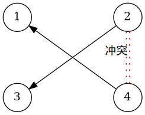

## 题目引入

[【POI2001】【HDU1814】和平委员会
题面](https://vjudge.net/problem/hdu-1814)

> Description
> 根据宪法，Byteland民主共和国的公众和平委员会应该在国会中通过立法程序来创立。 不幸的是，由于某些党派代表之间的不和睦而使得这件事存在障碍。
> 此委员会必须满足下列条件：
> 每个党派都在委员会中恰有1个代表，
> 如果2个代表彼此厌恶，则他们不能都属于委员会。
> 每个党在议会中有2个代表。代表从1编号到2n。 编号为2i-1和2i的代表属于第I个党派。
> 任务是写一程序：
> 输入党派的数量和关系不友好的代表对，
> 计算决定建立和平委员会是否可能，若行，则列出委员会的成员表。
> 
> Input
> 第一个行有2非负整数n和m。 他们各自表示：党派的数量n，1＜=n＜=8000和不友好的代表对m，0 ＜=m ＜=20000。 在下面m行的每行为一对整数a,b，1＜=a
> 
> Output
> 如果委员会不能创立，输出中应该包括单词NIE。若能够成立，输出中应该包括n个从区间1到2n选出的整数，按升序写出，每行一个，这些数字为委员会中代表的编号。 如果委员会能以多种方法形成，程序输出字典序最小的一个。
> 
> Sample Input
> 3 2
> 1 3
> 2 4
> 
> Sample Output
> 1
> 4
> 5

## 基础

### 核心思想
<!-- template start -->
用图来表示点之间的关系

::: center

:::
设一个点选中为$1$,不能选为$2$,还没有选标记为$0$

 - 当你选你一组中的一个点
    - 同组的另一个点必须被设定为2
    - 这个点的后驱必须都选
- 如果在选点的过程种发生了冲突(标记已经为2),就不能这样选

核心的核心: 冲突判定
<!-- template end -->

## 参考/引用

 - [【研究总结】2-sat问题](https://blog.csdn.net/jarjingx/article/details/8521690)
 - [2-SAT速成](https://www.cnblogs.com/zwfymqz/p/8485365.html)
 - [2-SAT问题的小结](https://www.cnblogs.com/-ZZB-/p/6635483.html)
