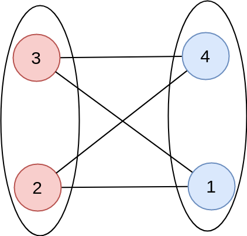

## 二分图染色

二分图的另一种等价的说法是，可以把每个节点着以黑色和白色之一，使得每条边的两个端点颜色不同.不难发现，非连通的图是二分图当且仅当每个连通分量都是二分图，因此我们只考虑无向连通图。

性质:**二分图内无奇环**





证明：假设二分图中的环是奇数环。

设一个环，x1，x2，x3，，，，x(2*k-1)，k>=1且为整数。相邻两点有边连接，x1与x(2*k-1)相连。

由二分图定义可知：x1与x2分别在X集合和Y集合，由于x2与x3的关系可知x3在X集合，则x4在Y集合，以此类推，可得奇数点在X集合，偶数点在Y集合，那么点x(2*k-1)则在X集合中，即与x1同为一个集合，但有之间假设的x1与x(2*k-1)有连边，那么此时就与二分图定义不符，这二分图中的环不可能是奇数环

证明：如果某个图不具有奇环，那这个图是二分图。
下面来证明图G中每个不具有奇环的非琐碎组件H是二分图。
假设u是H中一个顶点，V(H)中的顶点可以分为两个集合X与Y，X中的顶点与u的最小路径的长度为偶数；
Y中的顶点与u的最小路径的长度为奇数。
下面用反证法来证明。
假设X中的顶点x1与x2是邻接的，那UX1，X1X2，X2U就构成了一个环，这个环的长度为奇数；这与H不具有奇环相矛盾。因此，X中不存在相邻接的顶点。同样可以证明Y中也不存在相邻接的顶点。
   这样，我们就构造出非琐碎组件H的两个集合X与Y，X与Y是不相交的，X中任意两个顶点都不是邻接的；同样Y中任意两个顶点也都不是邻接的。因此H是二分的。同样可以证明所有其它的G的组件都是二分的。因此也就证明了不具有奇环的图是二分图。

判断

若遇到一个点：

 1. 已经访问过/已经染色
 2. 这个点的颜色和dfs过程中的上一个点的颜色相同
    2.1 也就是说：已经有色，但和需要标记的颜色相反

则表明出现奇环，不能构成二分图

核心代码:
<!-- template start -->
```c
//u 当前点编号，pre 上一个点的颜色
bool dfs(int u,int pre){
    
    vis[u] = true;
    color[u]= !pre;
    
    int i;
    for(i=head[u];i!=-1;i =  e[i].next){
        int v = e[i].v;
        
        if( vis[v] == false){
            if( dfs(v,!pre) == false)
                return false;
        }
        else if (color[v] == color[u])
            return false;

    }
    return true;
}
```
<!-- template end -->

## 模板题目：

https://www.luogu.org/problemnew/show/UVA10004

## 题目:

- HDU3478
- 关押罪犯
- NOIP2008双栈排序 [解析](https://www.byvoid.com/zhs/blog/noip2008-twostack)
- bzoj4881 [ Lydsy2017年5月月赛 ] -- 二分图染色+线段树
- http://hzwer.com/category/algorithm/graph-theory/two-graph-coloring
