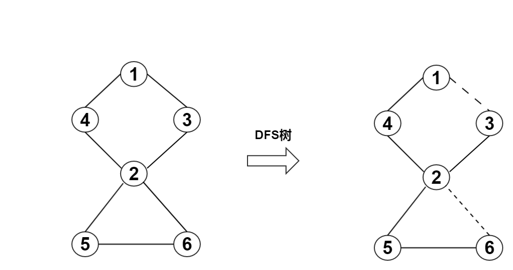
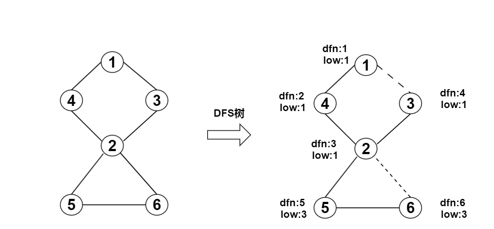
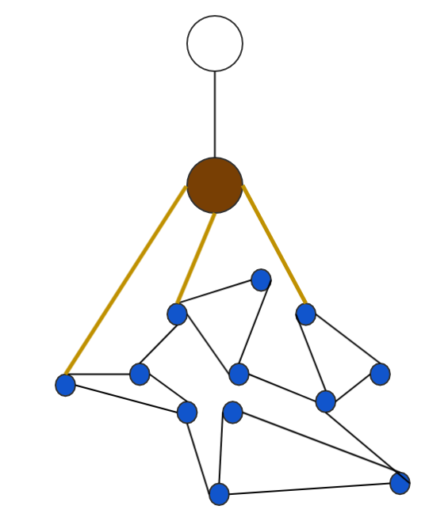
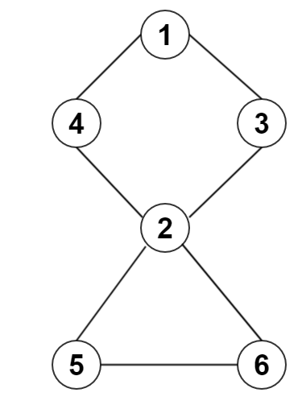

# 求无向图割点

## 定义

在无向连通图中，删除一个顶点v及其相连的边后，原图从一个连通分量变成了两个或多个连通分量，则称顶点v为割点，同时也称关节点(Articulation Point)。一个没有关节点的连通图称为重连通图(biconnected graph)。若在连通图上至少删去k 个顶点才能破坏图的连通性，则称此图的连通度为k。

 > 关节点和重连通图在实际中较多应用。显然，一个表示通信网络的图的连通度越高，其系统越可靠，无论是哪一个站点出现故障或遭到外界破坏，都不影响系统的正常工作；又如，一个航空网若是重连通的，则当某条航线因天气等某种原因关闭时，旅客仍可从别的航线绕道而行；再如，若将大规模的集成电路的关键线路设计成重连通的话，则在某些元件失效的情况下，整个片子的功能不受影响，反之，在战争中，若要摧毁敌方的运输线，仅需破坏其运输网中的关节点即可。

## 简单的例子

(a)中G7 是连通图，但不是重连通图。图中有三个关节点A、B 和G 。若删去顶点B 以及所有依附顶点B 的边，G7 就被分割成三个连通分量{A、C、F、L、M、J}、{G、H、I、K}和{D、E}。类似地，若删去顶点A 或G 以及所依附于它们的边，则G7 被分割成两个连通分量。





## 求割点的方法

暴力的方法：

 - 依次删除每一个节点$v$
 - 用DFS（或BFS）判断还是否连通
 - 再把节点$v$加入图中

若用邻接表，需要做$V$次DFS，时间复杂度为$O(V \times (V+E))$。

## 有关DFS搜索树的概念

在介绍算法之前，先介绍几个基本概念

 - **DFS搜索树：**用DFS对图进行遍历时，按照遍历次序的不同，我们可以得到一棵DFS搜索树，如图(b)所示。
 - **树边：**（或称为父子边），在搜索树中的实线所示，可理解为在DFS过程中访问未访问节点时所经过的边。
 - **回边：**（或称为返祖边、后向边），在搜索树中的虚线所示，可理解为在DFS过程中遇到已访问节点时所经过的边。

## 基于DFS的算法

该算法是R.Tarjan发明的。观察DFS搜索树，我们可以发现有两类节点可以成为割点：

 - **情况1:**对根节点$u$，若其有两棵或两棵以上的子树，则该根结点u为割点`证明1`；
 - **情况2:** 对非叶子,非根节点$u$，若存在一颗子树上的节点$v$均没有指向$u$的祖先节点的回边，说明删除$u$之后，其它点与$u$的子树的节点不再连通；则节点$u$为割点。`证明2`

对于根结点，显然很好处理；但是对于非叶子节点，怎么去判断有没有回边是一个值得深思的问题。

### 证明1

如果一个点$u$是$DFS$树的根结点,那么:

 - 如果去掉$u$后剩下的点是连通的,那根$u$只有一个子树,$u$不是割点
 - 如果去掉$u$后剩下的点不是连通的,那根$u$不只一个子树,$u$是割点

### 证明2

我们用$dfn[u]$记录节点$u$在$DFS$过程中被遍历到的次序号，$low[u]$记录节点$u$或$u$的子树通过非父子边追溯到最早的祖先节点（即$DFS$次序号最小），那么$low[u]$的计算过程如下：

$$
low[u] = \left\{\begin{matrix}
\min \{ low[u],\ low[v]\} & Note 1\\
\min \{ low[u],\ dfn[v]\} & Note 2
\end{matrix}\right.
$$

 - $Note1:$ $(u,v)$为树边
 - $Note2:$ $(u,v)$为回边,且$u$不为$v$的父亲

下表给出图(a)对应的$dfn$与$low$数组值。

| i      | 0 | 1 | 2  | 3  | 4  | 5  | 6 | 7 | 8 | 9 | 10 | 11 | 12 |
|--------|---|---|----|----|----|----|---|---|---|---|----|----|----|
| vertex | A | B | C  | D  | E  | F  | G | H | I | J | K  | L  | M  |
| dfn[i] | 1 | 5 | 12 | 10 | 11 | 13 | 8 | 6 | 9 | 4 | 7  | 2  | 3  |
| low[i] | 1 | 1 | 1  | 5  | 5  | 1  | 5 | 5 | 8 | 2 | 5  | 1  | 1  |

下给出图(2)对应的dfn与low数组值。




对于情况2，当(u,v)为树边且$low[v] >= dfn[u]$时，节点u才为割点。该式子的含义：以节点u为根的子树所能追溯到最早的祖先节点不超过自己本身$u$

 - 如果$low(v) = dfn[u]$,证明$u$的子树的点最早只能回到点$u$,子树上至少有一条**回边**连接$u$
 - 如果$low(v) > dfn[u]$,证明$u$的子树的点最早能回到点到达不了点$u$,子树上没有**回边**连接$u$


## 疑问/讨论:为什么是 low[u] = min(low[u], dfn[v]);

当点`u`在DFS过程中,边`(u,v)`是一条回边,什么这样更新: `low[u] = min(low[u], dfn[v]);`而不是:`low[u] = min(low[u], low[v]);`?

```c
else if(v != fa[u]) { // fa[u] != v 证明(u,v) 不是树边
    low[u] = min(low[u], dfn[v]);
}
```

看下图:


DFS的顺序为:`1,4,2,3,5,6`,如果我们使用:`low[u] = min(low[u], low[v]);`,那么访问到点`6`的时候,`low(6) = low(2) = 1`,这说明点`6`能回到理早的点`1`,但是是通过割点`2`回去的!!

如果使用:`low[u] = min(low[u], low[v]);`更新,那么一个存在割点的连通无向图,那每个点都能回到最早的点,那就求不出最早的点.就求不出来割点.

如果使用:`low[u] = min(low[u], dfn[v]);`,那么一个点能通过的**回边**回到的较早点就是**回边的另一个点**,这样不会通过割点回到更早的点,顶多通过**回边**回到割点.


### 体会下面的图:


红点为一部分割点,虚线为回边,我们不希望通过**连接割点的回边**回到更早的点



红点为割点,在DFS的过程中,通过`low[u] = min(low[u], dfn[v]);`,蓝点能回到的更早的只能是割点:红点.所有的蓝点都被**局限在**红点以下

通过回边更新时,应该描述为:点`u`通过回边能到达的更早的值为相临的点`v`,且`(u,v)`为回边

## 具体代码

**图:**



**数据:**

第一行表示n个点,m条边
第2行到第m+1行表示边

```
6 7
1 3
1 4
4 2
2 6
2 5
3 2
5 6
```


### 代码
```c
#include <cstdio>
#include <cstring>

#define N 100

int n,m;//存点 边

int dfn[N] = {0}; //存点的时间序号
int low[N] = {0};
bool cut[N]= {0}; //点i是不是割点
int cnt = 0; // 序号记数
int ans = 0; //计算有多少点是割点

struct Edge {
    int v;
    int next;
}E[N];
int size = 0;
int head[N];

void addEdge(int x,int y){
    size++;
    E[size].v = y;
    E[size].next = head[x];
    head[x] = size;
}

int min(int a,int b){
    if(a <b) return a;
    return b;
}

int root; //root点
void tarjan(int u){
    int child=0;//记录root的孩子数
    dfn[u] = low[u] = ++cnt; // 编号
    
    int i;
    for(i=head[u];i!=-1;i=E[i].next){ //遍历相邻点
        int v = E[i].v ;//另一个点
        if(! dfn[v] ){ //v点的编号为0，也就是没有被访问
            tarjan(v); //从这个点开始dfs
            low[u] = min(low[u],low[v]);//树枝边
            if( u == root) child++; // u是root点
            
            if(low[v] >= dfn[u] && u != root) // 情况2
                cut[u] =1;
        }
        else
            low[u] = min(low[u],dfn[v]); //回边
    }
    // 退出这个点
    if( u == root && child >1)  //情况1:
        cut[u] = 1;
}

int main(){
    memset(head,-1,sizeof(head));
    scanf("%d%d",&n,&m);
    int i,j;
    for(i=1;i<=m;i++){
        int x,y;
        scanf("%d%d",&x,&y);
        addEdge(x,y);
        addEdge(y,x);
    }


    for( i = 1;i<=n;i++){  // 图可能不是连通的
        if( !dfn[i]){
            root = i;
            tarjan(i);
        }
    }
    for(i=1;i<=n;i++)
        if( cut[i]){
            ans++;      // 不能在dfs里计算,因为可能会重复++
            printf("%d is cut node\n",i);
        }
    printf("cut total is %d",ans);
    return 0;
}
```

## 一句话算法

**$low[v] >=dfn[u]$代表$u$的孩子$v$找不到另一条路绕过点$u$,$u$为割点**


## 练习题目

 - luogu P3388 【模板】割点（割顶）
 - luogu P3145 [USACO16OPEN]分割田地Splitting the Field
 - luogu P1345 [USACO5.4]奶牛的电信Telecowmunication
 - luogu P3469 [POI2008]BLO-Blockade

## 说明

部分抄自 http://www.cnblogs.com/en-heng/p/4002658.html
