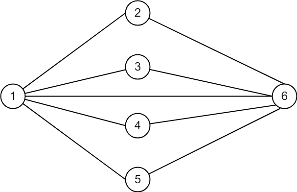

## SPFA 算法原理

见下面的ppt


链接: http://pan.baidu.com/s/1nvnQiVZ 密码: 2pc1


SPFA算法原理：

 - 加入了队列优化的Bellman_ford算法；有些情况下，ford算法会重复运算某些点；
 - SPFA 当一个点的dis被更新的时候，也许与他相邻的点也需要被更新，所以把这个点加入队列
 - 如果队列为空，那么就结束运算

注意：加入点的进入队列的时候，还需要判断，点是否已经在队列里了，如果已经在，就不需要加入队列了
一个点被拿出队列的时候，也许还可以在被放进去，所以出队时要设为false


----------------------------

## 一句话算法

<!-- template start -->
 - SPFA是对bellman-ford算法的队列优化
 - 一个点被更新了,它还有可能更新周围的点,入队
<!-- template end -->

<!-- template start -->
```c
void spfa(){
    push(s);
    dis[s] = 0;
    inQueue[s] = 1;
    pre[s] = -1;


    int i;
    while( empty() == false){
        int t = pop();  //取队首
        inQueue[t] = 0; // 不在队中

        for(i = first[t];i !=-1;i = edge[i].next){
            int tv = edge[i].v;
            int tw = edge[i].w;
            if( dis[tv] > dis[t] + tw){ //更新
                dis[tv] = dis[t] + tw;
    
                /* 不在队列中,就加入队列 */
                if( inQueue[tv] == 0){
                    push(tv);
                    inQueue[tv] = 1;
                }
            }
        }
    }
}
```
<!-- template end -->


## 代码


输入数据

第一行:n,e;n个点,e条边

第二行:s,t;s起点,t终点

剩下e行:`u v w`分别是一条边的起点,终点,权值

```
5 7
1 5
1 2 2
1 3 4
1 4 7
2 3 1
3 4 1
2 5 2
3 5 6
```

**代码**

```c
/*============================================================================
* Title : SPFA算法--边集数组实现
* Author: Rainboy
* Time  : 2016-04-12 10:13
* update: 2018-07-16 14:34
* © Copyright 2016 Rainboy. All Rights Reserved.
*=============================================================================*/

/*-----------------------------------------------------------------------------
 *  SPFA算法原理：
 *      加入了队列优化的Bellman_ford算法；有些情况下，ford算法会重复运算某些点；
 *      SPFA 当一个点的dis被更新的时候，也许与他相邻的点也需要被更新，所以把这个点加入队列
 *      如果队列为空，那么就结束运算
 *   注意：加入点的进入队列的时候，还需要判断，点是否已经在队列里了，如果已经在，就不需要加入队列了
 *          一个点被拿出队列的时候，也许还可以在被放进去，所以出队时要设为false
 *-----------------------------------------------------------------------------*/

/* 自己维护队列的版本 */
#include <cstdio>
#include <cstring>

#define maxv 1000
#define maxe 1000

const int INF = 0x7f7f7f7f;
const int lq =  2*maxv+5; //队列长度  能找都要那么多
int dis[maxv];

//队列
int queue[lq+1];
int head=0,tail=0;

void push(int x){ queue[tail++] = x; }
bool empty() {return head == tail;}
int pop() { return queue[head++];}


//向量星
int first[100];
struct E {
    int u,v,w,next;
} edge[10000];
int edge_cnt = 0;

void addEdge(int u,int v,int w){
    edge_cnt++;
    edge[edge_cnt].u  = u;
    edge[edge_cnt].v  = v;
    edge[edge_cnt].w  = w;
    edge[edge_cnt].next  = first[u];
    first[u] = edge_cnt;
}

bool inQueue[maxv] = {0};//点是否在队列中
int pre[maxv]={0};      //前趋
int s,t;//起点,终点
int n,e;// 多少点，多少边


/* 初始化 */
void init(){
    memset(dis,0x7f,sizeof(dis));
    memset(first,-1,sizeof(first));

    //读取数据
    scanf("%d%d",&n,&e);
    scanf("%d%d",&s,&t);

    int i,t1,t2,t3;
    for(i=1;i<=e;i++) { //读取边
        scanf("%d%d%d",&t1,&t2,&t3);
        addEdge(t1,t2,t3); //无向图
        addEdge(t2,t1,t3);
    }
}

void spfa(){
    push(s);
    dis[s] = 0;
    inQueue[s] = 1;
    pre[s] = -1;


    int i;
    while( empty() == false){
        int t = pop();  //取队首
        inQueue[t] = 0; // 不在队中

        for(i = first[t];i !=-1;i = edge[i].next){
            int tv = edge[i].v;
            int tw = edge[i].w;
            if( dis[tv] > dis[t] + tw){ //更新
                dis[tv] = dis[t] + tw;
    
                /* 不在队列中,就加入队列 */
                if( inQueue[tv] == 0){
                    push(tv);
                    inQueue[tv] = 1;
                }
            }
        }
    }
}

int main(){
    init();
    spfa();
    int i;
    printf("%d->%d = %d\n",s,t,dis[t]);
    return 0;
}

```

## SPFA判断负环

这们这里的spfa代码是bfs版的,BFS版的判断标准： 判断条件是**存在一点被更新次数大于等于总顶点数**

原理:



在无负环的图中,一个点的前趋越多,那更新的次数就越多,也就是被更新的次数越多,一点最多有$$n-1$$个前趋,所以最多被更新$$n-1$$次

**练习题目**

 - [luogu P3385 【模板】负环](https://www.luogu.org/problemnew/show/P3385)
 - POJ3259

## 优化


SPFA 算法有两个优化算法 SLF 和 LLL：
- SLF：Small Label First 策略，设要加入的节点是j，队首元素为i，若$dist(j) < dist(i)$，则将 j 插入队首，否则插入队尾。
- LLL：Large Label Last 策略，设队首元素为i，每次弹出时进行判断，队列中所有 dist 值的平均值为 x，若$dist(i)>x$ 则将i 插入到队尾，查找下一元素，直到找到某一i 使得$dist(i)<=x$则将 i 出对进行松弛操作。

## 参考/引用

- [SPFA的两种优化SLF和LLL_No Program No Life-CSDN博客](https://blog.csdn.net/oranges_c/article/details/64124235)
