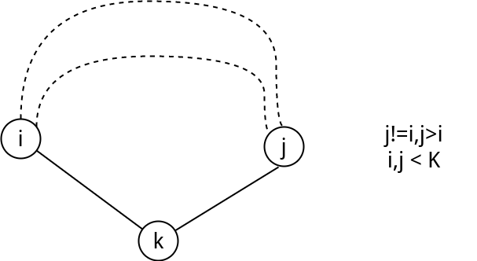

# floyed求最小环

**什么叫环:**从一个点出发,每条边只经过一遍,然后又回到这个点,所经过的路经就叫**环**.

## 求无向图最小环


题目地址: [ hdu 1599 find the mincost route ](https://vjudge.net/problem/hdu-1599)


这里是要求无向图最小环,最小环:最少有三个点,一条边不能走两次,所以不能直接查看$d[i][i]$



存在一个最小环,那么:

 - 设最小环上的点的编号最大编号为$k$
 - $i,j$是与$k$相邻的点
 - 对于最小环的剩下一部分必然是$i$到$j$的最短路径$f^{k-1}(i,j)$,因为最小
 - $f(i,j)$所经过的最大点绝对不达到$k$

$$
ans= f^{k-1}(i,j)+Graph[i][k]+Graph[j][k] 
$$
ps:这个公式暗示了环至少要有三个点,三条边,想一想为什么.

所以**我们只需要修改floyed**的代码就可以找到**最小环**

 - 枚举$k$的时候,在更新$f(i,j)$自己本身之前,这个时候的$f(i,j)$一定是**经过的点的最大值不超过$k-1$的$i \rightarrow j$的最短路**.
 - 在这个时候我们找到这样的$i,j$
  - 是$k$的相邻点
  - $i <k,j<k, i != j$
 - 那么可以求出$i,j,k$所在环的最小环的值A
 - 所有的A中最小的那个就是**最小环的值**


<!-- template start -->
```c
for(k=1;k<=n;k++) {
    for(i=1;i<k;i++) // 此时[i,j]之间的最短路还不经过k
        for(j=i+1;j<k;j++) // 为什么是i+1,不用枚举f[i][j]后又枚举f[j][i],对称性
            if(f[i][j]+m[i][k]+m[k][j]<ans)
                ans=f[i][j]+m[i][k]+m[k][j];
    for(i=1;i<=n;i++)
        for(j=1;j<=n;j++)
            if(f[i][k]+f[k][j]<f[i][j])
                f[i][j]=f[i][k]+f[k][j];
}
```
<!-- template end -->

**如果输出最小环上的点?**

每一次得到一个新的最小环值$ans$的时候,就把$f(i,j)$路径上的点保存下来.

**代码**
注意:切记别爆inf*3即可,笔者第一次提交就错在这里`_(:з」∠)_`

```c
#include <cstdio>
#include <cstring>

int n,m;

int inf = 0x1f1f1f1f;
int f[110][110];
int g[110][110];
int i,j,k;
int ans;

int min(int a,int b){
    if(a < b)
        return a;
    return b;
}

//初始化,相关数据
void init(){

    memset(f,0x1f,sizeof(f));
    memset(g,0x1f,sizeof(g));
    ans = inf;

    //读取数据

    for(i=1;i<=m;i++){
        int t1,t2,t3;
        scanf("%d%d%d",&t1,&t2,&t3);
        g[t1][t2]= g[t2][t1] =  min(t3, g[t1][t2]);
        f[t1][t2]= f[t2][t1] = min(t3, f[t1][t2]); //边界
    }
}

void floyed(){

    for (k=1;k<=n;k++){
        
        for(i=1;i<k;i++) //找最小值
            for(j=i+1;j<k;j++)
                ans =min( ans, g[i][k] + g[k][j] + f[i][j]);

        //更新
        for(i=1;i<=n;i++) 
            for(j=1;j<=n;j++)
                f[i][j]= min( f[i][j],f[i][k]+f[k][j]);

    }
}


int main(){
    
    while( scanf("%d%d",&n,&m) !=EOF){
        init();
        floyed();
        if( ans < inf)
            printf("%d\n",ans);
        else
            printf("It's impossible.\n");
    }
    return 0;
}


```
## 有向图最小环

题目地址:[vijos 1243 最佳路线](https://vijos.org/p/1423)

对于上面代码部分，这个$j$之所以从$i+1$开始就可以了是因为无向图的对称性质，而有向图并不具有这个性质，所以需要改动. 但是要是仔细想想的话，**有向图的最小环其实只要直接跑一遍floyed**，然后遍历一遍$dis[i][i]$即可，因为图是无向的所以不必担心出现一条边走两次的情况.

但是这里要说明一下,求有向图的最小环算法,floyed并不是最好的算法,因为它的时间复杂度很高.


## 练习题目

 - [poj 1734 Sightseeing trip ](https://vjudge.net/problem/POJ-1734)
 - [noip2015 信息传递](https://www.luogu.org/problemnew/show/P2661) 求最小环,floyed只能拿30分,[pcs题目解析地址](http://pcs.rainboy.top/#/article/Syak7_Fm7)
