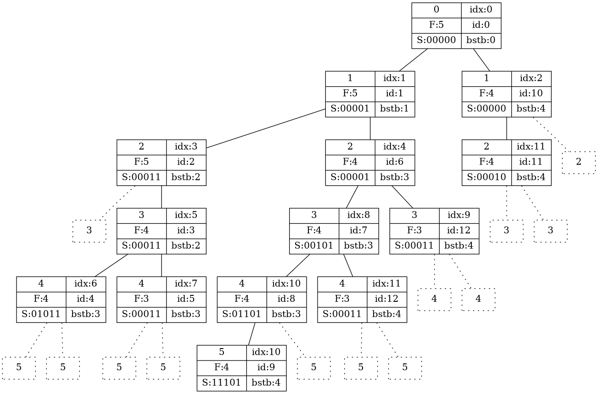

@[toc]

# 最大团

## 算法思想

```viz-neato
graph G {
    node[shape=circle,height=0.2];
    1[pos="0,0!"];
    2[pos="0,-1!"];
    3[pos="1,0!"];
    4[pos="1,-1!"];
    5[pos="2,-0.8!"];
    1--2--4--5--3;
    3--4;
    1--3;
    1--5;
    1--4;
}
```

使用最暴力的搜索方法:每一个点有两种可能性**选**或者**不选**。使用$dfs$方法，枚举每个点选或不选的所有情况。

当然这种纯粹的$dfs$搜索的方法，时间复杂度呈指数级,$O(2^n)$。我们必须加上相应的优化。

 - **可行性剪枝:** 当选择某个点$i$的时候。点$i$必须和所有已经选择点相连接。
 - **分支限界:** $dfs$进入下一个点的时候，必须保证$F \leq bstb$。 最终$bstb$即为所求。
    - 下界:$bstb$,表示这个时刻已经算出的最优结果(已经能最多选多少点)
    - 上界:$F = C_n+n-dep$,表示从这个点继续搜索的最大期望(最多能选多少点)

### dfs-分支限界过程

```viz-dot
<%- include("dfs-分支限制过程.dot") %>
```

### 样例 输入/输出

**输入**,图见上

```
5 8
1 3
1 2
1 4
1 5
2 4
3 4
3 5
4 5
```

**输出:最大团点的数量**,

```
4
```

### 代码 version1

```c
<%- include("code/最大团v1.cpp") %>
```

## DP优化

能不能进一步优化?

```viz-dot
<%- include("dot/最大图DP.dot") %>
```

$dp[i]$表示点集$[i,n]$中,最大团点的数目.

**状态转移方程如下**:

$$
dp[i] = max{dp[j],dp[j]+1}
$$

**限制条件**:
点i和dp[j]中最大团的点都相连

注意dp[j]的最大团有可能有多中情况,所以不能用记录dp[j]最大团的集合,来进行计算,只能dfs

### 层次求出可行点

如果已经选了某些点,如何

这是一种交集

### 代码 version2

**仔细阅读代码,思考,才能理解**

```c
<%- include("code/最大团v2.cpp") %>
```

## 废弃内容

::: fold
```
## 优先队列优化

我们可以继续加上一个优化: 一个点的$F$值大,那从这个点开始搜索得到最优解的可能性就高,于是用优先队列$priority_queue$先取$F$值大的点


### 算法过程



每个点表示一个状态,按$F,idx$($F$相同,$idx$大的优先级高)的优先级来取点

- $idx$:产生这个点的序号
- $id$:在有限队列中取出这个点的序号
- $F$:上界
- $bstb$:取出这个点的时候面临的下界
- $S$:选点的状态


## 样例题目

​```viz-dot
graph G {
    node[shape=circle];
    nodesep=1;
    ranksep=1;
    {
        rank="same";
        1--2--3;
    }
    {
        rank="same";
        4--5;
    }
    1--{4,5};
    {2,3}--5;

}
​```


​```c
<%- include("maximum_clique.cpp") %>
​```

```
:::

## 资料

 - [bilibili 算法设计与分析 屈婉玲教授 ](https://www.bilibili.com/video/av7134874/?p=72)
 - [072最大团问题](https://zh.coursera.org/lecture/algorithms/072zui-da-tuan-wen-ti-pTihC)
