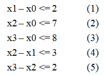

@[toc]
## 题目描述

给定$n$个变量和$m$个不等式，每个不等式形如 $x[i] - x[j] <= a[k]$`(0 <= i, j < n, 0 <= k < m， a[k]已知)`，求$ x[n-1] - x[0]$ 的最大值。例如当$n = 4,m = 5$,不等式组如下图所示的情况，求$x3 - x0$的最大值。

<center>



</center>


#### [输入格式]

 - 第一行数字n,m,s,t,表明有m对不等式,n个变量
 - 接下来m行,每行a,b,c,表明$a-b <=c$

#### [输出格式]

一个数,求$s-t$的最大值

#### [输入样例]
```
1 0 2
2 0 7
3 0 8
2 1 3
3 2 2
```
#### [输出样例]

```
7
```

## 简单解析

我们先来看一下**三角不等式**,有三个不等式如下,

$$
\begin{matrix}
a-b<=1 & \\
b-c<=1 & \\
a-c<=3 & \\
\end{matrix}
$$

问$a-c$最大能达到多少?很容易计算出来$a-c <=2$,所以最大能达到$2$,我们可以建立一个图如下:

```viz-dot
digraph g{
    node[shape=circle fixedsize=true style=filled fillcolor=white colorscheme=accent8 ];
    rankdir=LR;
    b->a[label=1];
    c->b[label=1];
    c->a[label=3];
}
```


我们发现在要求的值就是**c到a的最短路**.


同样,对于题目的等式,我们可以肉计算，费尽千辛万苦，终于整理出以下三个不等式

```
1.      (3)                 x3 - x0 <= 8
2.      (2) + (5)           x3 - x0 <= 9
3.      (1) + (4) + (5)     x3 - x0 <= 7
```

这里的T等于{8， 9， 7}，所以min{ T } = 7，答案就是7.

**同样,类比三角不等式的方式,我们也可以建立如下图**

```viz-dot
digraph g{
    node[shape=circle fixedsize=true style=filled fillcolor=white colorscheme=accent8 ];
    rankdir=LR;
    x0,x1,x2,x3;
    x0->x1[label=2];
    x0->x2[label=7];
    x0->x3[label=8];
    x1->x2[label=3];
    x2->x3[label=2];
}
```


建图方式为:$a-b <= c$那么画一条$b$到$c$的有向边,权值为$c$

明显可以看出来,$x0 \rightarrow x3$的最小值是$7$,所以答案为$7$.


## 怎么理解这种方式


**差分约束系统**是一种**约束**系统.

例如,$a-b<=5$表示$a$比$b$最多大$5$,又有$b-c<=7$,表示$b$比$c$最多大$7$,二个式子的关系综合起来可以表示如图:


```viz-dot
digraph g{
    node[shape=circle fixedsize=true style=filled fillcolor=white colorscheme=accent8 ];
    rankdir=LR;
    c->b[label=7];
    b->a[label=5];
}
```
图的含义:$c$到$b$要加上$7$,表示$b$比$c$大$7$这种约束条件.


如果再加一个约束公式:$a-c <=1$,那么图变成:


```viz-dot
digraph g{
    node[shape=circle fixedsize=true style=filled fillcolor=white colorscheme=accent8 ];
    rankdir=LR;
    c->b[label=7];
    b->a[label=5];
    c->a[label=1];
}
```

那么明显,$c \rightarrow a$ 有两条路径:

 - 一个是$c \rightarrow b \rightarrow a$ 路径为$13$,表明$a-c<=13$,约束1
 - 一个是$c \rightarrow a $ 路径为$1$,表明$a-c<=1$,约束2

如果**约束1**与**约束2**都要成立,那么明显要选一个小的.所以说

 - **我们要找最短路,最短路表示使所有约束关系成立的尽可能大的那个关系!!**
 - **转成图,只不过是用来表示约束关系!**

## 结论:一句话算法

**对于每个不等式 x[i] - x[j] <= a[k]，对结点 j 和 i 建立一条 j -> i的有向边，边权为a[k]，求x[n-1] - x[0] 的最大值就是求 0 到n-1的最短路**

## 解的存在性
## 最大值 => 最小值

```
B - A >= x      (1)
C - B >= y      (2)
C - A >= z      (3)
```

```viz-dot
digraph g{
    node[shape=circle fixedsize=true style=filled fillcolor=white colorscheme=accent8 ];
    rankdir=LR;
    A->B[minlen=3 label=x];
    B->C[minlen=3 label=y];
    A->C[label=z];
}
```

得出:

```
A -> C >= x+y      (1)
A -> C >= z        (2)
```

如果要使用上面的关系成立,那么显然要选$max\{x+y,z\}$,所以要选**最长路**,当然如果图中存在**正权环**,则无解.

## 口诀

::: blackboard
$\leqslant$求最短路得到最大值,无解为正环  
$\geqslant$求最长路得到最小值,无解为负环
:::

## 不等式标准化

## 无解的情况

## 定理

引理：设${\displaystyle x=(x_{1},x_{2},\cdots ,x_{n})}$是差分约束系统$ {\displaystyle Ax\leq b}$的一个解，d为任意常数。则 ${\displaystyle x+d=(x_{1}+d,x_{2}+d,\cdots ,x_{n}+d)}$也是该系统$i {\displaystyle Ax\leq b}$的一个解。


```viz-dot
digraph title {
    graph[label="图1" labelloc=t fontsize=20]
    node[shape=circle fixedsize=true style=filled fillcolor=white colorscheme=accent8 ];
    rankdir=LR;
    a->b->c[minlen=3 label=2];
    a->c[label=2];
}
```

```viz-dot
digraph g{
    graph[label="图2" labelloc=t fontsize=20]
    node[shape=circle fixedsize=true style=filled fillcolor=white colorscheme=accent8 ];
    rankdir=LR;
    a->b->c[minlen=3 label=2];
    a->c[label=2 dir=back];
}

```

```viz-dot
digraph g{
    graph[label="图3" labelloc=t fontsize=20]
    node[shape=circle fixedsize=true style=filled fillcolor=white colorscheme=accent8 ];
    rankdir=LR;
    a->b->c[minlen=3 label=2];
    a->c[label=-2];
}
```


## 练习题目


 - [poj-3169 Layout](https://vjudge.net/problem/poj-3169)

 - luogu P1250 种树 高性能 普及/提高-
 - luogu P1993 小K的农场 提高+/省选-
 - luogu P2294 [HNOI2005]狡猾的商人 各省省选 2005 湖南 提高+/省选-
 - luogu P2474 [SCOI2008]天平 各省省选 2008 四川 高性能 省选/NOI-
 - luogu P3275 [SCOI2011]糖果 2011 四川 提高+/省选-
 - luogu P3530 [POI2012]FES-Festival


| 题目名                       | 难度  | 解释                                         |
|------------------------------|-------|----------------------------------------------|
| Layout                       | ★★☆☆☆ | 差分约束系统 - 最短路模型 + 判负环           |
| World Exhibition             | ★★☆☆☆ | 差分约束系统 - 最短路模型 + 判负环           |
| House Man                    | ★★☆☆☆ | 差分约束系统 - 最短路模型 + 判负环           |
| Intervals                    | ★★☆☆☆ | 差分约束系统 - 最长路模型 边存储用链式前向星 |
| King                         | ★★☆☆☆ | 差分约束系统 - 最长路模型 + 判正环           |
| XYZZY                        | ★★☆☆☆ | 最长路 + 判正环                              |
| Integer Intervals            | ★★☆☆☆ | 限制较强的差分约束 - 可以贪心求解            |
| THE MATRIX PROBLEM           | ★★★☆☆ | 差分约束系统 - 最长路模型 + 判正环           |
| Is the Information Reliable? | ★★★☆☆ | 差分约束系统 - 最长路模型 + 判正环           |
| Advertisement                | ★★★☆☆ | 限制较强的差分约束 - 可以贪心求解            |
| Cashier Employment           | ★★★☆☆ | 二分枚举 + 差分约束系统 - 最长路模型         |
| Schedule Problem             | ★★★☆☆ | 差分约束系统 - 最长路模型                    |
| Candies                      | ★★★☆☆ |                                              |
| Burn the Linked Camp         | ★★★☆☆ |                                              |
| Instrction Arrangement       | ★★★☆☆ |                                              |


## 相关资料

 - [数与图的完美结合—浅析差分约束系统](https://wenku.baidu.com/view/29818121192e45361066f5af.html)
 - [冯威《数与图的完美结合——浅析差分约束系统》](https://wenku.baidu.com/view/108cab976bec0975f465e2d5.html)
