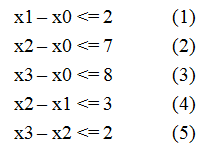

## 一.题目描述

给定$n$个变量和$m$个不等式，每个不等式形如 $x[i] - x[j] <= a[k] $`(0 <= i, j < n, 0 <= k < m， a[k]已知)`，求$ x[n-1] - x[0]$ 的最大值。例如当$n = 4,m = 5$,不等式组如下图所示的情况，求$x3 - x0$的最大值。

<center>



</center>


### [输入格式]

 - 第一行数字n,m,s,t,表明有m对不等式,n个变量
 - 接下来m行,每行a,b,c,表明$a-b <=c$

### [输出格式]

一个数,求$s-t$的最大值

### [输入样例]
```
1 0 2
2 0 7
3 0 8
2 1 3
3 2 2
```
### [输出样例]

```
7
```

## 二.简单解析

我们先来看一下**三角不等式**,有三个不等式如下,

```math
\begin{matrix}
a-b<=1 & \\
b-c<=1 & \\
a-c<=3 & \\
\end{matrix}
```

问$a-c$最大能达到多少?很容易计算出来$a-c <=2$,所以最大能达到$2$,我们可以建立一个图如下:


我们发现在要求的值就是**a到b的最短路**.


同样,对于题目的等式,我们可以肉计算，费尽千辛万苦，终于整理出以下三个不等式

```
1.      (3)                 x3 - x0 <= 8
2.      (2) + (5)           x3 - x0 <= 9
3.      (1) + (4) + (5)     x3 - x0 <= 7
```

这里的T等于{8， 9， 7}，所以min{ T } = 7，答案就是7.

**同样,类比三角不等式的方式,我们也可以建立如下图**


建图方式为:$a-b <= c$那么画一条$b$到$c$的有向边,权值为$c$

明显可以看出来,$x0 \rightarrow x3 $的最小值是$7$,所以答案为$7$.


## 三.怎么理解这种方式


**差分约束系统**是一种**约束**系统.

例如,$a-b<=5$表示$a$比$b$最多大$5$,又有$b-c<=7$,表示$b$比$c$最多大$7$,二个式子的关系综合起来可以表示如图:


```
    7        5
c------->b------->a
```
图的含义:$c$到$b$要加上$7$,表示$b$比$c$大7$这种约束条件.


如果再加一个约束公式:$a-c <=1$,那么图变成:


```
     b
    ^ \
  7/   \5
  /     v
 a------>c
    1
```

那么明显,$a \rightarrow c $ 有两条路径:

 - 一个是$a \rightarrow b \rightarrow c$ 路径为$13$,表明$c-a<=13$,约束1
 - 一个是$a \rightarrow c $ 路径为$1$,表明$c-a<=1$,约束2

如果**约束1**与**约束2**都要成立,那么明显要选一个小的.所以说

 - **我们要找最短路,最短路表示使所有约束关系成立的尽可能大的那个关系!!**
 - **转成图,只不过是用来表示约束关系!**

## 四.结论:一句话算法

**对于每个不等式 x[i] - x[j] <= a[k]，对结点 j 和 i 建立一条 j -> i的有向边，边权为a[k]，求x[n-1] - x[0] 的最大值就是求 0 到n-1的最短路**

## 五.解的存在性
## 六.最大值 => 最小值

```
B - A >= x      (1)
C - B >= y      (2)
C - A >= z      (3)
```

```
      B
     ^ \
  x /   \y
   /     \
  /       v
 A------->C
    z
```

得出:

```
A -> C >= x+y      (1)
A -> C >= z        (2)
```

如果要使用上面的关系成立,那么显然要选$max\{x+y,z\}$,所以要选**最长路**,当然如果图中存在**正权环**,则无解.

## 七.不等式标准化

## 八.定理

引理：设 $ {\displaystyle x=(x_{1},x_{2},\cdots ,x_{n})}$是差分约束系统$ {\displaystyle Ax\leq b}$的一个解，d为任意常数。则 ${\displaystyle x+d=(x_{1}+d,x_{2}+d,\cdots ,x_{n}+d)}$也是该系统$i {\displaystyle Ax\leq b}$的一个解。

## 九.代码


```c
```
