@[toc]

本篇文章由**彭政**同学编写,感谢! :clap:  :clap: :clap:

## 定义

若一个**无向图**中去掉**任意**一个节点(边)都不会改变此图的连通性，则称该图为点(边)双连通图。一个无向图中的**每一个极大点(边)双连通子图**称作次无向图的点(边)双连通分量。点双连通分量和边双连通分量统称为双连通分量。

更加简洁明了的定义:不存在割点(边)的图为点(边)双连通图。注意：边双连通分量不存在原图下的割边，但点双连通分量可以存在原图下的割点。

todo图例


## 前述

网上没有关于双连通分量的细致讲解。以下的内容和代码均是个人理解上的原创并AC模板题后的成果(除遗留部分)，如果存在冗杂或缺漏的地方请联系我改进。

## 总述

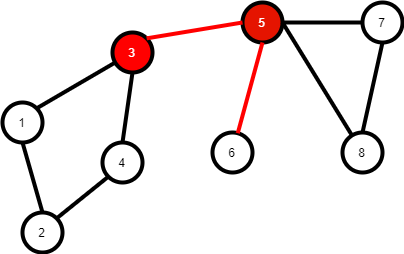

如上图，割点和割边被标记为红色。根据定义，该图存在割点和割边，故不属于双连通图。     我们可以发现，在子图{1,2,3,4}中，我们任意去除其中的一条边，该子图仍旧是连通的；同理我们任意去除其中的一个点(与该点直接相连的边也会被去除),其它点和边构成的子图仍旧是连通的。所以，该子图是原图的一个边双连通分量，也是原图的一个点双连通分量。按照此种方式，我们可以找出原图的边双连通分量有{1,2,3,4},{5,7,8},{6}三个。点双连通分量有{1,2,3,4},{3,5},{5,6},{5,7,8}四个。

关于{6}是否属于边双连通分量的疑问：该问题未被明确定义。但孤立点满足边双连通分量的性质，为了描述的方便以及缩点树的引入，我们将{6}归为边双连通分量。但孤立点并不是点双连通分量。

关于两点一线(即{3,5})是否属于点双连通分量的疑问：该问题同样未被明确定义。虽然满足点双连通分量的定义，但许多点双连通分量的性质在两点一线的情况下都不适用。大部分人认可其为点双连通分量，这里也将其归入点双连通分量。


#### 问题：

Q:  既然{6}可以作为边双连通分量，为什么其余的点不能为边双连通分量？                        
A：边双连通分量的定义为无向图中的每一个**极大**边双连通子图。上图中除6外的其余各点已经被包含在更大的双连通图中(例如节点1被包含在边双连通分量{1,2,3,4}中)，故不能将其再归入其它的双连通分量中。


### 性质:

网上没有明确的归纳，甚至双连通分量的模板还存在差异和争议，这里我参照一些模糊的讲解并根据自己的理解，总结出了双连通分量的一些性质。

 - 性质1：任意一个无向图都可以根据所有的割边将其划分为若干个边双连通分量，边双连通分量中不存在割边。同一节点存在且仅存在于某一个边双连通分量中。
 - 性质2：除孤立点构成的边双连通分量外，其余边双连通分量中的每个节点的度数不小于2
 - 性质3：同一点可以同时存在于多个点双连通分量中，且该点必为割点。非割点只能存在于一个点双连通分量中。
 - 性质4：除两点一线的结构外，点双连通分量一定为边双连通分量。但反过来，边双连通分量并不一定为点双连通分量。
 - 性质5：所有的桥(割边)都会沟通两个边双连通分量。且不存在两条桥，使它们沟通两个相同的边双连通分量。
 - 性质6：在连通图中，边双连通分量的数量等于该连通图中割边的数量+1。

下面我们分别探究边双连通分量和点双连通分量，两者均由tarjan算法实现，先从较易实现的边双连通分量开始。

## 边双连通分量：

先来回顾一下我们是如何寻找割边的。
我们寻找割边时：
low[i]表示节点i能到达时间戳最小的节点编号
dfn[i]表示节点i被访问的时间戳
如果某个直接连通的两点u和v满足$low[v]>dfn[u]$，即点v在不经过点u的**孩子**的情况下不能访问更早的点(包括点u)，那么边$<u,v>$一定为割边。


实际上，寻找到了割边，我们就得到了所有的边双连通分量。根据归纳的性质1：图中的所有边双连通分量一定被割边所划分，所以我们可以在访问节点的同时寻找割边并标记每一条割边。再通过dfs，不经过割边的情况下遍历所有点，就找到了所有的边双连通分量。


#### 问题:

Q:根据dfs序的性质，如果两点的low值相等，那么它们不就在同一个边双连通分量中了吗？完全可以根据low值来得到所有的边双连通分量啊。为什么还要标记割边并再dfs得到所有的边双连通分量呢？
A:这不失为一个好办法。但是如果图中存在重边，那么这种方法将不再适用。不过可以通过过滤重边来达到目的。


### 代码(主体部分)：

```c++
int low[maxn],dfn[maxn];
int col[maxm<<1];//用于标记桥
int ord=1;
void tarjan(int u,int pre){
    low[u]=dfn[u]=ord++;
    int i;
    for(i=head[u];i!=-1;i=e[i].next){
        int v=e[i].v;
        if(v!=pre){
            if(!dfn[v]){
         		tarjan(v,u);
            	low[u]=min(low[u],low[v]);
            
            	if(low[v]>dfn[u]){
                	col[i]=col[i^1]=1;//标记边及其反向边
                	                  //注意: 边的编号0开始
                }
            }
            else {
                low[u]=min(low[u],dfn[v]);
            }
        }
    }
}

int mark;
int color[maxn];//不同的边双连通分量会被染为不同的颜色
void dfs(int u,int pre){
    color[u]=mark;
    
    int i;
    for(i=head[u];i!=-1;i=e[i].next){
        int v=e[i].v;
        if(!col[i] and v!=pre and !color[v]){//该边非桥,不为前驱,且没有被染色
            dfs(v,u);
        }
    }
    
}

void handle(){
    tarjan(1,0);//原图连通
    
    int i;
    for(i=1;i<=n;i++){
        if(!color[i]){//该点没有被染过
            mark++;
            dfs(i,0);
        }
    }
}
```

## 点双连通分量

能不能像求边双连通分量那样标记每一个割点，再进行dfs染色得到每一个点双连通分量呢？
答案是**不行**的。因为割点会存在于多个点双连通分量中。

### 问题

Q:那我先染色其它点，割点特殊考虑不行吗？  
A:行，网上仍有割点延迟出栈的写法求出所有的点双连通分量。但是这样的话割点只会被染色到某一个点连通分量中，不利于接下来的处理，而且**极易出错**，比如接下来这一个图。

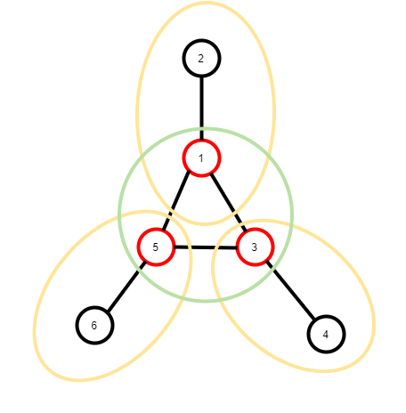

如图，节点1,3,5均为割点，并且{1,2},{3,4},{5,6}均为点双连通分量。但是割点1,3,5恰好又构成一个点双连通分量{1,3,5}。如果单纯地将其染为某一颜色，则可能三个割点的颜色均不相同，会使问题变得十分复杂。所以我们不采用这种方法。


**合理且有效的办法是：标记边。**
上面给出的图，如果使用标记边的方法，将变得十分清晰。

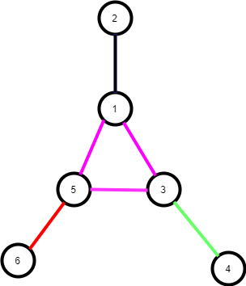

**同一颜色的边直接相连的点所在的集合一定是某一个点双连通分量**

### 代码(主体部分)：

```c++
int low[maxn],dfn[maxn],col[maxm<<1];
int ord=1;
int mark;
deque<int>train;//这里用双端队列实现栈,队尾为栈顶
void tarjan(int u,int pre){
    low[u]=dfn[u]=ord++;
    
    int i;
    for(i=head[u];i!=-1;i=e[i].next){
        int v=e[i].v;
        if(v!=pre){
            if(!dfn[v]){
                train.push_back(i);//该边入栈
                tarjan(v,u);
                low[u]=min(low[u],low[v]);
                
                if(low[v]>=dfn[u]){//注意割点和割边判断条件的不同
           			mark++;//颜色更新
                    int next_edge;
                    while(!train.empty()){
                        next_edge=train.back();//取出栈顶
                        train.pop_back();//弹出栈顶
                        col[next_edge]=col[next_edge^1]=mark;//标记边和反向边
                        if(e[next_edge].u==u or e[next_edge].v==u){
                            break;//如果该边直接与点u相连，那么就到此为止
                        }
                    }
                }
            }
            else{
             	low[u]=min(low[u]),dfn[v]);   
            }
        }
    }
}
```


## 缩点树：

在明白如何求解双连通分量之后，我们再来探究一下由双连通分量实现的缩点树。

**网上没有任何一个关于缩点树的专门讲解和代码的整理，以下内容全为yy。**

缩点树大部分情况下由边双连通分量实现。

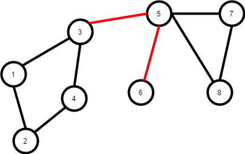

以该图为例，我们通过一次tarjan找到了割边<3,5>和<5,6>，接下来将所有割边删除。


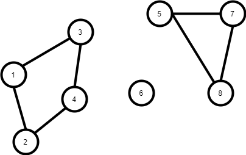

剩下的每一个连通块均为一个边双连通分量。我们将所有的边双连通分量缩为一点。


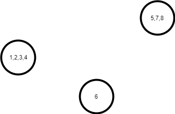

再将原先被删去的割边恢复。


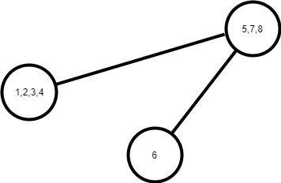


我们发现，原来的连通图变成了一棵树！并且每一条树边都和原图的割边一一对应(这也一定程度上证明了性质6)。接下来可以利用树的算法进行快速地树上操作，利用缩点树可以有效地处理必经边或是必经点问题。


那么，我们如何构建这颗树呢？

我们假定原图存在K-1条割边，那么一定会被划分为K个边双连通分量，并且每一个边双连通分量包含的各点都被染上了相同的颜色，同时不同边双连通分量的颜色均不相同。我们可以将其颜色编号来作为树的节点编号。

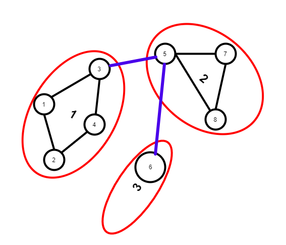


如图，颜色1中包含点:1,2,3,4；颜色2中包含点:5,7,8；颜色3中包含点:6(蓝色边为割边)

我们只需要找到所有的割边就行了，在染色前我们已经将所有的割边标记，只需要扫一遍建边即可。注意：割边和其反向边都会被标记，在找到一条割边时，我们得到其u和v，只需要建立u->v的边，v->u的边会在我们找到该割边的反向边时被建立。


### 代码(主体部分)

```c++
struct edge {
    int u,v;
}e[maxm<<1],E[maxm<<1];//分别用来建立原图和缩点树
int cnt,E_cnt;
int head[maxn],E_head[maxn];
void addedge(int x,int y,edge e[],int head[],int *cnt){//不使用指针会重复写两次建图函数
    e[(*cnt)].u=x;
    e[(*cnt)].v=y;
    e[(*cnt)].next=head[x];
    head[x]=(*cnt);
    (*cnt)++;
}

void create(){
    int i;
    for(i=0;i<cnt;i++){
        if(col[i]){
            addedge(color[e[i].u],color[e[i].v],E，E_head,&(E_cnt));
        }
    }
}
```


### 例题1：分离的路径

题目可在蓝书上找到，原题来自USACO 2006 Jan.Gold 分离的路径

为了从 F*F* 个草场中的一个走到另一个，贝茜和她的同伴们不得不路过一些她们讨厌的可怕的树。奶牛们已经厌倦了被迫走某一条路，所以她们想建一些新路，使每一对草场之间都会至少有两条相互分离的路径，这样她们就有多一些选择。

每对草场之间已经有至少一条路径，给出所有 R 条双向路的描述，每条路连接了两个不同的草场，请计算最少的新建道路的数量。

路径由若干道路首尾相连而成，两条路径相互分离，是指两条路径没有一条重合的道路，但是两条分离的路径上可以有一些相同的草场。

对于同一对草场之间，可能已经有两条不同的道路，你也可以在它们之间再建一条道路，作为另一条不同的道路。


| 输入样例 | 输出样例 |
| -------- | -------- |
| 7 7      | 2        |
| 1 2      |          |
| 2 3      |          |
| 3 4      |          |
| 2 5      |          |
| 4 5      |          |
| 5 6      |          |
| 5 7      |          |


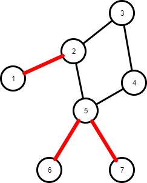


上图为测试样例的图。题目要求任意两点间都至少存在两条不相交的道路，我们可以判定，满足情况的点一定存在于同一边双连通分量中，因为不同边双连通分量之间存在必经边(桥)。我们只需要添加若干条边，使原图的极大边双连通子图为其本身就好了。

那么问题来了，究竟至少添加多少边才能使原图为边双连通图呢？


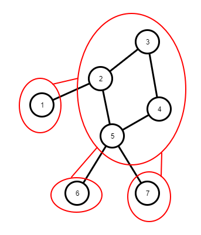

我们建立好缩点树之后发现，只需要将叶子节点两两连接，就能使各点存在两条互不相交的路径，剩余的节点任意连接就可以了。所以答案为(叶子数+1)/2。由于该题只需要得到建边的数量，所以这颗缩点树我们没有必要建出来，我们只需要知道叶子结点的数量就好了,叶子节点的数量可通过节点的度来表征。


### 代码:

```c++
#include <bits/stdc++.h>
using namespace std;


int n,m;

#define maxn 5005
#define maxm 10005

struct edge{
    int u,v,w,next;
}e[maxm<<1];
int head[maxn];
int cnt=0;
void addedge(int x,int y,int z){
    cnt++;
    e[cnt].u=x;
    e[cnt].v=y;
    e[cnt].w=z;
    e[cnt].next=head[x];
    head[x]=cnt;
}

int min(int x,int y){
    return (x<y)? x :y;
}

int low[maxn];
int dfn[maxn];
int idx=1;

struct info {
    int u,v;
    bool friend operator < (const info &a,const info &b){//一定要重载"<"
        if(a.u<b.u)
            return true;
        if(a.u==b.u and a.v<b.v)
            return true;
        return false;
    }
}

map<info>train;//使用STL set过滤重边最为简洁

void read(){
    scanf("%d%d",&n,&m);
    int i;
    memset(head,-1,sizeof(head));
    for(i=1;i<=m;i++){
        int a,b;
        scanf("%d%d",&a,&b);
        if(a>b) {int t=a;a=b;b=t;}//保证u<v
     	train.insert({a,b});
    }
   	for(set<info>::iterator idx=train.begin();idx!=train.end();idx++){
        addedge((*idx).u,(*idx).v,0);
        addedge((*idx).v,(*idx).u,0);
    }
}


void tarjan(int u,int pre){
    low[u]=dfn[u]=idx++;
    int i;
    for(i=head[u];i!=-1;i=e[i].next){
        int v=e[i].v;

        if(v!=pre){
            if(!dfn[v]){
                tarjan(v,u);
                low[u]=min(low[u],low[v]);

            }

            else {
                low[u]=min(low[u],dfn[v]);
            }
        }
    }
}


int dgree[maxn];//入度


void create(){//重边已经被过滤掉了，所以利用low值判断会更加简洁
    int i,j;
    for(i=1;i<=n;i++){
        for(j=head[i];j!=-1;j=e[j].next){
            if(low[e[j].u]!=low[e[j].v]){
                //两点能回到的最早时间戳不相同，说明两点存在于两个双连通分量内
                dgree[low[e[j].v]]++;
            }
        }
    }
}

int leaf;//叶子数量

void print(){
    int i;
    for(i=1;i<idx;i++){
        if(dgree[i]==1){//入度为1，则该点为叶子节点
            leaf++;
        }
    }
	printf("%d",((leaf+1)>>1));
}

int main(){
    read();
    tarjan(1,0);
    create();
    print();
    return 0;
}
```


### 例题2(遗留)：

AHOI2005 航线规划

对Samuel星球的探险已经取得了非常巨大的成就，于是科学家们将目光投向了Samuel星球所在的星系——一个巨大的由千百万星球构成的Samuel星系。

星际空间站的Samuel II巨型计算机经过长期探测，已经锁定了Samuel星系中许多星球的空间坐标，并对这些星球从1开始编号1、2、3……。

一些先遣飞船已经出发，在星球之间开辟探险航线。

探险航线是双向的，例如从1号星球到3号星球开辟探险航线，那么从3号星球到1号星球也可以使用这条航线。

例如下图所示：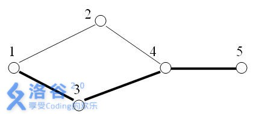


在5个星球之间，有5条探险航线。

A、B两星球之间，如果某条航线不存在，就无法从A星球抵达B星球，我们则称这条航线为关键航线。

显然上图中，1号与5号星球之间的关键航线有1条：即为4-5航线。

然而，在宇宙中一些未知的磁暴和行星的冲撞，使得已有的某些航线被破坏，随着越来越多的航线被破坏，探险飞船又不能及时回复这些航线，可见两个星球之间的关键航线会越来越多。

假设在上图中，航线4-2（从4号星球到2号星球）被破坏。此时，1号与5号星球之间的关键航线就有3条：1-3，3-4，4-5。

小联的任务是，不断关注航线被破坏的情况，并随时给出两个星球之间的关键航线数目。现在请你帮助完成。

| 输入  | 输出 |
| ----- | ---- |
| 5 5   | 1    |
| 1 2   | 3    |
| 1 3   |      |
| 3 4   |      |
| 4 5   |      |
| 4 2   |      |
| 1 1 5 |      |
| 0 4 2 |      |
| 1 5 1 |      |
| -1    |      |


这一题可能有其它的方法。
不过可以利用双连通分量解决，求出边双连通分量后构建缩点树。倒序处理信息，利用树链剖分与线段树维护树上的必须边信息，节点的含义为该节点与其父亲形成的边是否为必须边，在缩点树建成时，所有除根外的节点与其父亲都通过割边相连接，均为必须边，故应置1。倒序处理信息时，如果是查询操作，则直接查询u,v简单路径的区间和(但不应包括lca(u,v),因为lca(u,v)与其父亲形成的边并没有走过)，如果是删除操作，则将u,v区间置0，但同样不包括其lca,这样我们就可以得到倒序的答案，再反过来输出即可。

由于不能下载数据，不知道哪里出了问题，目前停留在40分，应该是代码错误，挂上求纠错。

**这里利用图来说明我的思路，我觉得思路应该不会出现太大漏洞的。**

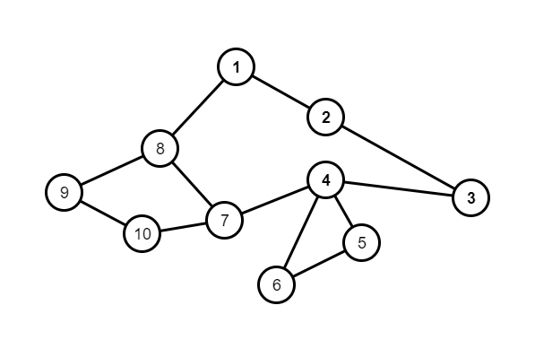


以该图为例，假设我们的操作为
0 8 7
1 1 3
0 7 4
1 3 1
一开始读入所有的点和边以及操作并存储下来，利用STL set将要删除的边删去，这样我们可以得到最终图。

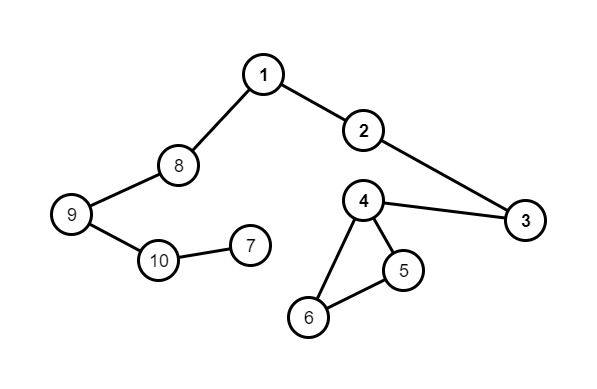

接下来我们找到所有割边。

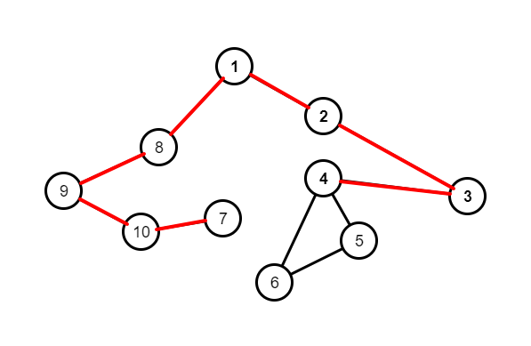

找到了所有割边，现在我们可以进行染色，缩点，并建立缩点树。

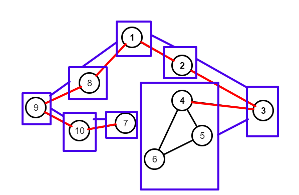


我们可以取任意一点为树的根，除根外的所有节点的点权置1.

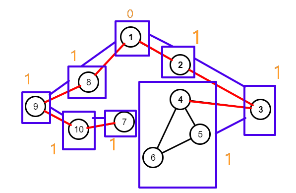


我们可以发现，缩点树上一点u和一点v的简单路径经过的关键边的数量可以利用经过点权的和来表示，二者一定是相等的吗？
**并不是。**可能上面的图不好发现，如果换做下面的图就很显然了。

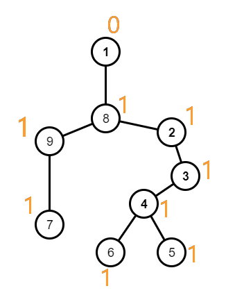

如图。假如我们想知道7->6经过了多少关键边，如果单纯地跨链求区间和的话会得到7。事实上通过观察我们可以发现，7->6只经过了6条关键边，那么为什么会多出一条呢？
先来明确缩点树上的节点的信息，节点上的权值表示该节点与其父亲形成的边是否为关键边。可以发现，LCA(7,6)(即编号8)这个点权为1，表示该点与其父亲(编号为1)形成的边为关键边，但是这条边我们并没有走，但是却被计入了区间和中。所以我们不能加上该点的权值。对此，我的方法是:
**sum[u,v]=sum[u,root]+sum[v,root]-(sum[LCA(u,v),root]<<1);**
sum可以通过区间查询快速得到，通过这种方式，我们就可以完全规避掉公共祖先的权值了。


明白这一点后我们回到原图，开始逆向处理信息。
首先是1 3 1,即3->1路径上关键边的数量，直接按照上述方法即可。
然后是0 4 7,即删除边<4,7>，因为我们是倒过来处理的，所以现在的图是最终图，即所有需要删除的边已经被删除了。那么可以得知，在这条操作之前，边<4,7>还没有被删除，所以我们应该"加回去",不过没有必要再在树上建立<4,7>的边，只需要将简单路径4->7的节点权值置0就可以了。**格外注意：同查询一样，公共祖先与其父亲形成的边并没有经过，不应置0。**

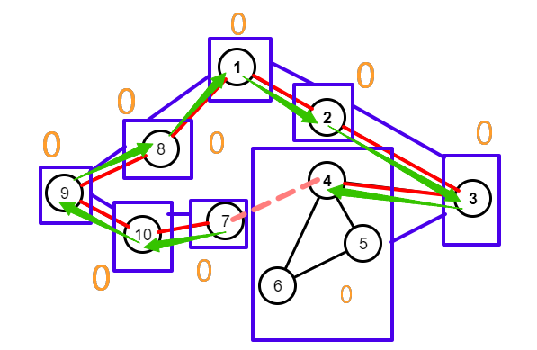


之后的操作同理，其实就是在树上区间修改，区间查询的过程。

```c++
#include <cstdio>
#include <cstring>
#include <algorithm>
#include <sstream>
#include <queue>
using namespace std;
#define in =gets()
#define maxn 30005
#define maxm 100005
#define maxc 40005
int n,m;

struct edge{
    int u,v,w,next;
}e[maxm<<1],E[maxm<<1];
int head[maxn],_head[maxn];
int cnt=0,_cnt=0;
void addedge(int x,int y,int z,edge e[],int head[],int(*cnt)){
    (*cnt)++;
    e[(*cnt)].u=x;
    e[(*cnt)].v=y;
    e[(*cnt)].w=z;
    e[(*cnt)].next=head[x];
    head[x]=(*cnt);
}

int gets(){
    int x=0,f=1;
    char ch=getchar();
    while(ch<'0' or ch>'9'){
        if(ch=='-')
            f=-1;
        ch=getchar();
    }
    while(ch>='0' and ch<='9'){
        x=(x<<1)+(x<<3)+(ch^48);
        ch=getchar();
    }
    return x*f;
}

int min(int x,int y){
    return (x<y)? x :y;
}

struct info {
    int step,s,t;
}/*node[maxm],ask[maxc]*/;

struct cmp {
    bool operator()(const info &a,const info &b){
        if(a.s>b.s)
            return true;
        if(a.s==b.s and a.t>b.t)
            return true;
        return false;
    }
};

priority_queue<info,vector<info>,cmp>node,compask;
deque<info>ask;

void read(){
    n in;m in;
    int i,j=1;
    memset(head,-1,sizeof(head));
    memset(_head,-1,sizeof(_head));
    for(i=1;i<=m;i++){
        int a,b;
        a in;b in;
        if(a>b){
            int t=a;a=b;b=t;
        }
        node.push({-1,a,b});
    }
    while(1){
        int a;
        a in;
        if(a==-1){
            return ;
        }
        int b,c;
        b in;c in;
        if(b>c){
            int t=b;b=c;c=t;
        }
        ask.push_back({a,b,c});
        if(a==0){
            compask.push({a,b,c});
        }
    }
}

void create(){//过滤边并建图(使用STL set过滤边会更加简洁)
    while(!node.empty()){
        int u=node.top().s;
        int v=node.top().t;
        node.pop();
        if(!compask.empty()){
            if(u==compask.top().s and v==compask.top().t){
                //需要删掉的边
                compask.pop();
                continue;
            }
        }
        addedge(u,v,0,e,head,&cnt);
        addedge(v,u,0,e,head,&cnt);//否则建图
    }
}

int low[maxn];
int dfn[maxn];
int idx=1;
bool flag[maxm<<1];


void tarjan(int u,int pre){
    low[u]=dfn[u]=idx++;

    int i;
    for(i=head[u];i!=-1;i=e[i].next){
        int v=e[i].v;

        if(v!=pre){
            if(!dfn[v]){
                tarjan(v,u);
                low[u]=min(low[u],low[v]);

                if(low[v]>dfn[u]){
                    //v能回到的最小搜索的点大于u说明v不能不经过u而访问更早的点，则<u,v>为桥
                    flag[i]=true;
                    int id=i;
                    if((id&1)==1){//不能少括号
                        flag[i+1]=true;
                    }
                    else 
                        flag[i-1]=true;//将该边和其反向边标记
                }
            }
            else {
                low[u]=min(low[u],dfn[v]);
            }
        }
    }
}

int color[maxn];
int mark;//颜色标记

//bool color_flag[maxn];

void dfs_color(int u,int pre){
    color[u]=mark;
    int i;

    for(i=head[u];i!=-1;i=e[i].next){
        int v=e[i].v;
        if(flag[i]){
            //如果碰到桥，那么会有两种情况，v点没有被染色，v点已经被染色
            if(color[v]){
                //已经被染色，说明当前连通分量与该连通分量与该桥相关联
                //存在连接这两个连通分量的桥有且仅有此一条，如果多于一条那么这两个连通分量应为一个连通分量
                addedge(color[pre],color[v],0,E,_head,&_cnt);
                addedge(color[v],color[pre],0,E,_head,&_cnt);
               
                //两个连通分量之间的正反向建边只会进行一次，因为搜索时最多搜到两次(互相搜),但有一次一定某一连通
                //分量并没有被染色，所以只有另一次的搜索才会建立这一组边
            }
            //同一个连通分量仅会被处理一次
        }
        if(v!=pre and (!flag[i]) and (!color[v])){
            //后继点不为前驱，该边非桥，并且没有被染色
            dfs_color(v,u);
        }
    }
}

void handle_for_color(){
    int i;
    for(i=1;i<=n;i++){
        if(!color[i]){
            //该点没有被标记
            mark++;//更新颜色值
            dfs_color(i,i);//将其与其所在的双连通分量标记为一个颜色
        }
    }
    //保证颜色范围为[1,mark] mark∈[1,n]
}

int root=1;
int fa[maxn];
int dep[maxn];
int son[maxn];
int top[maxn];
int size[maxn];
int seg[maxn];
int rev[maxn];
int tmp=1;

int *st;
int *lazy;

void prep(){
    memset(son,-1,sizeof(son));
    st = new int [(mark<<2)+5];
    lazy = new int [(mark<<4)+5];
}


void dfs1(int u,int pre,int d){
    dep[u]=d;
    fa[u]=pre;
    size[u]=1;

    int i;
    for(i=_head[u];i!=-1;i=E[i].next){
        int v=E[i].v;
        if(v!=pre){
            dfs1(v,u,d+1);
            size[u]+=size[v];

            if(son[u]==-1 or size[v]>size[son[u]])
                son[u]=v;
        }
    }
}

void dfs2(int u,int sf){
    top[u]=sf;
    seg[u]=tmp++;
    rev[seg[u]]=u;

    if(son[u]==-1)
        return ;
    else dfs2(son[u],sf);

    int i;
    for(i=_head[u];i!=-1;i=E[i].next){
        int v=E[i].v;
        if(v!=fa[u] and v!=son[u]){
            dfs2(v,v);
        }
    }
}

//除根节点外其余节点初始权均为1，节点权的意义为该节点与其父节点形成的边是否为必须边，树上的任意一边必为割边
//所以一开始均初始为1，根无父亲，初始为0
void build(int k,int l,int r){
    if(l==r){
        if(l!=root){
            st[k]=1;
        }
        return ;
    }

    int mid=(l+r)>>1;

    build((k<<1),l,mid);
    build((k<<1)|1,mid+1,r);
    st[k]=st[k<<1]+st[(k<<1)|1];
}

int ans[maxc];
int tail=1;//尾标

int lca(int x,int y){//树剖后爬树求LCA
    int f1=top[x];
    int f2=top[y];

    while(f1!=f2){
        if(dep[f1]<dep[f2]){
            int t=f1;f1=f2;f2=t;
            t=x;x=y;y=t;
        }

        x=fa[f1];
        f1=top[x];
    }

    if(dep[x]>dep[y]){
        int t=x;x=y;y=t;
    }

    return x;
}

void add(int k,int l,int r){
    st[k]=0;
    lazy[k]=1;
}

void pushdown(int k,int l,int r,int mid){
    if(lazy[k]==0)
        return ;
    add((k<<1),l,mid);
    add((k<<1)|1,mid+1,r);
    lazy[k]=0;
}

int query(int k,int l,int r,int x,int y){
    if(l>=x and r<=y){
        return st[k];
    }

    int mid=(l+r)>>1;

    int res=0;

    pushdown(k,l,r,mid);
    if(mid>=x)
        res+=query((k<<1),l,mid,x,y);
    if(mid<y)
        res+=query((k<<1)|1,mid+1,r,x,y);
    return res;

}

int pre_query(int x,int y){
    int f1=top[x];
    int f2=top[y];

    int res=0;

    while(f1!=f2){
        if(dep[f1]<dep[f2]){
            int t=f1;f1=f2;f2=t;
            t=x;x=y;y=t;
        }

        res+=query(1,1,mark,seg[f1],seg[x]);

        x=fa[f1];
        f1=top[x];
    }

    if(dep[x]>dep[y]){
        int t=x;x=y;y=t;
    }

    res+=query(1,1,mark,seg[x],seg[y]);

    return res;
}

void update(int k,int l,int r,int x,int y){

    if(l>=x and r<=y){
        add(k,l,r);
        return ;
    }

    int mid=(l+r)>>1;
    pushdown(k,l,r,mid);
    if(mid>=x)
        update((k<<1),l,mid,x,y);
    if(mid<y)
        update((k<<1)|1,mid+1,r,x,y);
    st[k]=st[(k<<1)]+st[(k<<1)|1];
}

void pre_update(int x,int y){
    int f1=top[x];
    int f2=top[y];
    while(f1!=f2){
        if(dep[f1]<dep[f2]){
            int t=f1;f1=f2;f2=t;
            t=x;x=y;y=t;
        }
        update(1,1,mark,seg[f1],seg[x]);

        x=fa[f1];
        f1=top[x];
    }

    if(dep[x]>dep[y]){
        int t=x;x=y;y=t;
    }

    update(1,1,mark,seg[x],seg[y]);
}

void reupdate(int k,int l,int r,int num){
    if(r<num or l>num)
        return ;

    if(l==r){
        st[k]=1;
        return ;
    }


    int mid=(l+r)>>1;
    pushdown(k,l,r,mid);

    reupdate((k<<1),l,mid,num);
    reupdate((k<<1)|1,mid+1,r,num);

    st[k]=st[(k<<1)]+st[((k<<1)|1)];
}
bool find(int k,int l,int r,int num){//该节点的权值是否为1
    if(r<num or l>num)
        return false;

    if(l==r){
        if(st[k]==1)
            return true;
        return false;
    }

    int mid=(l+r)>>1;
    pushdown(k,l,r,mid);
    if(mid>=num)
        return find((k<<1),l,mid,num);
    return find((k<<1)|1,mid+1,r,num);
}
void handle(){
    int i;
    while(!ask.empty()){
        int step=ask.back().step;
        int u=color[ask.back().s];
        int v=color[ask.back().t];//转换为该点的颜色，因为缩点树中我们节点的编号按照颜色而来
        ask.pop_back();
        if(step==1){
            ans[tail++]=(pre_query(u,root)+pre_query(v,root)-(pre_query(lca(u,v),root)<<1));
        }
        else {
            if(find(1,1,mark,lca(u,v))){//如果LCA点权不为0，那么我们会在区间更新中将其置0，所以应该再单点更新回去
                pre_update(u,v);
                reupdate(1,1,mark,lca(u,v));//公共祖先与其父亲形成的边并没有被走过，不应该置零
            }
            else {//如果LCA点权为0，直接区间修改即可
                pre_update(u,v);
            }
        }
    }
}

void print(){
    int i;
    for(i=tail-1;i>=1;i--){
        printf("%d%c",ans[i],10);
    }
}

void end(){
    delete []st;
    delete []lazy;
}
int main(){
    read();//存入图和操作信息
    create();//建立最终图
    tarjan(1,0);//题目保证图的连通性
    handle_for_color();//dfs染色，实现双连通分量的颜色标记，并建立缩点树
    prep();//重置重儿子，申请存储线段树的内存
    dfs1(root,root,1);
    dfs2(root,root);//两次dfs，得到树剖七值
    build(1,1,mark);//建立线段树
    handle();//逆序处理信息
    print();
    end();//内存释放
    return 0;
}
```


