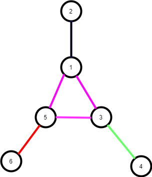

## 定义

<!-- template start -->
点连通图:删去任意一个点之后图依然是连通的.
<!-- template start -->

其他:

一个连通图，如果任意两点至少存在两条点不重复路径，则称这个图为点双连通的.

点连通度


点双连通图的定义等价于任意两条边都同在一个简单环中

对一个无向图，点双连通的极大子图称为点双连通分量（简称双连通分量）

## 性质

 - 如何证明割点在两点双之间呢？

## 样例

::: line
```viz-dot
graph g {
    label="图1";
    node[shape=circle fixedsize=true style=filled fillcolor=white colorscheme=accent8 ];
    1--2;
}
```

```viz-dot
graph g {
    label="图2";
    node[shape=circle fixedsize=true style=filled fillcolor=white colorscheme=accent8 ];
    1--2--3;
}
```

```viz-dot
graph g {
    label="图3";
    node[shape=circle fixedsize=true style=filled fillcolor=white colorscheme=accent8 ];
    1--2;
    1--3;
    2--4;
    2--5;
    3--6;
    3--7;
}
```
:::

点连通分量的个数

- 图1:1
  - $(1,2)$
- 图2:2
  - $(1,2),(2,3)$
- 图2:6
  - $(1,2),(1,3),(2,4),(2,5),(3,6),(3,7)$

## 模板

割点可以属于多个点双连通分量,其余的点和边只属于一个点双连通分量.

对于每两个点双连通分量,最多只有一个共点即割点.任意一个割顶都是至少两个点双连通的公共点.

<!-- template start -->
核心: 求解割顶的过程中用一个栈保存遍历过的边（注意不是点！因为不同的双连通分量存在公共点即割顶）,之后每当找到一个点双连通分量，即子结点v与父节点u满足关系low[v]>=dfn[u]，我们就将栈里的东西拿出来直到遇到当前边.
<!-- template end -->

这里注意放入栈中的不是点，而是边，这是因为点双连通分量是存在重复点的，如果我们放入栈中的是点，那么对于某些点双连通分量，就会少掉一些点（这些点都是割顶）。

::: line
```viz-dot
graph g {
    label="图4";
    rankdir=LR;
    node[shape=circle fixedsize=true style=filled fillcolor=white colorscheme=accent8 ];
    1--2;
    1--3;
    2--3;
}
```

```viz-dot
graph g {
    label="图5:图4的dfs生成树";
    node[shape=circle fixedsize=true style=filled fillcolor=white colorscheme=accent8 ];
    1--2--3;
}
```
:::

如图4,有一个点连通分量,在生成树上,边$(1,2),(2,3)$被压入栈内,如果只看点,点2出现了两次,所以要避免同一个点在一个bcc中出现多次.

::: warning
!!!注意: 和求割点不同的地方
1. 模板 18-20 行
2. 没有判断root是否是割点
:::

<!-- template start -->
```c
<%- include("template/bcc_template.cpp") %>
```
<!-- template end -->

## 题目



### 数据

```
5 6
2 1
1 5
1 3
5 3
5 6
3 4
```

### 代码

```c
<%- include("template/bcc.cpp") %>
```
