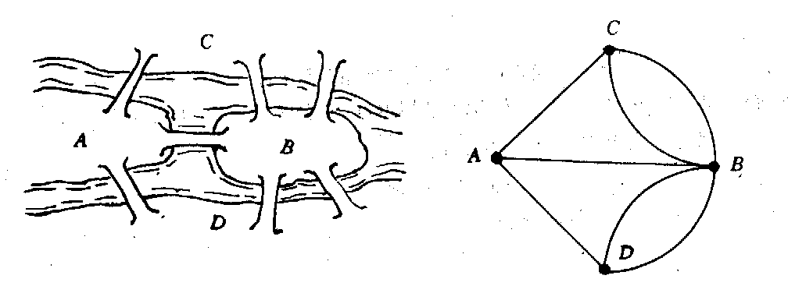

## 引言

欧拉回路问题,又称为"一笔画"问题.也就是能否不重复的一笔画出整个图的问题.

欧拉回路是数学家欧拉在研究著名的德国哥尼斯堡(Koenigsberg)七桥问题时发现的。如图a所示，流经哥尼斯堡的普雷格尔河中有两个岛，两个岛与两岸共4处陆地通过7座杨 彼此相联。7桥问题就是如何能从任一处陆地出发，经过且经过每个桥一次后回到原出发点。

::: center

:::

## 定义 

- 欧拉路径: 图G中每条边都经过一次的路径.
- 欧拉回路: 闭合的欧拉路径.
- 欧拉图: 存在欧拉回路的图.
- 半欧拉图: 存在欧拉路径但不存在欧拉回路的图.

更容易理解的定义:

- 欧拉回路：每条边恰好只走一次，并能回到出发点的路径
- 欧拉路径：经过每一条边一次，但是不要求回到起始点

## 性质与定理


欧拉回路存在性的判定： 

- 一、无向图 每个顶点的度数都是偶数，则存在欧拉回路。
- 二、有向图（所有边都是单向的） 每个节顶点的入度都等于出度，则存在欧拉回路。

欧拉路径存在性的判定：

- 一 无向图 一个无向图存在欧拉路径，当且仅当 该图所有顶点的度数为偶数 或者 除了两个度数为奇数外其余的全是偶数。
- 二 有向图 一个有向图存在欧拉路径，当且仅当 该图所有顶点的度数为零 或者 一个顶点的度数为1，另一个度数为-1，其他顶点的度数为0。

因为如果通过深搜判断点的数量，可能题意描述点有n个，实际上一些点为单点，欧拉回路求的是道路，单点不影响。会出现误判。

### 特殊得情况: 自环

如果图存在自环

```viz-dot
digraph g {
    node[shape=circle fixedsize=true style=filled fillcolor=white colorscheme=accent8 ];
    1->1;
    2->2;
    3->3;
}
```

## 模板

<!-- template start -->
核心思想:标记边,用dfs的访问的顺序(栈)存点.

```c
stack<int> sta,ans;
void Euler(int s){
    sta.push(s); //起点入栈
    while( !sta.empty() ){
        int x = sta.top(),i = head[x];
        //找到第一条未访问的边
        while( i!=-1 && vis[i] ) i = e[i].next;
        if( i!=-1){
            sta.push(e[i].v);
            head[x] = e[i].next;
            //标记边,边从0开始编号
            vis[i] = vis[i^1] = 1;
        }
        else { //退出这个点
            sta.pop();
            ans.push(x);
        }
    }
}
```
<!-- template end -->


**我们维护的栈恰好替我们完成了拼接工作**.

因为把所有的边都走一遍,所以递归的层级是O(M),通常边的数量比较大,所以不能直接dfs,容易造成栈溢出,所以要用栈手动模拟递归,把dfs转为非递归代码.

```viz-dot
graph g {
    node[shape=circle fixedsize=true style=filled fillcolor=white colorscheme=accent8 ];
    {rank=same; 2,3;}
    {rank=same; 4,5,6;}
    {rank=same; 1,7;}
    edge[minlen=2];
    1--2[label="(1)"];
    2--3[label="(2)"];
    3--1[label="(3)"];
    1--4[label="(4)"];
    4--5[label="(5)"];
    5--1[label="(9)"];
    5--6[label="(6)"];
    6--7[label="(7)"];
    7--5[label="(8)"];
}
```

## 哈
