@[toc]

## 学习网络

```viz-dot
digraph g {
    {"KMP","Trie"}-> "AC自动机"
}
```

要学AC自动机需要自备两个前置技能:KMP和trie树。
KMP是用于一对一的字符串匹配,而trie虽然能用于多模式匹配,但是每次匹配失败都需要进行回溯,如果模式串很长的话会很浪费时间,所以AC自动机应运而生,如同Manacher一样,AC自动机利用某些操作阻止了模式串匹配阶段的回溯,将时间复杂度优化到了$O(n)$为文本串长度

## 引入

现在有模式串：ATC,CAT,GCG,ACC,主串：GCATCG，问：主串中包含几个模式串？


手动的暴力匹配，得到结果如下，可以发现有两个匹配。
$$
G\fcolorbox{red}{white}{CAT}CG \\
GC\fcolorbox{red}{white}{ATC}G
$$

显然暴力的事件复杂度为：$O（n \times m \times \overline{len(m)})$.

有没有更快的算法呢？这里就要用到AC自动机了， 算法过程如下：

 1. **建立模式串的Trie树**，与普通的Trie树的建立一样
 2. 在Trie树建立失配指针next（类似kmp的next）
 3. 在主串上查找

## 建立 next 数组，失配指针

next数组也就是失配指针，需要我们预处理出来。next [u] 表示：在匹配到 u 节点而 u 的转移边都不匹配时，满足最长前缀匹配关系的新的 u 结点，也就是满足 $T'[1 \cdots k] = T [j-k+1 \cdots j]$ 的 $k(k＜j)$的最大值所对应的结点编号。

显然，next [u] 的深度是小于 u 结点的，因此我们可以按结点的深度大小，也就是 BFS 的顺序来
构建 next 数组，构建过程与 KMP 算法类似，也与主串和模式串的匹配过程类似。我们设 v，u 分别
表示字符串 $T'=[1 \cdots j]，T'=[1 \cdots i]$，其中 v 是 u 的后缀且 $next［u］= v$。枚举 u 的转移边指向的结点也就
是转移结点 x，现在我们要求出 $next [x]$，若 $T'[j+1]=T [i＋1]$，也就是下一位仍然匹配，那么设 v
的相同字符转移边指向的结点为 y，令 next [x] 等于 y，否则 $T'[j+1]$ 与 $T [i＋1]$++失配++，我们令 $v=next
[v]$，即跳到字符串 v 的后缀 next [v] 处，按照以上的过程继续判断是否匹配。若跳到空结点，那么无
法匹配，$next [x]＝0$

下面，我们用实例描述建立 next 数组（即下述的前缀指针）的过程:


**Trie树与失配指针**

::: lb


:::


**建立失配指针的过程**

::: lb





:::

通俗话的讲：沿着父亲的 next 指针一路走，一路匹配，即可(当前点有匹配边)。


### **优化：**

注意下面的模板代码的bfs_next()函数中,当不存在u的转移边i时，令ch[u][i]等于
ch[next[u]][i],这并不符合trie树的构造，但在代码中确实正确的，为什么呢？

::: center

:::

## 匹配

在主串 S 中，问

 - 有几个模式串 $T_i$ 在主串 S 中出现
 - 模式串 $T_i$ 是在主串 S 中出现几次

**演示：**

<iframe src="//player.bilibili.com/player.html?aid=242811910&bvid=BV1Me411s77J&cid=180286958&page=1" scrolling="no" border="0" frameborder="no" framespacing="0" allowfullscreen="true" height=600 width=800> </iframe>

通俗话的讲：沿着当前点的 next 指针一路走，一路匹配，即可。

## 模板

<!-- template start -->
```c
namespace AC {

    //trie树,每个单词出现的次数,失配指针
    int trie[maxn][26],cntword[maxn],next[maxn],tot=1;
    int bo[maxn]; // 是否是单词

    void ac_init(){ 
        tot=1;  //结点从1开始编号
        memset(bo,0,sizeof(bo));
        memset(trie,0,sizeof(trie));
        memset(next,0,sizeof(next));
    }

    void build_trie(char *s){  // 建立trie树
        int len = strlen(s), u = 1;
        for(int i=0; i<len; ++i){
            int c = s[i] -'a';
            if( !trie[u][c]) trie[u][c] = ++tot;
            u = trie[u][c];
        }
       bo[u]++;
    }
    void  bfs_next(){
        for(int i =0;i<=25;++i) trie[0][i] = 1;
        queue<int> q; q.push(1); //队列
        next[1] = 0;             //根的失配指针
        while( !q.empty()){
            int u = q.front(); q.pop();
            for(int i = 0;i <= 25; ++i){
                if( !trie[u][i]) trie[u][i] = trie[next[u]][i]; // 优化
                else {
                    q.push(trie[u][i]);
                    int v = next[u]; 
                    next[ trie[u][i] ] = trie[v][i];
                }
            }
        }
    }

    void find( char *s){
        int u = 1, len=strlen(s);
        for(int i = 0; i <=len ;++i){
            int c = s[i] - 'a';
            int k = trie[u][c];
            while( k > 1){
                ans += bo[k];
                bo[k] = 0;
                k = next[k];
            }
            u = trie[u][c];
        }
    }
}
```
<!-- template end -->

## 演示


## 参考

- [AC 自动机 算法详解（图解）及模板 | bestsort 的小站](https://bestsort。cn/2019/04/28/402/)
- 信息学奥赛一本通・提高篇 第二部分 第四章 AC 自动机
