@[toc]

## 一. 定义

后缀自动机（Suffix Automaton，简称SAM）是一种用于字符串处理的有限状态自动机（DFA），它可以接受其母串的任何一个后缀，且构造算法为线性算法.

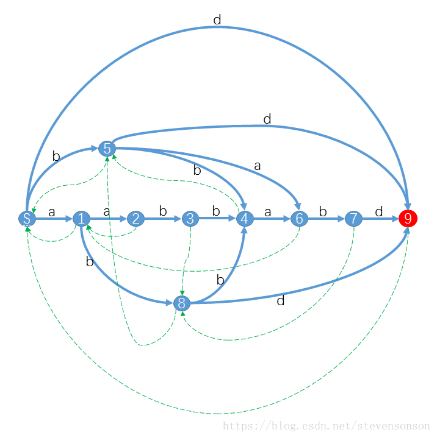
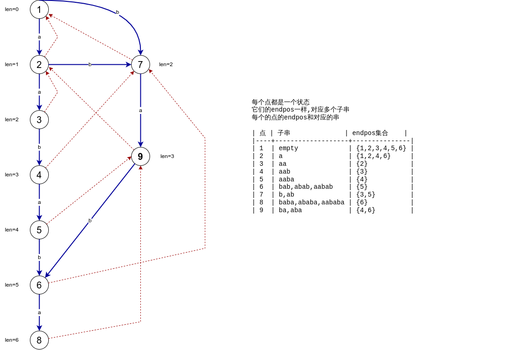

## 二. 直观的看SAM

可以直观看到的性质有

1. 有一个源点,从源点到任意一个点经过的边可以形成一个字符串,它是原串的子串
2. 整个自动机可以表示出原串的所有子串,也就是说路径和子串一一对应(也就是从起点到达任意点的路径一定对应一个子串)
3. 路径不同,形成的子串也不同


还有一个很重要的结论:

一个n个字符的串形成的后缀自动机,最多有2n个点,且最多有3n条边,所以它是一个优秀的线性算法.

SAM问题中经常考虑两种边：

- (1) 转移边，类似于Trie。表示在某个状态所表示的所有子串的后面添加一个字符。
- (2) Link,parent链。表示一种后缀之间的关系(包含关系),表示将某个状态所表示的最短子串的首字母删除后形成的子中所对应的点(状态)。这类边构成一棵树。

## 三. endpos及其性质

- $endpos$:一个子串$S{i}$出现的在原串中右端数字所组成的集合
  例如,原串为$abcab$,那么$endpos(ab) = \{2,5\}$
- 不同子串的endpos可能会相同,也就说一个endpos集合可能对应多个子串.
- **状态**:SAM中一个点我们称为一个状态,与一个endpos唯一对应,也就是说不出现两个不同状态具有同一个endpos,每个点的endpos不同.


**endpos的性质**,其实也是SAM的性质：

1. 两个endpos相同的子串,短串为长串的后缀
2. 两个不同子串的endpos，要么有包含关系，要么没有交集。
3. 任意两个串s1,s2,且`len(s1) <= len(s2)` ，则 s1 是 s2 的后缀当且仅当 endpos(s1)⊇endpos(s2) ，s1 不是 s2 的后缀当且仅当 endpos(s1)∩endpos(s2)=∅　。
4. 一个endpos可能对应多个子串(这此子串开成一个endpos等价类) ，其中最长的那个子串为maxS ，那短的那个子串为minS.对于任意maxS的后缀子串s,当满足 `|len(minS)| <= |len(s)| <= len(maxS)`时,s是这个endpos等价类对应的子串之一.换名话说,同一个endpos等价类对应的子串后缀相同,长度连续.


## 四. parent Tree 与 其性质

什么是parent tree ,看图,注意红色的边,它表示两个点之间的父子关系,每个点都有一个父亲,所以形成一个树.关键的问题是父子关系表示什么?


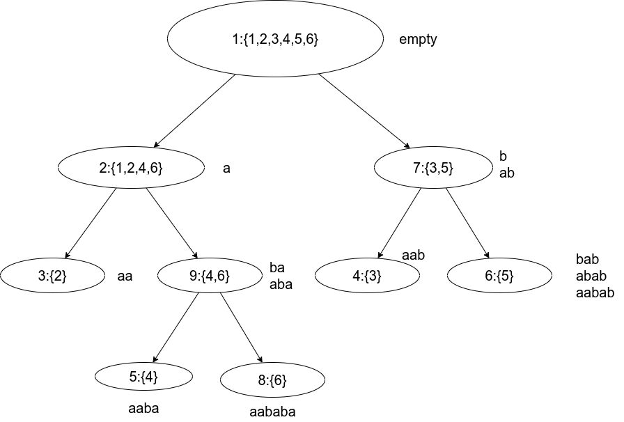


1. 把所有点的endpos列出来,观察,发现是集合之间的分割
2. len(fa(a)) + 1 = minlen(a),son的最小串是父亲的最长串前面添加了一个字符
4. 沿着parent tree上的link向上走,是一个不停缩小后缀的过程,删除前面的字符
5. 集合可能在分割的时候丢失
6. 证明了SAM上的点最多有2n个


## 五. 如何构造自动机

增量法构建,假如我们已经有一个字符串$S$中的子串$[1,i]$这部分前缀的的SAM,然后在这个SAM上加入第$i+1$个字符形成新的SAM


1. case 1 : `abc`
2. case 2 : `aba`
    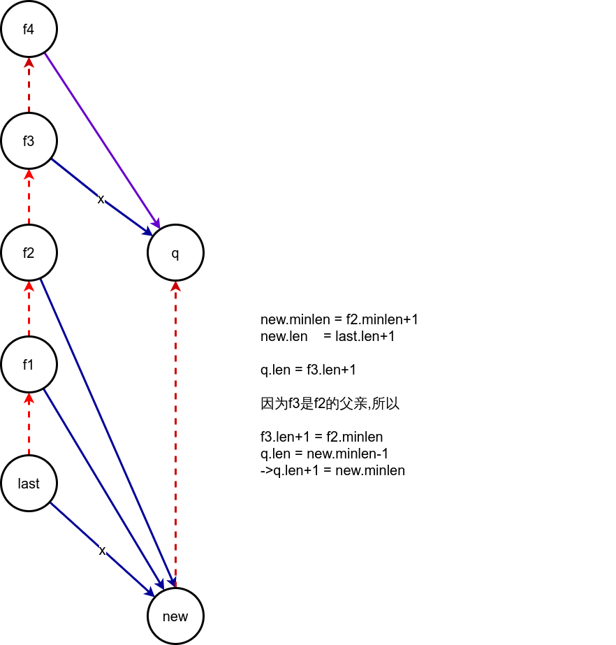
3. case 3 : `abb`
    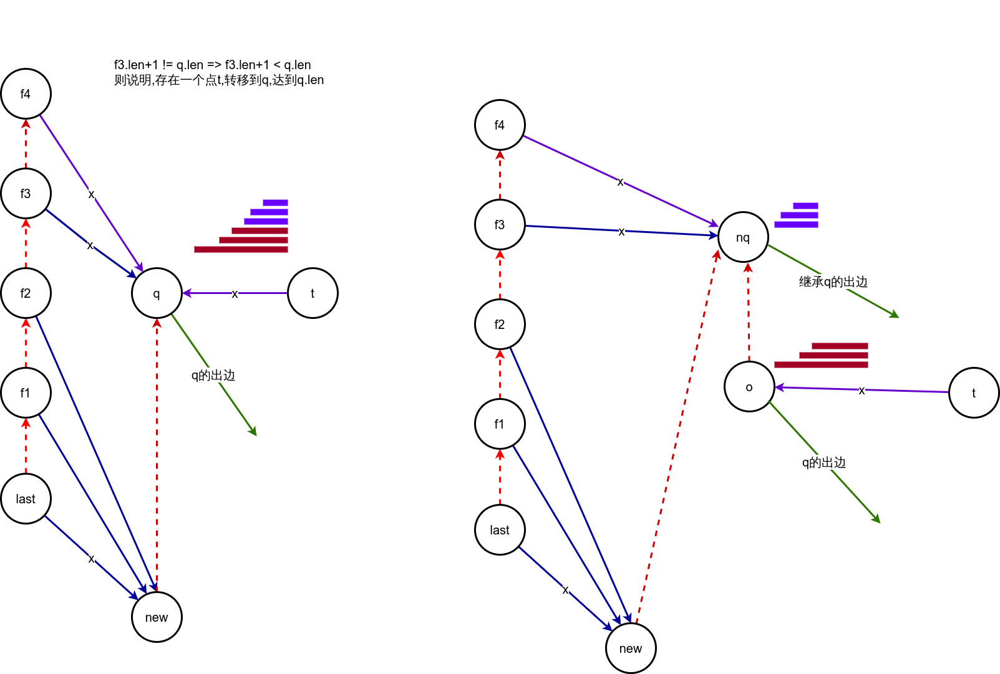

    - 把q拆出两个点o,n,都一样继承q的出边,也就是和q的出边一样
    - 更高的parent链上的点的转移边都应该连上nq,因为nq是q分出来的那些由parent链
    - 因为o,nq的后缀相同,且nq的后缀更短,所以o的父亲是nq
    - new的父亲也应该是nq
    - 

其它例子`aaa`


具体流程:

设当前插入的字符为$x$.

- 向后缀链的末尾插入一个新节点$now$；
- 检查$now$在后缀链上的上一个节点$p=last$，是否存在字符为$x$的子节点$q=p.ch[x]$；
若不存在，则连边$p.ch[x]=now$，继续向上找父亲$p=p.fa$；
- 退出循环时，若$p=0$，**说明没有匹配到的后缀**，$now.fa=root$，结束。
- 若$p!=0$，则检查$p−>q$是否为后缀链上的边；
  - 若$q.len=p.len+1$，说明匹配到了一个存在的后缀，$now.fa=q$，结束。
  - 否则，说明这样的后缀不存在于已经加入的后缀链中，需要新建一个节点$q{new}$来表示.
    $q_new$复制$q$的父节点和子节点信息，$q{new}.len=p.len+1$；
  - $q{new}$不是后缀链上原有的点，所以；
  - 新建的$(1,qnew]$是$(1,now]$和$(1,q]$的后缀，所以$q{new}为$now$和q的父节点，
    $now.fa=q.fa=q{new}$
  - 从当前$p$开始，将指向q的点改为指向$q{new}，即$p.ch[x]=q{new}，并不断向上找父亲$p=p.fa$。

**下面给出一个字符串aababa的构造过程**

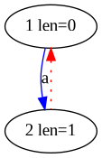

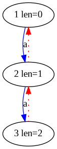

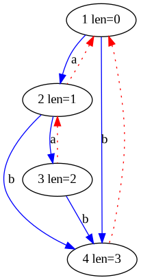

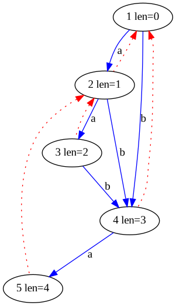

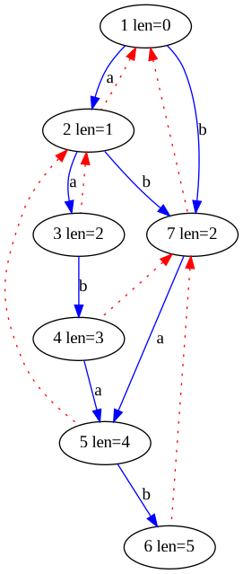

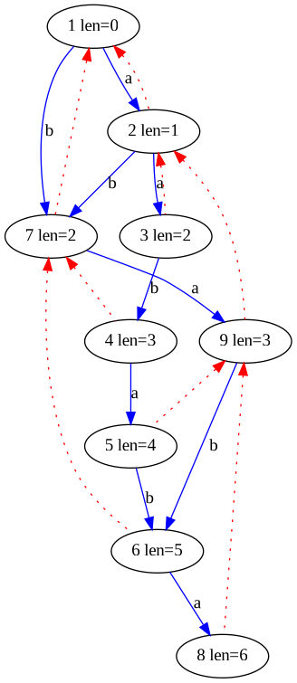

[下载:我写的生成SAM图程序](./sam.cpp),配合[在线graphviz](https://edotor.net/)使用

## 六. SAM时间复杂度

线性。
证明较为复杂，TODO。


## 七. 代码

```c++
<%- include("template.cpp") %>
```

## 八. SAM上的应用

1. 不同子串的个数
2. 子串匹配

## 参考

- [后缀自动机原理及实现 – KSkun's Blog](https://ksmeow.moe/suffix_automaton/#toc)
- [AcWing 2766. 后缀自动机 - AcWing](https://www.acwing.com/activity/content/code/content/585844/)
- [SUFFIX AUTOMATON by- saisumit | saisumit](https://saisumit.wordpress.com/2016/01/26/suffix-automaton/)
- [史上最通俗的后缀自动机详解 - KesdiaelKen 的博客 - 洛谷博客](https://www.luogu.com.cn/blog/Kesdiael3/hou-zhui-zi-dong-ji-yang-xie)
