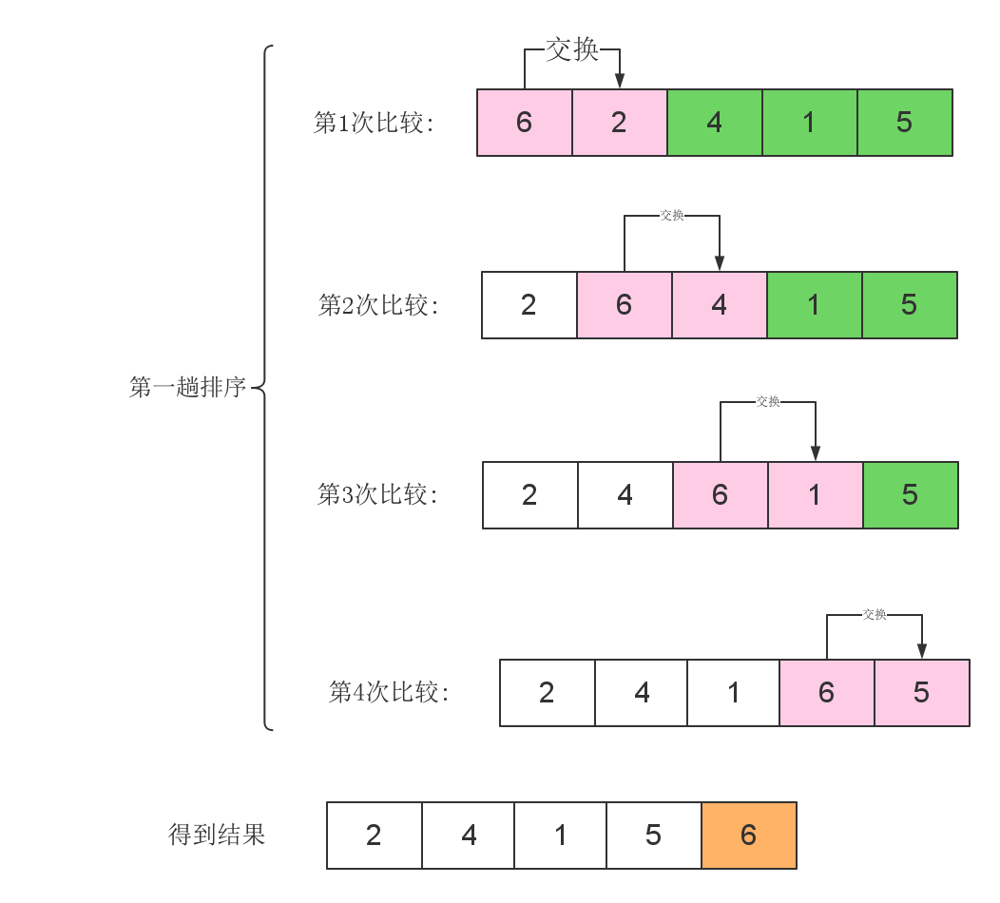

# 冒泡排序


冒泡排序是很简单的算法,这里我们看一下它的原是就可以了



通过的上面的图片我们可以等到下面的信息:

 1. 每一趟排序都是把最值排序在后面
 2. 对于有**n**个数的数组来说,要排序**n-1**趟
  - n个数字只**n-1**个数字就可以了,最后一个数字自动就在第一位
 3. 对第1趟排序的范围是`a[1]-->a[n-1]`
 4. 对第2趟排序的范围是`a[1]-->a[n-2]`
 5. 对第i趟排序的范围是`a[1]-->a[n-i]`


**一句话算法：第一趟循环n-1次,第二趟循环n-2次,第i趟循环n-i次**

### bubble_sort代码核心代码

<!-- template start -->
```c
void bubble_sort(int a[],int n){
    int i,j;
	int tmp;
    for(i=1;i<=n-1;i++) //n个数,要进行n-1趟排序
        for(j=1;j<=n-i;j++){//第i趟排序的最后一个下标:n-i
            if(a[j] > a[j+1]){
                tmp =a[j];
                a[j] =a[j+1];
                a[j+1]=tmp;
            }
        }
}
```
<!-- template end -->

### 完整代码

```c
#include <cstdio>
int a[100];

void bubble_sort(int a[],int n){
    int i,j;
	int tmp;
    for(i=1;i<=n-1;i++) //n个数,要进行n-1趟排序
        for(j=1;j<=n-i;j++){//第i趟排序的最后一个下标:n-i
            if(a[j] > a[j+1]){
                tmp =a[j];
                a[j] =a[j+1];
                a[j+1]=tmp;
            }
        }
}
int main(){
	int i;
	for(i=1;i<=10;i++)
		scanf("%d",&a[i]);
	bubble_sort(a,10);
	
	for(i=1;i<=10;i++)
	printf("%d ",a[i]);
	
}
```
